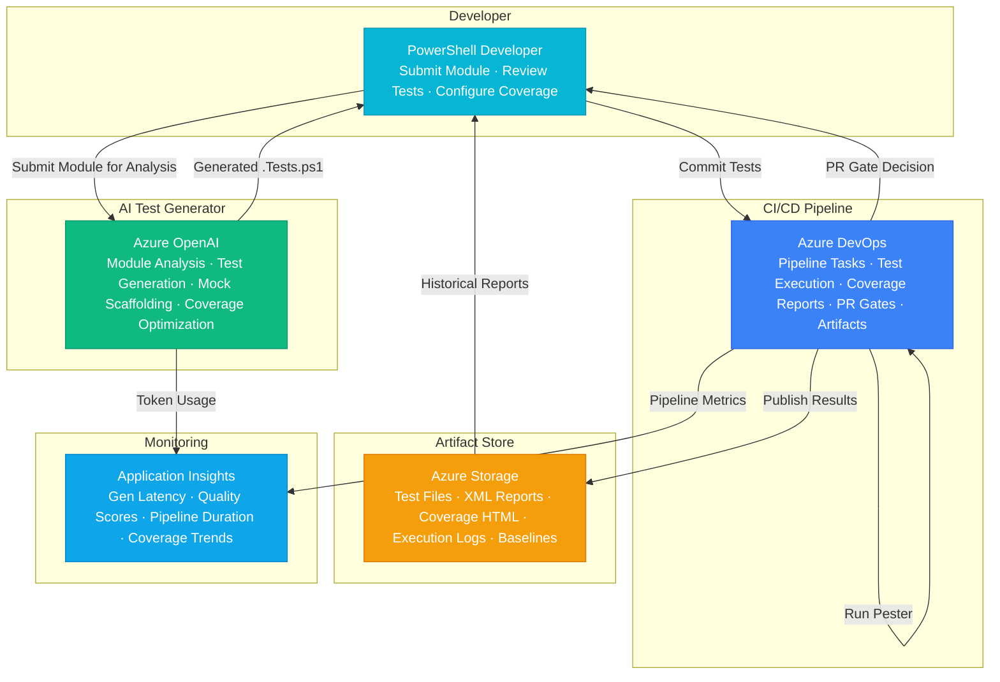

# Architecture — Play 101: Pester Test Development — AI-Assisted PowerShell Test Generation Using Pester 5.x Framework

## Overview

AI-powered test generation platform that analyzes PowerShell modules and automatically generates comprehensive Pester 5.x test suites — enabling teams to achieve high test coverage with minimal manual effort while following PowerShell testing best practices. Azure OpenAI powers test generation — GPT-4o analyzes PowerShell module source code to understand function signatures, parameter sets, pipeline input behavior, error handling patterns, and module dependencies, then generates complete Pester 5.x test files with proper Describe/Context/It block hierarchy, Should assertion operators (Be, BeExactly, BeOfType, HaveCount, Throw, Invoke-MockOf), mock definitions for external dependencies (Mock, InModuleScope), TestDrive for file system operations, BeforeAll/AfterAll lifecycle hooks for test setup and teardown, and TestCases for data-driven testing with multiple parameter combinations; GPT-4o-mini handles simpler generation tasks: test boilerplate scaffolding, assertion suggestions from function return types, test naming conventions aligned with the module's function naming, and inline documentation comments explaining test intent. Azure DevOps provides CI/CD pipeline integration — pipeline tasks for automated Pester test execution, test result publishing in NUnit XML format for dashboard visualization, code coverage reporting with JaCoCo-compatible output, PR quality gates requiring minimum test coverage thresholds (e.g., 80% line coverage), pipeline templates for standardized test execution across multiple repositories, and artifact publishing for test reports and coverage HTML files. Azure Storage hosts test artifacts — generated test files under version control, Pester output XML reports for historical analysis, code coverage HTML reports for developer review, test execution logs for debugging failures, PowerShell module snapshots for regression testing baselines, and golden test output files for comparison-based assertions. Designed for PowerShell module authors, DevOps engineers maintaining infrastructure-as-code, platform engineering teams with large PowerShell codebases, and any team wanting to retrofit test coverage onto existing PowerShell projects.

## Architecture Diagram

## Data Flow

1. **Module Analysis & Test Planning**: Developer submits PowerShell module for test generation — either a single .psm1/.ps1 file, a module manifest (.psd1) with associated files, or an entire module directory → GPT-4o analyzes the module: parses function definitions extracting parameter names, types, mandatory/optional status, parameter sets, pipeline input attributes (ValueFromPipeline, ValueFromPipelineByPropertyName), ValidateSet/ValidatePattern constraints, default values, and OutputType declarations → Identifies external dependencies: cmdlets from other modules (Az.*, ActiveDirectory, etc.) that need mocking, file system operations requiring TestDrive, network calls requiring mock HTTP responses, database connections requiring mock contexts → Generates test plan: which functions to test, test categories (unit, integration, parameter validation, error handling, pipeline behavior), mock strategy per dependency, TestCases data sets for parameter combinations, expected code coverage target
2. **Pester 5.x Test Generation**: GPT-4o generates complete .Tests.ps1 files following Pester 5.x syntax — BeforeDiscovery block for data-driven test case generation, BeforeAll for module import and shared mock definitions, Describe blocks per public function with descriptive names → Context blocks for logical test groupings: "When parameter X is provided", "When called with pipeline input", "When the target resource does not exist", "When an error occurs" → It blocks with clear test names and single-assertion-per-test pattern: `It "Should return a hashtable with Name property" { $result | Should -BeOfType [hashtable]; $result.Name | Should -Be $expectedName }` → Mock definitions: `Mock Get-AzResource { return @{ Name = 'test'; ResourceGroupName = 'rg-test' } }` with InModuleScope where needed → TestDrive usage for file operations: `$testFile = Join-Path $TestDrive 'config.json'; Set-Content -Path $testFile -Value $testContent` → Error testing: `{ Get-Widget -Name $null } | Should -Throw -ExpectedMessage '*cannot be null*'` → GPT-4o-mini generates test documentation, helper function stubs, and assertion suggestions for simple parameter validation tests
3. **Test Review & Refinement**: Generated tests presented to developer for review — each test file includes inline comments explaining test rationale, mock strategy decisions, and coverage goals → Developer reviews and refines: adds domain-specific test cases the AI couldn't infer, adjusts mock return values to match realistic data, adds integration test markers for tests requiring live resources → Optional AI refinement loop: developer submits specific functions with "test this edge case" instructions, GPT-4o generates targeted additional tests → Final test files committed to source control alongside the module code, following naming convention: `ModuleName.Tests.ps1` in a `Tests/` directory
4. **CI/CD Pipeline Execution**: Azure DevOps pipeline triggered on PR or commit — pipeline template includes: PowerShell 7 environment setup, module dependency installation (Install-Module for required Az modules), Pester 5.x installation and configuration → Test execution: `Invoke-Pester -Path ./Tests -OutputFile TestResults.xml -OutputFormat NUnitXml -CodeCoverage @{ Path = './src/*.ps1'; OutputFormat = 'JaCoCo'; OutputPath = 'coverage.xml' }` → Results processing: NUnit XML published to Azure DevOps Test tab for visualization, JaCoCo coverage report generated as HTML artifact, coverage percentage extracted for PR gate evaluation → PR quality gates: pipeline fails if test coverage drops below configured threshold (default 80%), if any test fails, or if new functions lack corresponding tests (detected via AST comparison) → Test artifacts (XML, HTML, logs) published to Azure Storage for historical tracking
5. **Coverage Analysis & Trend Tracking**: Application Insights tracks test generation metrics — AI generation latency per module size, compilation success rate of generated tests (target >95%), assertion coverage (assertions per function), mock accuracy (generated mocks that correctly simulate dependencies) → Azure Storage maintains historical test results — coverage trend over time per module, test suite growth as new functions are added, failure rate trends indicating code quality trajectory → Coverage gap analysis: compare function list from module manifest against test file coverage, identify untested code paths, suggest additional test scenarios to developer → Monthly reports: test coverage dashboard across all PowerShell repositories, AI-generated vs manually-written test ratio, quality metrics (tests passing in CI, flaky test identification, average test execution time)

## Service Roles

| Service | Layer | Role |
|---------|-------|------|
| Azure OpenAI | Generation | Module analysis, Pester test generation, mock scaffolding, assertion suggestions, coverage optimization |
| Azure DevOps | CI/CD | Pipeline tasks, test execution, result publishing, coverage reporting, PR gates, artifact management |
| Azure Storage | Artifacts | Test files, NUnit XML reports, coverage HTML, execution logs, module baselines, golden outputs |
| Application Insights | Monitoring | Generation latency, quality scores, pipeline duration, coverage trends, token usage |

## Security Architecture

- **Code Privacy**: PowerShell module source code sent to Azure OpenAI for analysis uses enterprise Azure OpenAI endpoints with data privacy guarantees — no training on customer data, data residency in configured region, encrypted in transit and at rest
- **Managed Identity**: Azure DevOps service connections use managed identity or federated credentials for Azure resource access — no service principal secrets in pipeline definitions; Storage access via managed identity
- **Pipeline Security**: Generated test files undergo the same PR review process as application code — no auto-merge of AI-generated content; pipeline tasks run in isolated agents with no persistent state; secrets managed via Azure DevOps variable groups linked to Key Vault
- **RBAC**: Developers generate and review tests; DevOps engineers manage pipeline templates and quality gates; team leads configure coverage thresholds; administrators manage Azure DevOps project settings and service connections
- **Artifact Protection**: Test results and coverage reports stored in Azure Storage with access control — team members access their repository's artifacts; compliance auditors access cross-repository coverage dashboards; retention policies automatically purge old artifacts

## Scaling

| Metric | Dev | Production | Enterprise |
|--------|-----|-----------|------------|
| PowerShell modules | 5 | 50 | 500 |
| Functions per module (avg) | 10 | 20 | 30 |
| Tests generated/day | 50 | 500 | 10,000 |
| Pipeline runs/day | 5 | 50 | 500 |
| Test execution time (avg) | 30s | 2min | 5min |
| Code coverage target | 60% | 80% | 90% |
| Artifact storage | 5GB | 50GB | 200GB |
| Concurrent generations | 1 | 5 | 20 |
