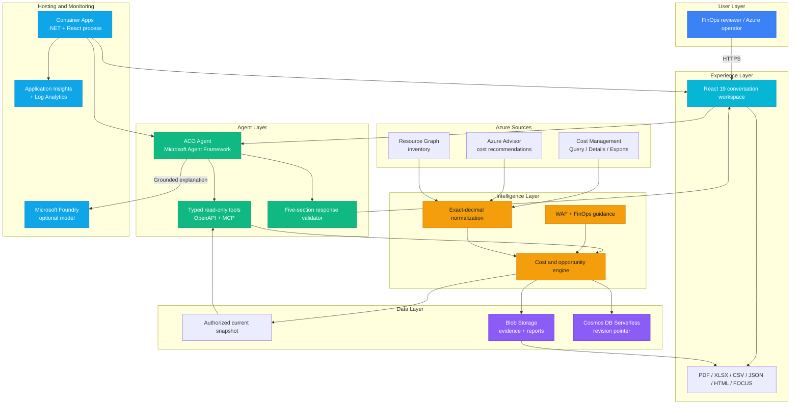

# Play 102 - Azure Cost Optimizer

> Evidence-backed Azure cost analysis with deterministic financial truth, typed read-only tools, and a grounded ACO Agent.

Build a complete Azure Cost Optimizer experience on the Azure Cost Intelligence stack. A .NET 10 engine normalizes cost evidence with exact decimal arithmetic, Microsoft Agent Framework explains that evidence through bounded tools, React 19 renders checked answers and reports, and Azure Container Apps provides the optional hosted path.

## Quick Start

```powershell
# 1. Navigate to the play
cd solution-plays/102-azure-cost-optimizer

# 2. Restore and build the local sample
npm run restore:web
npm run build:web
npm run restore:backend
npm run build:backend

# 3. Start with bundled evidence: zero Azure and model calls
.\ops\start-solution.ps1 -Mode Sample -Port 8080
```

Open `http://127.0.0.1:8080`. For the guided path, open this folder in VS Code, select **ACO Builder**, and ask it to start the Azure Cost Optimizer solution one question at a time.

## Architecture



| Service | Layer | Role |
|---------|-------|------|
| Azure Cost Management | Evidence | Bounded cost summaries, selected details, and recurring exports |
| Azure Advisor | Evidence | Microsoft-generated cost recommendations and estimates |
| Azure Resource Graph | Evidence | Authorized resource inventory for correlation |
| Microsoft Foundry | AI | Optional grounded explanations over minimized typed evidence |
| Azure Container Apps | Compute | Optional single-process .NET API and React hosting |
| Blob Storage | Data | Content-addressed snapshots, source receipts, and report files |
| Cosmos DB Serverless | Data | Scope-partitioned current-revision pointer |
| Managed Identity + Entra ID | Security | Secretless service access and authenticated hosting |
| Application Insights + Log Analytics | Monitoring | Traces, dependency latency, refresh health, and diagnostics |

> [Full architecture details](architecture.md) - collection flow, agent flow, hosted topology, official Azure icons, and security boundaries

## Pre-Tuned Defaults

- Local profile: bundled snapshot, zero Azure calls, zero model calls, and no persistence requirement
- Financial truth: exact decimal values, billed basis, one currency per total, and missing evidence remains unknown
- Agent budget: 3 fast or 6 thorough model/tool rounds, 150-second deadline, and checked five-section output
- Cache: 5-minute L1 evidence freshness and 30-minute principal-partitioned semantic answer cache tied to the current evidence revision
- Guardrails: read-only tools, numeric citation coverage `1.0`, groundedness minimum `0.95`, and paid inference disabled by default

## Solution Tracks

| Track | Best for | Azure writes | Model required |
|-------|----------|:------------:|:--------------:|
| Local sample | Explore the complete interface with bundled evidence | No | No |
| Local live | Analyze one authorized subscription on localhost | No resource writes | Optional |
| Hosted web | Run the web experience in Azure Container Apps | Explicit approval | Optional |
| Foundry channels | Add OpenAPI or MCP prompt-agent channels | Explicit approval | Yes |

See the [user guide](AzureCostOptimizerGuide.md) for prerequisites, authorization checks, what-if review, deployment, rollback, and cleanup.

## Cost Estimate

| Service group | Local sample | Hosted solution | Enterprise envelope |
|---------------|-------------:|----------------:|--------------------:|
| Microsoft Foundry model | $0 | $40 | $300 |
| Azure Container Apps | $0 | $25 | $180 |
| Monitor + Application Insights | $0 | $15 | $90 |
| Cosmos DB Serverless + Blob Storage | $0 | $10 | $120 |
| **Total** | **$0/mo** | **$90/mo** | **$690/mo** |

These are planning envelopes, not price quotes. Region, agreement, retention, usage, model choice, and reused services change actual cost.

> [Full cost breakdown](cost.json) - assumptions, service tiers, and optimization guidance

## DevKit (AI-Assisted Delivery)

| Primitive | What It Does |
|-----------|--------------|
| `agent.md` | FAI compatibility descriptor for the Play 102 delivery |
| `copilot-instructions.md` | Azure Cost Optimizer product, finance, cache, and evidence boundaries |
| 3 agents | Solution Builder, Reviewer, and Tuner |
| 4 skills | Build, deploy, evaluate, and tune the installed product |
| 6 prompts | `/setup`, `/local-run`, `/deploy`, `/test`, `/review`, and `/evaluate` |
| Session hook | Loads the guardrails and solution context without per-tool process overhead |

## Product Package

The play includes the complete v99 public product source: the .NET application, React frontend, deterministic engine, typed tools, MCP and OpenAPI channels, Bicep, evaluation assets, tests, and delivery contracts. The canonical archive and matching receipt are recorded in [the product bundle manifest](spec/product-bundle.v2.json).

Validate the source and fixed package boundary:

```powershell
npm run validate
```

Create a new public solution package only after validation:

```powershell
npm run package:solution
```

## Safety Boundary

Azure Cost Optimizer is read-only. It can collect authorized evidence, explain findings, and produce review plans; it cannot delete resources, purchase commitments, approve savings, or mutate Azure. Azure Advisor values are estimates, cost data is delayed, and financial parity requires the same subscription, dates, currency, billed basis, and collection time.

This public distribution is not production certification. Azure reads, resource creation, role assignment, model deployment, paid inference, public access, deployment, rollback, and deletion remain separately approved stages.

---

[Full documentation](spec/README.md) | [frootai.dev/solution-plays/102-azure-cost-optimizer](https://frootai.dev/solution-plays/102-azure-cost-optimizer) | [FAI Protocol](spec/fai-manifest.json)
