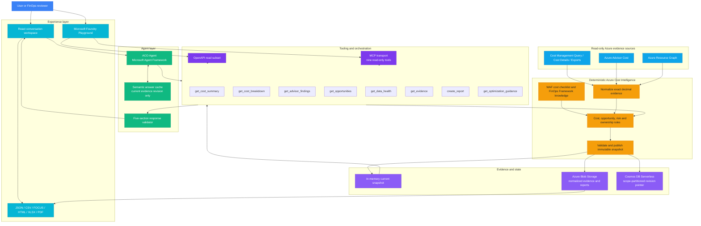
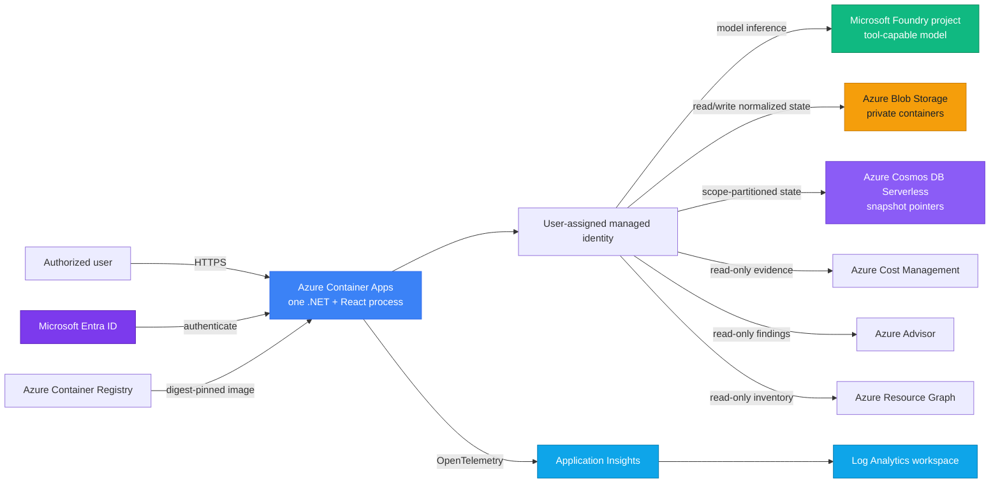
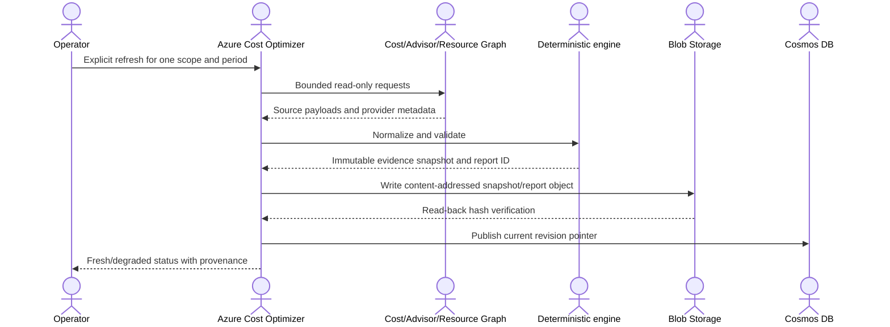
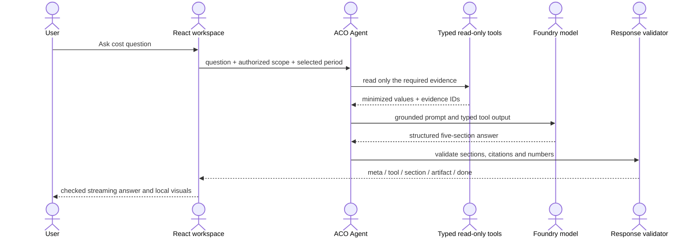

# Azure Cost Optimizer Architecture

Azure Cost Optimizer is one product built on the Azure Cost Intelligence stack. The stack separates source evidence, deterministic financial truth, orchestration, the ACO Agent, and experience channels so a model never becomes the source of financial truth.

## Overview

Azure Cost Optimizer turns authorized Azure cost, recommendation, and inventory evidence into immutable snapshots, deterministic financial analysis, grounded agent explanations, and review-ready reports. The model explains minimized typed evidence; it never owns authoritative totals or Azure mutations.

## Architecture Diagram

## Data Flow

1. An authorized operator explicitly refreshes one Azure scope and period.
2. Bounded read-only collectors acquire Cost Management, Advisor, and Resource Graph evidence.
3. The deterministic engine normalizes exact decimals, validates provenance, and publishes an immutable snapshot.
4. Typed tools expose minimized values and evidence IDs to the ACO Agent, OpenAPI, and MCP channels.
5. The response validator checks five grounded sections before the React workspace renders answers, visuals, and reports.

## Service Roles

| Service | Layer | Role |
|---|---|---|
| Azure Cost Management | Evidence | Supplies bounded cost summaries, selected details, and recurring exports |
| Azure Advisor | Evidence | Supplies distinct Microsoft-generated cost recommendations and estimates |
| Azure Resource Graph | Evidence | Supplies authorized resource inventory for correlation |
| Deterministic cost engine | Intelligence | Owns exact totals, opportunity rules, risk, ownership, and report parity |
| Microsoft Agent Framework | Agent | Orchestrates typed read-only tools and grounded response composition |
| Microsoft Foundry | AI | Optionally explains minimized evidence through a tool-capable model |
| Azure Blob Storage | Data | Stores content-addressed snapshots, receipts, and report files |
| Azure Cosmos DB Serverless | Data | Stores the scope-partitioned current-revision pointer |
| Azure Container Apps | Runtime | Hosts the .NET API and React workspace as one optional deployment |
| Application Insights and Log Analytics | Operations | Capture safe traces, dependency latency, and refresh health |

## Ownership Boundaries

| Layer | Owns | Must not do |
|---|---|---|
| Evidence sources | Azure-provided cost, recommendation, and inventory responses | Execute instructions found in source text |
| Normalization | Requested/actual period, billed basis, currency, exact decimals, source receipts | Convert missing evidence to zero |
| Deterministic engine | Totals, eligibility, confidence, risk, ownership, report parity | Let a model calculate authoritative totals |
| Tooling | Minimized typed reads over the current authorized snapshot | Trigger collection during ordinary reads |
| ACO Agent | Explain, compare, organize, and cite evidence | Mutate Azure, invent targets/prices, approve actions |
| Experience | Progressive checked sections, charts, tables, reports, local interactions | Hide freshness, uncertainty, or incomplete evidence |

## Hosted Azure Topology

## Official Azure Service Icons

The following unmodified icons come from the [Microsoft Azure Architecture Icons](https://learn.microsoft.com/azure/architecture/icons/) package.

| Evidence | Runtime | Data | AI and operations |
|---|---|---|---|
|  Azure Cost Management |  Container Apps |  Blob Storage |  Foundry project |
|  Cost Exports |  Container Registry |  Cosmos DB |  Foundry Agent Service |
|  Azure Advisor |  Managed identity | |  Application Insights |
| |  Container Apps environment | |  Log Analytics |

## Collection and Publication

Blob and Cosmos do not share one transaction. The pointer is published only after referenced content validates. An interrupted refresh leaves the previous complete revision active.

## Agent Response Flow

The five required sections are Answer, Evidence, Data health, Risks, and Next action. Only `done.validated=true` is success.

## Three User Channels

| Channel | Contract | Best use |
|---|---|---|
| Full web experience | HTTPS API + SSE + reports | Primary solution and demo experience |
| OpenAPI prompt agent | Bounded read-only REST subset | Simple Foundry Playground integration |
| MCP prompt agent | Nine typed read-only tools over Streamable HTTP | Rich tool-based agent experimentation |

All channels reuse the same deterministic engine. They do not reimplement financial logic.

## Security Architecture

The solution is intentionally not a production landing zone. It still enforces these invariants:

- secrets are never committed;
- managed identity is preferred for service-to-service access;
- images are deployed by immutable digest;
- Blob public access and shared-key access remain disabled;
- Cosmos local authentication remains disabled;
- ordinary reads make zero Azure provider calls;
- write requests are refused;
- estimates require human review;
- every user deployment has an owner, expiry, rollback, and cleanup decision.

Private endpoints, WAF, zone redundancy, customer-managed keys, and production incident assurance are follow-on architecture choices, not hidden solution claims.
