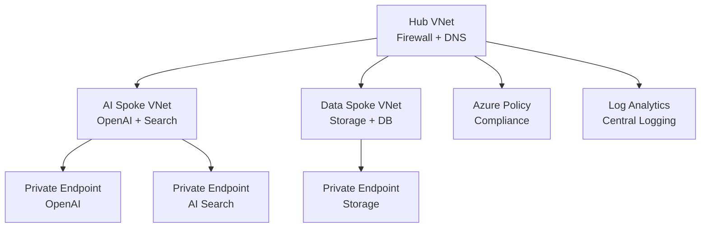

# Solution Play 11: AI Landing Zone Advanced

> **Complexity:** High | **Status:** ✅ Ready
> Enterprise-grade AI governance — hub-spoke networking, private endpoints, RBAC, and policy enforcement.

## Architecture

## Azure Services

| Service | Purpose |
|---------|---------|
| Azure Virtual Network | Hub-spoke topology with network isolation |
| Azure Firewall | Centralized egress filtering and threat protection |
| Azure Policy | Governance — enforce tagging, SKU limits, regions |
| Azure Private Link | Private endpoints for all AI services |
| Azure Log Analytics | Centralized audit logging and diagnostics |

## DevKit (.github Agentic OS)

This play includes the full .github Agentic OS (19 files):
- **Layer 1:** copilot-instructions.md + 3 modular instruction files
- **Layer 2:** 4 slash commands + 3 chained agents (builder → reviewer → tuner)
- **Layer 3:** 3 skill folders (deploy-azure, evaluate, tune)
- **Layer 4:** guardrails.json + 2 agentic workflows
- **Infrastructure:** infra/main.bicep + parameters.json

Run `Ctrl+Shift+P` → **FrootAI: Init DevKit** in VS Code.

## TuneKit (AI Configuration)

| Config File | What It Controls |
|-------------|-----------------|
| config/openai.json | Allowed models, regions, and capacity quotas |
| config/guardrails.json | Network rules, policy assignments, RBAC templates |
| config/agents.json | Agent behavior for infra provisioning review |
| config/model-comparison.json | Model selection and regional availability |

Run `Ctrl+Shift+P` → **FrootAI: Init TuneKit** in VS Code.

## Quick Start

1. Install: `code --install-extension frootai.frootai-vscode`
2. Init DevKit → 19 .github files + infra
3. Init TuneKit → AI configs + evaluation
4. Open Copilot Chat → ask to build this solution
5. Use /review → /deploy → ship

> **FrootAI Solution Play 11** — DevKit builds it. TuneKit ships it.
