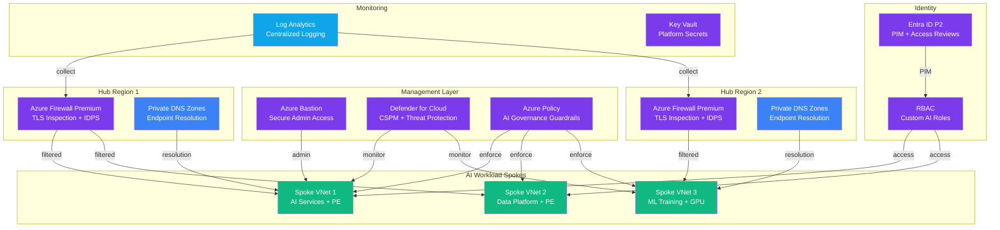

# Play 11 — AI Landing Zone Advanced 🏔️

> Multi-region, policy-driven enterprise AI infrastructure with Firewall, DNS, and governance.

The enterprise-grade version of Play 02. Multi-region VNets with Azure Firewall, NAT Gateway, private DNS zones, management group hierarchy, Azure Policy enforcement, and Defender for Cloud. Designed for regulated industries needing compliance controls.

## Quick Start
```bash
cd solution-plays/11-ai-landing-zone-advanced

# Deploy at management group scope
az deployment mg create --management-group-id $MG_ID --location eastus2 \
  --template-file infra/main.bicep --parameters infra/parameters.json

code .  # Use @builder for Bicep/MG, @reviewer for compliance audit, @tuner for cost
```

## Key Governance Targets
- Policy compliance: ≥95% · Defender score: ≥80% · Private endpoints: 100% on AI services

## DevKit (Infrastructure-Focused)
| Primitive | What It Does |
|-----------|-------------|
| `agent.md` | Root orchestrator with builder→reviewer→tuner handoffs |
| 3 agents | Builder (multi-region Bicep), Reviewer (compliance/Defender), Tuner (SKU/cost) |
| 3 skills | Deploy (105 lines), Evaluate (105 lines), Tune (116 lines) |
| 4 prompts | `/deploy`, `/test`, `/review` (governance), `/evaluate` (compliance) |

**Note:** This is a pure infrastructure play — no AI model parameters, no temperature tuning. TuneKit covers SKU sizing, policy effects, reserved instances, and Firewall rules.

## Architecture



> 📐 [Full architecture details](architecture.md) — data flow, security architecture, scaling guide

## Cost Estimate

| Service | Dev/PoC | Production | Enterprise |
|---------|---------|-----------|------------|
| Virtual Network (Multi-Region) | $0 (Single region) | $50 (Dual region) | $200 (Multi-region 3+) |
| Azure Firewall | $250 (Basic) | $650 (Standard) | $1,300 (Premium) |
| Azure Policy | $0 (Free) | $0 (Free) | $0 (Free) |
| RBAC + Entra ID | $0 (Free) | $60 (Entra P1) | $250 (Entra P2) |
| Private DNS Zones | $3 (Standard) | $8 (Standard) | $20 (Standard) |
| Monitor + Log Analytics | $0 (Free) | $50 (Pay-per-GB) | $200 (Commitment) |
| Defender for Cloud | $0 (Free) | $50 (CSPM) | $200 (Full CWP) |
| Key Vault (Platform) | $1 (Standard) | $5 (Standard) | $15 (Premium HSM) |
| Azure Bastion | $0 (Developer) | $140 (Basic) | $280 (Standard) |
| **Total** | **$254/mo** | **$1,013/mo** | **$2,465/mo** |

> 💰 [Full cost breakdown](cost.json) — per-service SKUs, usage assumptions, optimization tips

📖 [Full docs](spec/README.md) · 🌐 [frootai.dev/solution-plays/11-ai-landing-zone-advanced](https://frootai.dev/solution-plays/11-ai-landing-zone-advanced)
