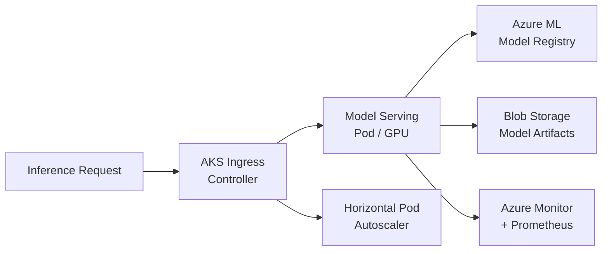

# Solution Play 12: Model Serving on AKS

> **Complexity:** High | **Status:** ✅ Ready
> Serve custom ML models at scale — AKS + Azure ML model registry + GPU node pools.

## Architecture

## Azure Services

| Service | Purpose |
|---------|---------|
| Azure Kubernetes Service | GPU-enabled cluster for model inference |
| Azure Machine Learning | Model registry and experiment tracking |
| Azure Blob Storage | Store model weights and artifacts |
| Azure Monitor | Cluster metrics, pod health, inference latency |
| Azure Container Registry | Store model serving container images |

## DevKit (.github Agentic OS)

This play includes the full .github Agentic OS (19 files):
- **Layer 1:** copilot-instructions.md + 3 modular instruction files
- **Layer 2:** 4 slash commands + 3 chained agents (builder → reviewer → tuner)
- **Layer 3:** 3 skill folders (deploy-azure, evaluate, tune)
- **Layer 4:** guardrails.json + 2 agentic workflows
- **Infrastructure:** infra/main.bicep + parameters.json

Run `Ctrl+Shift+P` → **FrootAI: Init DevKit** in VS Code.

## TuneKit (AI Configuration)

| Config File | What It Controls |
|-------------|-----------------|
| config/openai.json | Inference parameters — batch size, concurrency |
| config/guardrails.json | Resource limits, GPU quotas, scaling boundaries |
| config/agents.json | Agent behavior for deployment and rollback |
| config/model-comparison.json | Model benchmarks — latency, throughput, cost |

Run `Ctrl+Shift+P` → **FrootAI: Init TuneKit** in VS Code.

## Quick Start

1. Install: `code --install-extension psbali.frootai`
2. Init DevKit → 19 .github files + infra
3. Init TuneKit → AI configs + evaluation
4. Open Copilot Chat → ask to build this solution
5. Use /review → /deploy → ship

> **FrootAI Solution Play 12** — DevKit builds it. TuneKit ships it.
