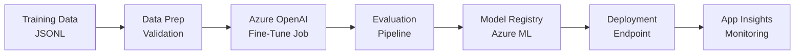

# Solution Play 13: Fine-Tuning Workflow

> **Complexity:** High | **Status:** ✅ Ready
> End-to-end fine-tuning — data prep, training, evaluation, and deployment on Azure OpenAI + Azure ML.

## Architecture

## Azure Services

| Service | Purpose |
|---------|---------|
| Azure OpenAI Service | Fine-tuning jobs for GPT models |
| Azure Machine Learning | Experiment tracking and model registry |
| Azure Blob Storage | Training data and checkpoint storage |
| Azure Container Apps | Host fine-tuned model inference endpoint |
| Azure App Insights | Model performance and drift monitoring |

## DevKit (.github Agentic OS)

This play includes the full .github Agentic OS (19 files):
- **Layer 1:** copilot-instructions.md + 3 modular instruction files
- **Layer 2:** 4 slash commands + 3 chained agents (builder → reviewer → tuner)
- **Layer 3:** 3 skill folders (deploy-azure, evaluate, tune)
- **Layer 4:** guardrails.json + 2 agentic workflows
- **Infrastructure:** infra/main.bicep + parameters.json

Run `Ctrl+Shift+P` → **FrootAI: Init DevKit** in VS Code.

## TuneKit (AI Configuration)

| Config File | What It Controls |
|-------------|-----------------|
| config/openai.json | Epochs, learning rate, batch size, base model |
| config/guardrails.json | Data quality checks, training cost limits |
| config/agents.json | Agent behavior for training pipeline orchestration |
| config/model-comparison.json | Base vs fine-tuned model performance comparison |

Run `Ctrl+Shift+P` → **FrootAI: Init TuneKit** in VS Code.

## Quick Start

1. Install: `code --install-extension frootai.frootai-vscode`
2. Init DevKit → 19 .github files + infra
3. Init TuneKit → AI configs + evaluation
4. Open Copilot Chat → ask to build this solution
5. Use /review → /deploy → ship

> **FrootAI Solution Play 13** — DevKit builds it. TuneKit ships it.
