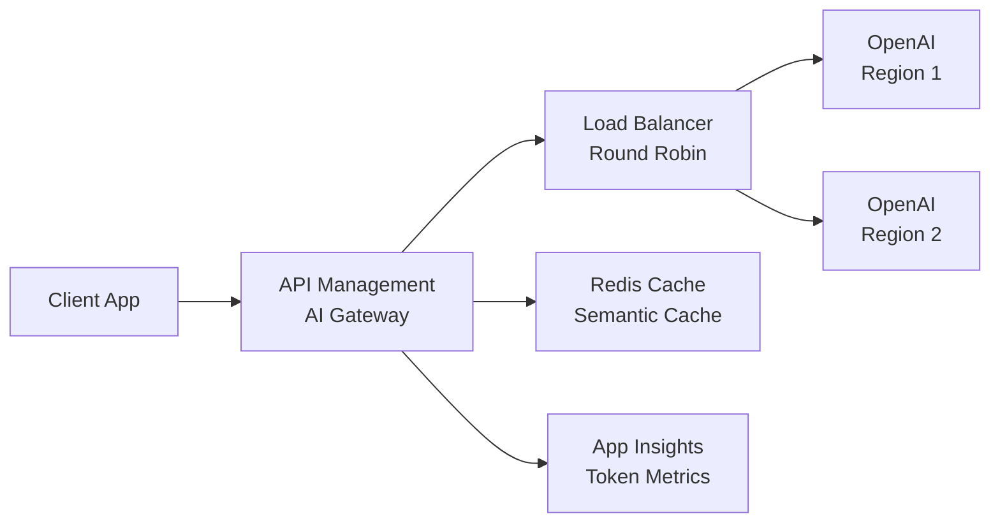

# Solution Play 14: Cost-Optimized AI Gateway

> **Complexity:** Medium | **Status:** ✅ Ready
> Intelligent API gateway — APIM load balancing across OpenAI endpoints with token tracking and caching.

## Architecture

## Azure Services

| Service | Purpose |
|---------|---------|
| Azure API Management | AI gateway with policies and rate limiting |
| Azure OpenAI Service | Multi-region LLM endpoints |
| Azure Cache for Redis | Semantic caching for repeated queries |
| Azure App Insights | Token usage tracking and cost analytics |
| Azure Key Vault | Store API keys and connection strings |

## DevKit (.github Agentic OS)

This play includes the full .github Agentic OS (19 files):
- **Layer 1:** copilot-instructions.md + 3 modular instruction files
- **Layer 2:** 4 slash commands + 3 chained agents (builder → reviewer → tuner)
- **Layer 3:** 3 skill folders (deploy-azure, evaluate, tune)
- **Layer 4:** guardrails.json + 2 agentic workflows
- **Infrastructure:** infra/main.bicep + parameters.json

Run `Ctrl+Shift+P` → **FrootAI: Init DevKit** in VS Code.

## TuneKit (AI Configuration)

| Config File | What It Controls |
|-------------|-----------------|
| config/openai.json | Token limits, model routing, fallback chains |
| config/guardrails.json | Rate limits, cost ceilings, content filtering |
| config/agents.json | Agent behavior for gateway policy management |
| config/model-comparison.json | Cost per token across models and regions |

Run `Ctrl+Shift+P` → **FrootAI: Init TuneKit** in VS Code.

## Quick Start

1. Install: `code --install-extension psbali.frootai`
2. Init DevKit → 19 .github files + infra
3. Init TuneKit → AI configs + evaluation
4. Open Copilot Chat → ask to build this solution
5. Use /review → /deploy → ship

> **FrootAI Solution Play 14** — DevKit builds it. TuneKit ships it.
