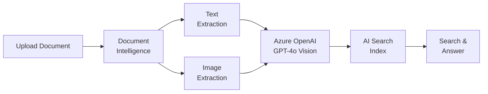

# Solution Play 15: Multi-Modal Document Processing

> **Complexity:** Medium | **Status:** ✅ Ready
> Process documents with text, images, and tables — Document Intelligence + GPT-4o Vision + AI Search.

## Architecture

## Azure Services

| Service | Purpose |
|---------|---------|
| Azure AI Document Intelligence | Extract text, tables, and images from documents |
| Azure OpenAI Service (GPT-4o) | Multi-modal understanding — text + image analysis |
| Azure AI Search | Index and retrieve multi-modal content |
| Azure Blob Storage | Store documents and extracted media |
| Azure Container Apps | Host the processing pipeline |

## DevKit (.github Agentic OS)

This play includes the full .github Agentic OS (19 files):
- **Layer 1:** copilot-instructions.md + 3 modular instruction files
- **Layer 2:** 4 slash commands + 3 chained agents (builder → reviewer → tuner)
- **Layer 3:** 3 skill folders (deploy-azure, evaluate, tune)
- **Layer 4:** guardrails.json + 2 agentic workflows
- **Infrastructure:** infra/main.bicep + parameters.json

Run `Ctrl+Shift+P` → **FrootAI: Init DevKit** in VS Code.

## TuneKit (AI Configuration)

| Config File | What It Controls |
|-------------|-----------------|
| config/openai.json | Vision model params, detail level, max tokens |
| config/guardrails.json | PII redaction, document retention policies |
| config/agents.json | Agent behavior for extraction quality review |
| config/model-comparison.json | GPT-4o vs GPT-4o-mini for vision tasks |
| config/search.json | Hybrid search ratio, top-k, reranker settings |
| config/chunking.json | Multi-modal chunk strategy, image embedding config |

Run `Ctrl+Shift+P` → **FrootAI: Init TuneKit** in VS Code.

## Quick Start

1. Install: `code --install-extension psbali.frootai`
2. Init DevKit → 19 .github files + infra
3. Init TuneKit → AI configs + evaluation
4. Open Copilot Chat → ask to build this solution
5. Use /review → /deploy → ship

> **FrootAI Solution Play 15** — DevKit builds it. TuneKit ships it.
