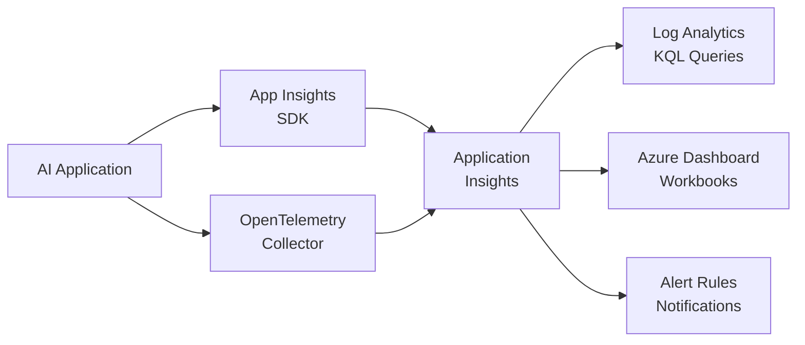

# Solution Play 17: AI Observability

> **Complexity:** Medium | **Status:** ✅ Ready
> Full-stack AI monitoring — App Insights + Log Analytics + custom dashboards for LLM metrics.

## Architecture

## Azure Services

| Service | Purpose |
|---------|---------|
| Azure Application Insights | Distributed tracing and LLM telemetry |
| Azure Log Analytics | KQL queries for token usage and latency |
| Azure Monitor Workbooks | Interactive dashboards for AI metrics |
| Azure Monitor Alerts | Threshold and anomaly-based alerting |
| Azure Container Apps | Host the AI application under observation |

## DevKit (.github Agentic OS)

This play includes the full .github Agentic OS (19 files):
- **Layer 1:** copilot-instructions.md + 3 modular instruction files
- **Layer 2:** 4 slash commands + 3 chained agents (builder → reviewer → tuner)
- **Layer 3:** 3 skill folders (deploy-azure, evaluate, tune)
- **Layer 4:** guardrails.json + 2 agentic workflows
- **Infrastructure:** infra/main.bicep + parameters.json

Run `Ctrl+Shift+P` → **FrootAI: Init DevKit** in VS Code.

## TuneKit (AI Configuration)

| Config File | What It Controls |
|-------------|-----------------|
| config/openai.json | Telemetry sampling, trace verbosity, model tags |
| config/guardrails.json | Alert thresholds, cost ceilings, SLA targets |
| config/agents.json | Agent behavior for automated incident triage |
| config/model-comparison.json | Model performance baselines for monitoring |

Run `Ctrl+Shift+P` → **FrootAI: Init TuneKit** in VS Code.

## Quick Start

1. Install: `code --install-extension psbali.frootai`
2. Init DevKit → 19 .github files + infra
3. Init TuneKit → AI configs + evaluation
4. Open Copilot Chat → ask to build this solution
5. Use /review → /deploy → ship

> **FrootAI Solution Play 17** — DevKit builds it. TuneKit ships it.
