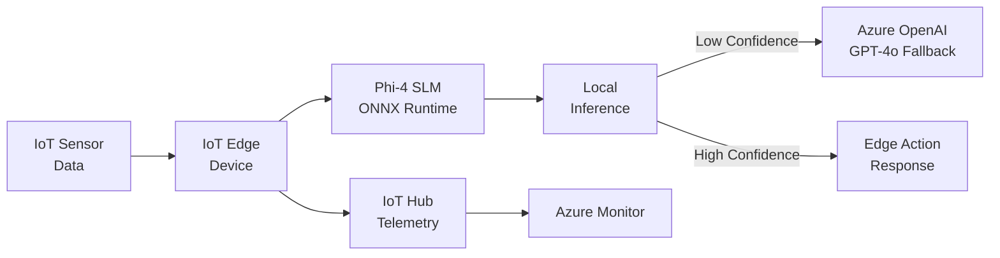

# Solution Play 19: Edge AI with Phi-4

> **Complexity:** High | **Status:** ✅ Ready
> Run Phi-4 SLM at the edge — IoT Edge + ONNX Runtime + Azure Container Apps for hybrid inference.

## Architecture

## Azure Services

| Service | Purpose |
|---------|---------|
| Azure IoT Edge | Deploy and manage edge AI modules |
| Azure IoT Hub | Device telemetry and cloud communication |
| Azure OpenAI Service | Cloud fallback for complex inference |
| Azure Container Registry | Store Phi-4 ONNX container images |
| Azure Monitor | Edge device health and inference metrics |

## DevKit (.github Agentic OS)

This play includes the full .github Agentic OS (19 files):
- **Layer 1:** copilot-instructions.md + 3 modular instruction files
- **Layer 2:** 4 slash commands + 3 chained agents (builder → reviewer → tuner)
- **Layer 3:** 3 skill folders (deploy-azure, evaluate, tune)
- **Layer 4:** guardrails.json + 2 agentic workflows
- **Infrastructure:** infra/main.bicep + parameters.json

Run `Ctrl+Shift+P` → **FrootAI: Init DevKit** in VS Code.

## TuneKit (AI Configuration)

| Config File | What It Controls |
|-------------|-----------------|
| config/openai.json | Phi-4 quantization, context length, cloud fallback model |
| config/guardrails.json | Confidence thresholds, offline mode rules, data limits |
| config/agents.json | Agent behavior for edge-cloud routing decisions |
| config/model-comparison.json | Phi-4 vs GPT-4o-mini — latency, cost, accuracy |

Run `Ctrl+Shift+P` → **FrootAI: Init TuneKit** in VS Code.

## Quick Start

1. Install: `code --install-extension frootai.frootai-vscode`
2. Init DevKit → 19 .github files + infra
3. Init TuneKit → AI configs + evaluation
4. Open Copilot Chat → ask to build this solution
5. Use /review → /deploy → ship

> **FrootAI Solution Play 19** — DevKit builds it. TuneKit ships it.
