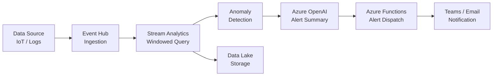

# Solution Play 20: Real-Time Anomaly Detection

> **Complexity:** High | **Status:** ✅ Ready
> Detect anomalies in real-time data streams — Event Hub + Stream Analytics + Azure OpenAI alerting.

## Architecture

## Azure Services

| Service | Purpose |
|---------|---------|
| Azure Event Hub | High-throughput real-time event ingestion |
| Azure Stream Analytics | Windowed queries and anomaly detection |
| Azure OpenAI Service | Generate human-readable alert summaries |
| Azure Functions | Dispatch alerts to Teams, email, or PagerDuty |
| Azure Data Lake Storage | Archive raw and processed event data |

## DevKit (.github Agentic OS)

This play includes the full .github Agentic OS (19 files):
- **Layer 1:** copilot-instructions.md + 3 modular instruction files
- **Layer 2:** 4 slash commands + 3 chained agents (builder → reviewer → tuner)
- **Layer 3:** 3 skill folders (deploy-azure, evaluate, tune)
- **Layer 4:** guardrails.json + 2 agentic workflows
- **Infrastructure:** infra/main.bicep + parameters.json

Run `Ctrl+Shift+P` → **FrootAI: Init DevKit** in VS Code.

## TuneKit (AI Configuration)

| Config File | What It Controls |
|-------------|-----------------|
| config/openai.json | Alert summary model, temperature, response format |
| config/guardrails.json | Detection thresholds, alert severity rules, cooldowns |
| config/agents.json | Agent behavior for triage and escalation logic |
| config/model-comparison.json | Model selection for real-time vs batch alerting |

Run `Ctrl+Shift+P` → **FrootAI: Init TuneKit** in VS Code.

## Quick Start

1. Install: `code --install-extension psbali.frootai`
2. Init DevKit → 19 .github files + infra
3. Init TuneKit → AI configs + evaluation
4. Open Copilot Chat → ask to build this solution
5. Use /review → /deploy → ship

> **FrootAI Solution Play 20** — DevKit builds it. TuneKit ships it.
