# Architecture — Play 33: Voice AI Agent

## Overview

Conversational voice AI agent that handles real-time calls with natural speech interaction. Azure Communication Services (ACS) Call Automation controls inbound/outbound PSTN, Direct Routing, and ACS-user calls through an asynchronous action/event model: Event Grid delivers `IncomingCall`, the application issues Call Automation actions, and ACS sends operation results to an HTTPS callback. Media is a separate path: ACS opens a full-duplex WebSocket to the Container Apps media endpoint and exchanges PCM 16-kHz or 24-kHz mono frames plus DTMF events. The runtime relays inbound audio through Azure AI Speech STT, Azure OpenAI dialogue, Content Safety, and Azure AI Speech TTS before returning outbound PCM audio over the same WebSocket. Redis stores active session state; Cosmos DB stores finalized transcripts and analytics.

## Architecture Diagram

```mermaid
graph TB
    subgraph Participants
        Caller[Caller<br/>PSTN · Direct Routing · ACS Client]
        Human[Human Agent / Contact Center]
    end

    subgraph Azure Communication Services
        ACS[ACS Calling + Call Automation<br/>Call Legs · Transfer · DTMF · Media Control]
        EventGrid[Event Grid<br/>IncomingCall Only]
        Callbacks[Direct HTTPS Callbacks<br/>Action Results · Call State]
    end

    subgraph Container Apps Voice Runtime
        Control[Call Control API<br/>Answer · Transfer · Start/Stop Media]
        Media[Media WebSocket<br/>PCM 16/24-kHz Mono · DTMF · Barge-in · 24-to-16-kHz Resampling]
        Dialog[Turn Orchestrator<br/>State Machine · Timeouts · Escalation]
    end

    subgraph AI Processing
        Speech[Azure AI Speech<br/>Streaming STT · Neural TTS · SSML]
        OpenAI[Azure OpenAI<br/>Dialogue · Intent · Tool Decisions]
        Safety[Azure AI Content Safety<br/>Input / Output Moderation]
    end

    subgraph Data Layer
        Redis[Azure Cache for Redis<br/>Active Session · Turn State · Playback Queue]
        CosmosDB[Cosmos DB<br/>Final Transcript · Call Metadata · Analytics]
    end

    subgraph Security
        KV[Key Vault<br/>Partner / Direct Routing Secrets Only]
        MI[User-Assigned Managed Identity<br/>Azure Service Authentication]
    end

    subgraph Monitoring
        AppInsights[Application Insights + Log Analytics<br/>Correlation ID · Turn Latency · Failures · Cost]
    end

    Caller -->|Voice Call| ACS
    ACS -->|IncomingCall Event| EventGrid
    EventGrid -->|Event Grid Webhook| Control
    ACS -->|Action + Call-State Webhooks| Callbacks
    Callbacks -->|Direct HTTPS POST| Control
    Control -->|Call Automation REST Actions| ACS
    ACS <-->|Full-duplex PCM WebSocket| Media
    Media -->|Inbound PCM Frames| Speech
    Speech -->|Partial / Final Transcript| Dialog
    Dialog -->|Moderate Input| Safety
    Dialog -->|Prompt + Context| OpenAI
    OpenAI -->|Response + Action| Dialog
    Dialog -->|Moderate Response| Safety
    Dialog -->|Text / SSML| Speech
    Speech -->|Outbound PCM Frames| Media
    Dialog <-->|Active State| Redis
    Dialog -->|Finalize Transcript| CosmosDB
    Control -->|Transfer Action| ACS
    ACS -->|Transferred Call Leg| Human
    MI -.->|Target RBAC| Speech
    MI -.->|Target RBAC| OpenAI
    MI -.->|Target RBAC| CosmosDB
    MI -.->|Target RBAC| KV
    Control -->|Traces| AppInsights
    Media -->|Media Metrics| AppInsights
    Dialog -->|AI Metrics| AppInsights

    style Caller fill:#3b82f6,color:#fff,stroke:#2563eb
    style ACS fill:#3b82f6,color:#fff,stroke:#2563eb
    style Control fill:#3b82f6,color:#fff,stroke:#2563eb
    style Media fill:#06b6d4,color:#fff,stroke:#0891b2
    style Dialog fill:#3b82f6,color:#fff,stroke:#2563eb
    style Speech fill:#10b981,color:#fff,stroke:#059669
    style OpenAI fill:#10b981,color:#fff,stroke:#059669
    style Safety fill:#10b981,color:#fff,stroke:#059669
    style Redis fill:#f59e0b,color:#fff,stroke:#d97706
    style CosmosDB fill:#f59e0b,color:#fff,stroke:#d97706
    style KV fill:#7c3aed,color:#fff,stroke:#6d28d9
    style MI fill:#7c3aed,color:#fff,stroke:#6d28d9
    style AppInsights fill:#0ea5e9,color:#fff,stroke:#0284c7
```

## Data Flow

1. **Call Control**: Event Grid sends `IncomingCall` to the control endpoint → the application answers or rejects with the Call Automation SDK and supplies the default HTTPS callback URI plus media WebSocket URI → subsequent action success/failure events return through HTTPS callbacks
2. **Media Session**: After the call connects, ACS opens the configured WebSocket to the media endpoint → the WebSocket upgrade headers carry the ACS correlation and call-connection IDs → the first `AudioMetadata` message describes encoding, sample rate, channels, and frame length → ACS streams `AudioData` and optional `DtmfData`; with bidirectional mode enabled, the application sends PCM audio or `StopAudio` messages back
3. **Speech & Dialogue**: The media endpoint forwards PCM 16-kHz frames to Speech STT, resampling ACS PCM 24-kHz input to 16-kHz before using the Speech SDK custom audio stream → partial/final text enters the turn orchestrator → input is moderated, active context is loaded from Redis, and Azure OpenAI returns response text plus bounded actions such as transfer or escalation
4. **Safe Playback & Barge-in**: Response text is moderated before Speech TTS creates outbound PCM → the media endpoint returns frames over the ACS WebSocket → voice activity or caller interruption sends `StopAudio`, cancels queued playback, and begins a new turn
5. **Completion & Evidence**: Redis holds only active call state → on disconnect, the finalized transcript and call metadata are written to Cosmos DB → Application Insights correlates Call Connection ID, ACS Correlation ID, turn latency, Speech/OpenAI failures, tokens, and escalation outcomes

## Service Roles

| Service | Layer | Role |
|---------|-------|------|
| Azure Communication Services | Communication | Calling, Call Automation actions/events, transfer, DTMF, bidirectional media streaming |
| Event Grid | Control | `IncomingCall` notification delivery to the application webhook |
| HTTPS callbacks | Control | Direct asynchronous Call Automation action results and call-state events from ACS |
| Container Apps | Compute | Call-control API, media WebSocket, turn orchestration, cancellation and escalation |
| Azure AI Speech (STT) | AI | PCM speech recognition, streaming partial results, language detection |
| Azure OpenAI (GPT-4o) | AI | Multi-turn conversational reasoning, intent resolution, response generation |
| Azure AI Speech (TTS) | AI | Neural voice synthesis, SSML rendering, prosody control |
| Azure AI Content Safety | AI | Moderation before model inference and before synthesized playback |
| Azure Redis Cache | Data | Active call session state, conversation context window, turn tracking |
| Cosmos DB | Data | Finalized call transcripts, call metadata, retention records, and analytics |
| Key Vault | Security | Partner or Direct Routing secrets that cannot use managed identity |
| Managed Identity | Security | Target identity for supported Azure data-plane access; explicit assignments remain required |
| Application Insights | Monitoring | Call latency, STT/TTS performance, LLM response time, conversation quality |

## Security Architecture

- **Managed Identity**: The target deployment uses the Container App's user-assigned identity with explicit data-plane authorization for each supported service; identity attachment alone grants no access, and these assignments must be proven before Deploy Verified promotion
- **Key Vault**: Only partner or Direct Routing secrets that cannot use identity belong in Key Vault; access requires an explicit Key Vault role assignment
- **Call Encryption**: All audio streams encrypted in transit (TLS 1.2+ for WebSocket, SRTP for PSTN/SIP)
- **PII Handling**: Caller phone numbers and personal data encrypted at rest in Cosmos DB — transcripts redactable via retention policies
- **RBAC**: Agent service principal has least-privilege roles — Cognitive Services User for Speech, Cosmos DB Data Contributor for transcripts
- **Rate Limiting**: Per-caller rate limits prevent abuse — max 5 concurrent calls per number, 30-minute max call duration
- **Content Safety**: Caller text is checked before model inference and response text is checked before TTS synthesis
- **Compliance**: Call recording consent handling integrated with Communication Services — configurable per jurisdiction

The current Bicep is an Evaluation Verified scaffold, not a production network baseline. Deploy Verified requires working identity assignments, private connectivity or approved network controls, a non-placeholder application image, and Azure deployment/smoke evidence.

## Scaling

| Metric | Dev | Production | Enterprise |
|--------|-----|-----------|------------|
| Concurrent calls | 5 | 100 | 1,000+ |
| Calls per day | 20 | 2,000 | 50,000+ |
| Avg call duration | 2 min | 4 min | 6 min |
| Turn latency P95 | 3s | 1.5s | 1s |
| STT accuracy | 85% | 92% | 95%+ |
| Languages supported | 1 | 5 | 20+ |
| Agent replicas | 1 | 3-5 | 10-20 |
| Redis connections | 10 | 200 | 2,000+ |
| Transcript storage | 1GB | 50GB | 500GB+ |
