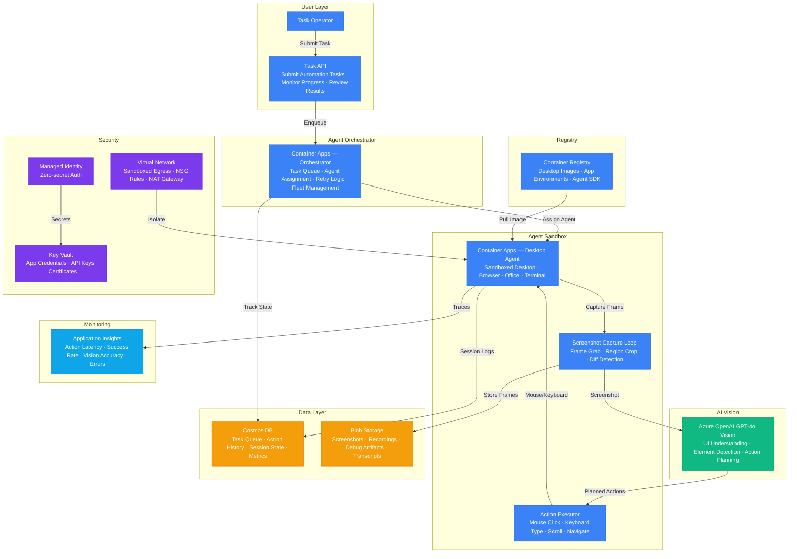

# Architecture — Play 42: Computer Use Agent

## Overview

Vision-based desktop automation platform where an AI agent observes, reasons about, and interacts with desktop applications through screenshots and mouse/keyboard actions. Azure OpenAI GPT-4o Vision analyzes captured UI screenshots to understand application state — identifying buttons, text fields, menus, and content. The agent plans multi-step action sequences (click, type, scroll, navigate) to accomplish user-defined tasks across any desktop application. Azure Container Apps provides sandboxed execution environments with pre-configured desktops (browsers, Office apps, terminals), each running a screenshot capture loop that feeds frames to the vision model. An action executor translates the model's planned actions into actual mouse/keyboard events via automation SDKs. Cosmos DB tracks task state, action history, and session context for multi-turn interactions. The architecture supports fleet-scale orchestration — multiple agents running parallel automation tasks with centralized monitoring and error recovery.

## Architecture Diagram

## Data Flow

1. **Task Submission**: Operator submits an automation task via the Task API — defining the target application, goal description (e.g., "Fill out expense report with these values"), input data, and success criteria → Task stored in Cosmos DB with status `queued` → Orchestrator assigns the task to an available agent container
2. **Desktop Initialization**: Orchestrator pulls the appropriate desktop image from ACR (e.g., browser-only, full Office suite, custom ERP) → Container Apps launches a sandboxed desktop environment with the target application pre-configured → Screenshot capture loop begins — capturing frames at 2fps during active interaction, 0.5fps during idle
3. **Vision Analysis**: Each captured screenshot sent to GPT-4o Vision with the task context → Model identifies current UI state: visible elements (buttons, fields, menus, dialogs), text content, error messages, progress indicators → Model plans the next 1-5 actions: `[{action: "click", target: "Submit button at (450, 320)"}, {action: "type", target: "Name field", text: "John Doe"}]` → Action plan validated against safety rules (no deletion without confirmation, no credential exposure)
4. **Action Execution**: Executor translates planned actions into native mouse/keyboard events via automation SDK (pyautogui, xdotool) → Each action executed with configurable delay (150ms default) for UI responsiveness → Post-action screenshot captured to verify the expected UI state change → If verification fails (UI didn't change as expected), agent retries with adjusted coordinates or alternative approach
5. **Completion & Reporting**: Task marked complete when success criteria met (target element visible, confirmation dialog detected, expected output produced) → Full session recording (screenshot sequence + action log) archived in Blob Storage → Metrics emitted to Application Insights: total actions, success/failure, duration, vision model calls, retry count → Failed tasks queued for human review with full replay capability

## Service Roles

| Service | Layer | Role |
|---------|-------|------|
| Azure OpenAI (GPT-4o Vision) | AI | Screenshot analysis, UI element detection, action planning, multi-step reasoning |
| Container Apps (Orchestrator) | Compute | Task queue management, agent assignment, fleet scaling, retry logic |
| Container Apps (Desktop Agent) | Compute | Sandboxed desktop environment, browser/Office/terminal, screenshot capture, action execution |
| Container Registry | Compute | Pre-configured desktop images, application environments, agent SDK |
| Cosmos DB | Data | Task queue, action history, session state, execution metrics |
| Blob Storage | Storage | Screenshot archive, session recordings, debug artifacts, task transcripts |
| Key Vault | Security | Application credentials, API keys, certificate management |
| Managed Identity | Security | Zero-secret authentication across all Azure services |
| Virtual Network | Security | Agent sandbox isolation, controlled egress, NSG rules |
| Application Insights | Monitoring | Action latency, success rates, vision accuracy, error classification |

## Security Architecture

- **Sandboxed Execution**: Each agent runs in an isolated Container Apps environment with no access to production networks — controlled egress via NAT gateway allows only target application URLs
- **Managed Identity**: All Azure service authentication via managed identity — no API keys stored in agent containers
- **Key Vault**: Target application credentials (login passwords, API tokens) stored in Key Vault with short-lived access policies — agent retrieves credentials at task start, never persists them
- **Network Isolation**: Agent VNET separated from production — NSG rules whitelist only required target application endpoints and Azure service IPs
- **Action Safety Rules**: Agent cannot execute destructive actions (delete, format, shutdown) without explicit task-level permission — safety rules enforced at the executor layer before any mouse/keyboard event
- **Screenshot Redaction**: Sensitive data (passwords, SSNs, credit cards) detected in screenshots via Content Safety and automatically redacted before storage in Blob
- **Session Recording Encryption**: All stored screenshots and recordings encrypted at rest with customer-managed keys — access requires both RBAC role and Key Vault permission
- **Audit Logging**: Every action (click, type, navigate) logged with timestamp, coordinates, and screenshot hash — immutable audit trail in Cosmos DB

## Scaling

| Metric | Dev | Production | Enterprise |
|--------|-----|-----------|------------|
| Concurrent agents | 1-2 | 10-20 | 50-100+ |
| Tasks per day | 5 | 200 | 2,000+ |
| Screenshots analyzed/day | 100 | 10,000 | 100,000+ |
| Actions per task (avg) | 10 | 25 | 50+ |
| Task completion rate | 70% | 90% | 95%+ |
| Vision analysis P95 | 5s | 3s | 2s |
| End-to-end task P95 | 10min | 5min | 3min |
| Screenshot retention | 7 days | 30 days | 90 days |
| Container image variants | 2 | 10 | 25+ |
| Fleet scale-out time | N/A | 2min | 30s |
