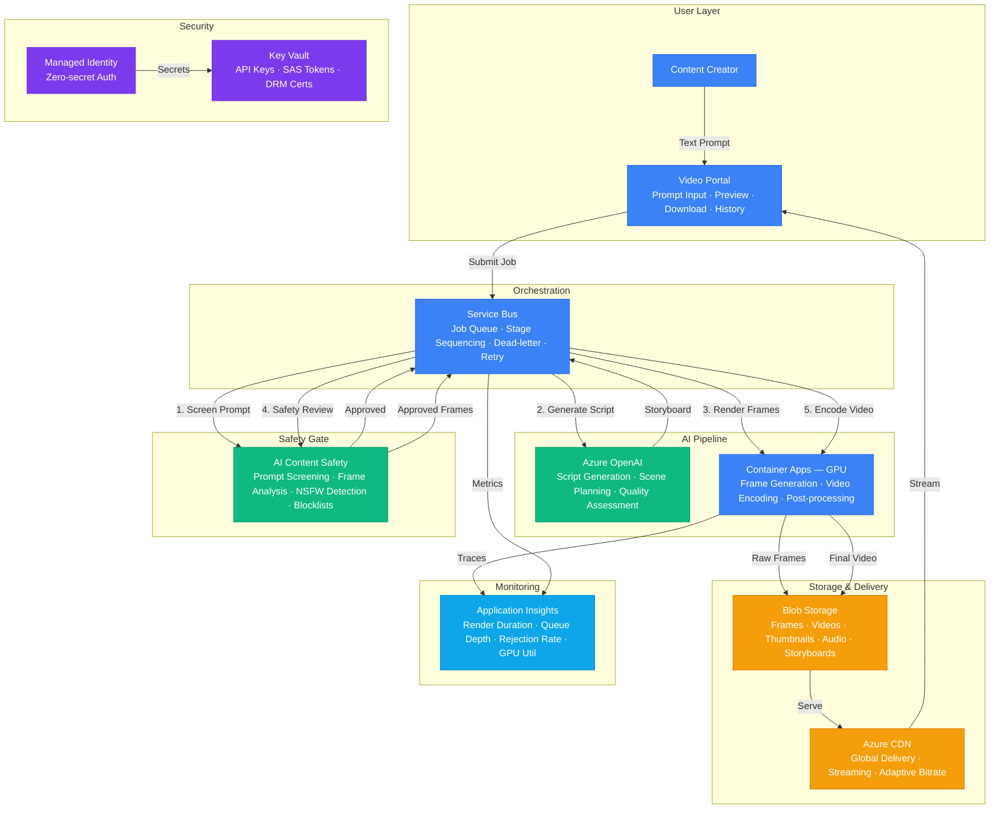

# Architecture — Play 43: AI Video Generation

## Overview

End-to-end AI video generation platform with integrated safety controls and quality assurance. Users submit text prompts describing desired video content — Azure OpenAI generates structured storyboards with scene descriptions, visual styles, camera angles, and transitions. GPU-enabled Container Apps render video frames using AI generation models, assemble sequences, encode audio, and produce final deliverables. Azure AI Content Safety gates every stage — screening prompts for policy violations, analyzing generated frames for harmful visual content, and reviewing final outputs before delivery. Service Bus orchestrates the multi-stage pipeline (script → storyboard → frames → assembly → safety review → encoding → delivery), ensuring reliable processing with dead-letter handling for failed stages. Blob Storage provides tiered asset management with CDN integration for global video delivery. The architecture enforces a "safety-first" principle — content is blocked at the earliest possible stage to minimize wasted GPU compute on policy-violating requests.

## Architecture Diagram

## Data Flow

1. **Prompt Submission & Screening**: Creator submits a text prompt via the Video Portal (e.g., "30-second product demo showing a laptop on a modern desk with ambient lighting") → Prompt enqueued in Service Bus → Content Safety screens the prompt for policy violations (harmful content requests, copyrighted character descriptions, deepfake attempts) → Rejected prompts return immediate feedback with violation category → Approved prompts proceed to script generation
2. **Script & Storyboard Generation**: Azure OpenAI processes the approved prompt → Generates a structured storyboard: scene breakdown (3-10 scenes), per-scene visual description, camera angle, lighting, duration, transition type → Style parameters extracted: color palette, mood, visual quality target, aspect ratio → Storyboard stored in Blob Storage → Creator can preview and edit the storyboard before rendering begins
3. **Frame Rendering**: Service Bus dispatches rendering jobs to GPU Container Apps → Each scene rendered independently as a frame sequence (24-30fps) → AI generation model produces raw frames based on scene descriptions and style parameters → Frames stored in Blob Storage as intermediate assets → Post-processing applied: color grading, stabilization, transition effects between scenes → Audio generated or synchronized based on script timeline
4. **Safety Review**: Generated frames sampled for Content Safety review — keyframes (first/last frame of each scene) plus random 10% of all frames → Visual content analyzed for harmful imagery, NSFW content, violence, and custom blocklist matches → Audio transcripts checked for policy violations → Failed frames trigger scene re-generation with modified parameters → Only fully approved frame sequences proceed to final encoding
5. **Encoding & Delivery**: Approved frame sequences assembled into final video → Encoding pipeline produces multiple renditions: 720p preview, 1080p standard, 4K premium → Thumbnails extracted at 25%, 50%, 75% timeline positions → Watermark applied (optional, configurable per tenant) → Final assets uploaded to Blob Storage → CDN configured for global delivery with adaptive bitrate streaming → Creator notified via Portal with preview and download links

## Service Roles

| Service | Layer | Role |
|---------|-------|------|
| Azure OpenAI | AI | Script generation, storyboard creation, scene planning, quality assessment |
| Container Apps (GPU) | Compute | Frame rendering, video encoding, post-processing, format conversion |
| Azure AI Content Safety | Safety | Prompt screening, frame-level visual moderation, audio safety, blocklists |
| Service Bus | Integration | Pipeline orchestration, job queue, stage sequencing, dead-letter, retry |
| Blob Storage | Storage | Video assets, frames, thumbnails, audio, storyboards, tiered lifecycle |
| Azure CDN | Networking | Global video delivery, adaptive bitrate streaming, low-latency playback |
| Key Vault | Security | API keys, SAS tokens, DRM certificates, watermarking keys |
| Managed Identity | Security | Zero-secret authentication across all Azure services |
| Application Insights | Monitoring | Rendering duration, GPU utilization, queue depth, safety rejection rates |

## Security Architecture

- **Prompt Injection Defense**: All user prompts sanitized and screened through Content Safety before reaching Azure OpenAI — prevents adversarial prompts designed to generate harmful or copyrighted content
- **Multi-Stage Safety Gates**: Content screened at three stages: (1) input prompt, (2) generated frames, (3) final output — harmful content blocked at the earliest stage to minimize wasted GPU compute
- **Managed Identity**: All service-to-service authentication via managed identity — no API keys in rendering containers
- **Key Vault**: DRM certificates, CDN tokens, and watermarking keys stored in Key Vault with RBAC access policies
- **Content Watermarking**: All generated videos include invisible AI-provenance watermark (C2PA standard) — traceable back to the generating request for accountability
- **Copyright Protection**: Prompt screening includes checks for copyrighted character names, brand logos, and celebrity likenesses — blocked before rendering
- **Data Isolation**: Each tenant's video assets stored in separate Blob containers with SAS-based access — no cross-tenant data leakage
- **Audit Trail**: Every generation request logged with prompt, safety scores, rendering parameters, and delivery metadata — immutable in Application Insights

## Scaling

| Metric | Dev | Production | Enterprise |
|--------|-----|-----------|------------|
| Videos generated/day | 10 | 100 | 500+ |
| Max video duration | 30s | 2min | 10min |
| Max resolution | 720p | 1080p | 4K |
| GPU containers | 1 | 4-8 | 16-32 |
| Render time per minute of video | 15min | 8min | 3min |
| Safety review latency | 10s | 5s | 2s |
| Concurrent rendering jobs | 1 | 10 | 50+ |
| Storage (monthly growth) | 5GB | 200GB | 2TB |
| CDN egress/month | 50GB | 500GB | 5TB |
| Pipeline throughput P95 | 30min | 15min | 5min |
