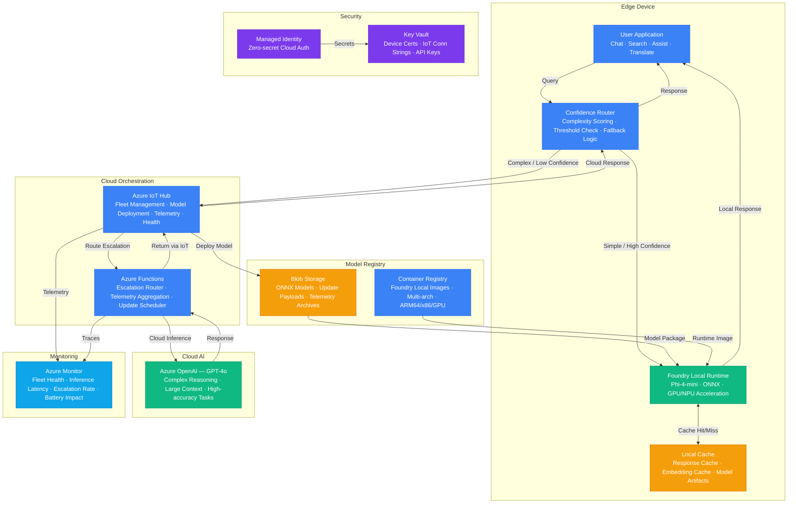

# Architecture — Play 44: Foundry Local On-Device AI

## Overview

Hybrid AI architecture combining on-device inference via Microsoft Foundry Local with intelligent cloud escalation for complex queries. Small language models (Phi-4-mini, Phi-4-multimodal) run directly on edge devices — laptops, tablets, IoT gateways, kiosks — providing sub-100ms inference for common tasks without network dependency. A confidence-based routing layer evaluates each query's complexity: simple questions handled locally with zero cloud cost, while ambiguous or high-stakes queries escalate to Azure OpenAI GPT-4o for superior accuracy. Azure IoT Hub manages the device fleet — deploying model updates, collecting telemetry, monitoring device health, and routing escalation requests. The architecture optimizes for three priorities: (1) low latency through local inference, (2) low cost by minimizing cloud API calls, (3) high availability via offline-capable on-device models with cloud fallback when connectivity returns.

## Architecture Diagram

## Data Flow

1. **Query Classification**: User submits a query via the application (chat, search, assist, translate) → Confidence Router evaluates query complexity using lightweight heuristics: token count, domain vocabulary, reasoning depth indicators (multi-hop questions, calculations, comparisons) → Router assigns a confidence score (0-1) predicting whether the local model can answer accurately → Queries above the threshold (default 0.7) proceed to local inference; below-threshold queries escalate to cloud
2. **Local Inference**: High-confidence queries sent to Foundry Local runtime → Phi-4-mini (or domain-specific fine-tuned SLM) processes the query using on-device GPU/NPU acceleration → Response generated in 50-150ms with zero network latency → Response cached locally keyed by semantic hash for future similar queries → Inference metrics (latency, token count, model version) buffered in local telemetry store for periodic upload
3. **Cloud Escalation**: Low-confidence queries packaged with conversation context and sent to IoT Hub as a device-to-cloud message → Azure Functions picks up the escalation, validates the request, and routes to Azure OpenAI GPT-4o → Cloud model processes the query with full reasoning capabilities and larger context window → Response returned via IoT Hub cloud-to-device messaging → Local cache updated with the cloud response for future similar queries → Escalation event logged with complexity score, cloud latency, and cost
4. **Model Management**: IoT Hub manages the device fleet lifecycle → New model versions (ONNX packages) uploaded to Blob Storage → IoT Hub schedules staged rollouts: 5% canary → 25% early adopters → 100% fleet → Delta updates applied where possible (diff-based ONNX patching) to minimize bandwidth → Device reports model version, inference accuracy, and resource usage → Rollback triggered automatically if error rate exceeds threshold after update
5. **Fleet Telemetry**: Devices batch telemetry every 5 minutes → IoT Hub ingests device health (CPU, memory, battery, disk), inference metrics (latency, accuracy, escalation rate), and model performance data → Azure Monitor aggregates fleet-wide analytics → Dashboards show: local vs. cloud inference ratio, P50/P95 latency by device type, escalation trends, model version distribution → Alerts trigger on anomalies: sudden escalation spike, model accuracy degradation, device health issues

## Service Roles

| Service | Layer | Role |
|---------|-------|------|
| Foundry Local Runtime | Edge AI | On-device inference with Phi-4-mini/SLM, GPU/NPU acceleration, offline-capable |
| Azure OpenAI (GPT-4o) | Cloud AI | Complex query handling, large context reasoning, high-accuracy escalation endpoint |
| Azure IoT Hub | Fleet Management | Device registration, model deployment, telemetry ingestion, escalation routing |
| Azure Functions | Cloud Compute | Escalation routing, telemetry aggregation, model update scheduling, anomaly detection |
| Blob Storage | Storage | Model packages (ONNX/GGUF), update payloads, telemetry archives |
| Container Registry | Compute | Foundry Local runtime images, multi-architecture (ARM64, x86, GPU variants) |
| Key Vault | Security | Device certificates, IoT connection strings, cloud API keys |
| Managed Identity | Security | Zero-secret authentication for cloud services |
| Azure Monitor | Monitoring | Fleet health, inference latency, escalation rates, battery impact, model accuracy |

## Security Architecture

- **Device Attestation**: Each edge device authenticated via X.509 certificates stored in Key Vault — device identity verified before model deployment or cloud escalation access
- **Managed Identity**: Cloud-side services (Functions, Blob, ACR) use managed identity — no API keys in configuration
- **Model Signing**: All model packages signed with a code-signing certificate — Foundry Local runtime verifies signature before loading any model, preventing tampered model injection
- **Encrypted Communication**: Device-to-cloud communication encrypted via TLS 1.2+ through IoT Hub — escalation queries and responses never traverse unencrypted channels
- **Local Data Isolation**: On-device inference data stays on-device — only escalation queries and aggregated telemetry (no PII) leave the device boundary
- **Secure Model Storage**: Model artifacts on-device stored in encrypted storage — protected from extraction even if device is physically compromised
- **Escalation Data Minimization**: Cloud escalation sends only the current query and minimal context — conversation history stays on-device to minimize data exposure
- **Fleet Segmentation**: IoT Hub device groups isolate fleet segments — production devices separated from test/canary groups with different access policies

## Scaling

| Metric | Dev | Production | Enterprise |
|--------|-----|-----------|------------|
| Device fleet size | 5-10 | 1K-10K | 100K+ |
| Local inference latency P95 | 200ms | 100ms | 50ms |
| Cloud escalation rate | 50% | 15-20% | 5-10% |
| Model update frequency | Weekly | Bi-weekly | Monthly |
| Model package size | 2GB | 2GB | 2-4GB |
| Offline capability | Hours | Days | Weeks |
| Telemetry batch interval | 1min | 5min | 15min |
| Fleet rollout duration | Instant | 4 hours | 24 hours |
| Supported device types | 1 | 5 | 15+ |
| Concurrent escalations | 5 | 500 | 10,000+ |
