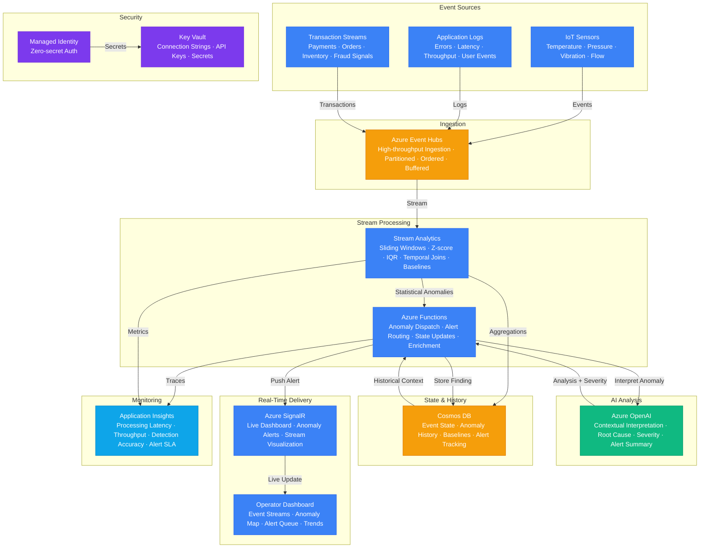

# Architecture — Play 45: Real-Time Event AI

## Overview

Real-time event processing platform with AI-powered anomaly detection and intelligent alerting. Azure Event Hubs ingests high-throughput event streams from IoT sensors, application logs, transaction systems, and telemetry feeds — handling millions of events per second. Azure Stream Analytics performs windowed statistical analysis (sliding windows, tumbling windows, temporal joins) to compute baselines and detect statistical anomalies (Z-score deviations, IQR outliers, sudden trend changes). Detected anomalies escalate to Azure OpenAI for contextual interpretation — the AI model analyzes the anomaly in context of historical patterns, correlates with related events, generates root cause hypotheses, and produces human-readable alert summaries with severity classifications. Cosmos DB maintains event state, anomaly history, and detection baselines with sub-10ms reads for real-time lookups. Azure SignalR Service pushes live updates to operator dashboards — anomaly alerts, event stream visualizations, and system health indicators appear in real-time without polling. The architecture is designed for sub-second end-to-end latency from event ingestion to alert delivery.

## Architecture Diagram

## Data Flow

1. **Event Ingestion**: IoT sensors, application services, and transaction systems emit events continuously → Azure Event Hubs ingests events into partitioned streams — each partition maintains strict ordering → Events buffered with configurable retention (1-7 days) for replay → Consumer groups allow parallel processing: real-time analytics + batch archival + anomaly detection → Throughput auto-scales via throughput units (1 TU = 1MB/s ingress, 2MB/s egress)
2. **Statistical Analysis**: Stream Analytics reads from Event Hubs consumer group → Sliding window queries compute rolling baselines: 5-min averages, 1-hour trends, 24-hour seasonality → Statistical anomaly detection: Z-score deviation (>3σ from baseline), IQR outlier detection, sudden rate changes (>200% spike in 30s window) → Temporal joins correlate events across streams: IoT sensor anomaly + application error within 60s = correlated incident → Baseline aggregations written to Cosmos DB for historical reference → Detected anomalies emitted as structured events to Functions via Event Hub output
3. **AI Interpretation**: Functions receives anomaly events from Stream Analytics → Retrieves historical context from Cosmos DB: similar past anomalies, baseline trends, resolution history → Constructs a contextualized prompt for Azure OpenAI with anomaly data, historical patterns, and domain knowledge → GPT-4o generates: root cause hypothesis (e.g., "Sensor cluster B3 temperature spike correlates with HVAC maintenance window"), severity classification (critical/high/medium/low), recommended actions, and a natural-language alert summary → AI analysis cached in Cosmos DB to avoid re-analysis of recurring patterns
4. **Alert Delivery**: Functions formats the alert with severity, summary, root cause, and recommended actions → High-severity alerts pushed immediately via SignalR to connected operator dashboards → Medium/low severity alerts batched and delivered every 60 seconds → Dashboard displays: live event stream, anomaly heat map, alert queue with AI-generated summaries, trend charts → Operators can acknowledge, escalate, or suppress alerts directly from the dashboard → Alert state tracked in Cosmos DB with full lifecycle (detected → notified → acknowledged → resolved)
5. **Feedback Loop**: Operator feedback on alert accuracy (true positive, false positive, severity adjustment) stored in Cosmos DB → Detection thresholds auto-tuned based on feedback: false positives increase threshold, missed anomalies decrease it → AI prompt templates refined with domain-specific learnings → Monthly baseline recalibration using seasonal patterns → Anomaly detection accuracy tracked in Application Insights

## Service Roles

| Service | Layer | Role |
|---------|-------|------|
| Azure Event Hubs | Ingestion | High-throughput event ingestion, partitioned streams, buffered retention |
| Azure Stream Analytics | Processing | Windowed aggregations, statistical anomaly detection, temporal joins, baselines |
| Azure Functions | Compute | Anomaly dispatch, AI enrichment, alert routing, state management |
| Azure OpenAI | AI | Contextual anomaly interpretation, root cause analysis, severity classification |
| Cosmos DB | Data | Event state, anomaly history, detection baselines, alert lifecycle tracking |
| Azure SignalR Service | Delivery | Real-time dashboard updates, anomaly alerts, WebSocket push notifications |
| Key Vault | Security | Connection strings, API keys, service secrets |
| Managed Identity | Security | Zero-secret authentication across all services |
| Application Insights | Monitoring | Processing latency, throughput metrics, detection accuracy, alert SLA |

## Security Architecture

- **Managed Identity**: Functions, Stream Analytics, and SignalR authenticate to all downstream services via managed identity — no connection strings in code
- **Key Vault**: Event Hub connection strings, Cosmos DB keys, and OpenAI API keys stored in Key Vault with RBAC-based access policies
- **Network Isolation**: Event Hubs and Cosmos DB accessible only via private endpoints in production — no public internet exposure for data plane
- **Event Encryption**: Events encrypted in transit (TLS 1.2+) and at rest (Azure platform encryption) — customer-managed keys for enterprise tier
- **RBAC Access Control**: Operator dashboard access gated by Azure AD — roles: Viewer (read alerts), Operator (acknowledge/suppress), Admin (configure thresholds)
- **Data Retention**: Event data retention configurable per compliance requirements — auto-purge after retention period with audit log
- **Anomaly Data Classification**: Anomaly findings classified by sensitivity — PII-containing anomalies (e.g., fraud with user data) masked before dashboard display
- **Alert Channel Security**: SignalR connections authenticated via Azure AD tokens — no anonymous dashboard access

## Scaling

| Metric | Dev | Production | Enterprise |
|--------|-----|-----------|------------|
| Events ingested/second | 100 | 50,000 | 1,000,000+ |
| Event Hubs throughput units | 1 | 4-8 | 20-50 (Premium PU) |
| Stream Analytics streaming units | 1 | 6-12 | 24-48 |
| Anomaly detection latency P95 | 5s | 1s | 200ms |
| AI interpretation latency P95 | 8s | 3s | 1s |
| End-to-end alert delivery P95 | 15s | 5s | 2s |
| Concurrent dashboard connections | 5 | 200 | 5,000+ |
| Anomalies detected/day | 10 | 500 | 10,000+ |
| Alert suppression window | N/A | 5min | Configurable |
| Historical retention | 7 days | 90 days | 1 year |
