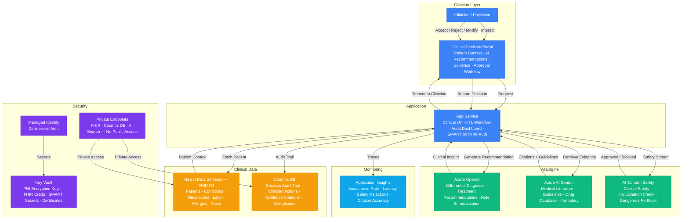

# Play 46 — Healthcare Clinical AI

HIPAA-compliant clinical AI — PHI de-identification with Presidio, ICD-10/CPT medical coding, drug interaction checking grounded in FDA data, patient risk scoring via FHIR, clinical NLP decision support with mandatory disclaimers, and immutable audit trails.

## Architecture

| Component | Azure Service | Purpose |
|-----------|--------------|---------|
| Clinical NLP | Azure OpenAI (GPT-4o, HIPAA-eligible) | Clinical decision support, coding, Q&A |
| De-Identification | Presidio (local) | Strip PHI before any AI processing |
| Patient Data | Azure Health Data Services (FHIR R4) | Patient records, conditions, medications |
| Drug Database | FDA drug interaction DB (grounding) | Evidence-based interaction checking |
| Hosting | Azure Container Apps (private endpoints) | Clinical AI API |
| Secrets | Azure Key Vault (CMK encryption) | API keys, FHIR credentials |
| Audit Trail | Immutable Blob Storage | HIPAA-compliant access logging |



📐 [Full architecture details](architecture.md)

## How It Differs from Related Plays

| Aspect | Play 35 (Compliance Engine) | **Play 46 (Healthcare Clinical AI)** | Play 01 (Enterprise RAG) |
|--------|---------------------------|--------------------------------------|--------------------------|
| Domain | General compliance | **Healthcare / clinical medicine** | Enterprise knowledge |
| Regulation | GDPR, SOC 2, EU AI Act | **HIPAA, BAA, PHI protection** | General data privacy |
| Data | Policy documents | **Patient records (FHIR R4)** | Corporate documents |
| AI Task | Gap detection | **Clinical coding, drug interactions** | Q&A with citations |
| Safety | Compliance scoring | **Clinical safety (0% harmful advice)** | Groundedness |
| De-identification | PII detection | **PHI de-identification (18 HIPAA types)** | PII redaction |

## DevKit Structure

```
46-healthcare-clinical-ai/
├── agent.md                                # Root orchestrator with handoffs
├── .github/
│   ├── copilot-instructions.md             # Domain knowledge (<150 lines)
│   ├── agents/
│   │   ├── builder.agent.md                # Clinical NLP + de-id + FHIR
│   │   ├── reviewer.agent.md               # HIPAA audit + PHI + safety
│   │   └── tuner.agent.md                  # De-id recall + coding + cost
│   ├── prompts/
│   │   ├── deploy.prompt.md                # Deploy HIPAA-compliant pipeline
│   │   ├── test.prompt.md                  # Test with synthetic data
│   │   ├── review.prompt.md                # HIPAA compliance audit
│   │   └── evaluate.prompt.md              # Measure clinical accuracy
│   ├── skills/
│   │   ├── deploy-healthcare-clinical-ai/  # BAA + FHIR + Presidio + private endpoints
│   │   ├── evaluate-healthcare-clinical-ai/# De-id recall, ICD-10, drugs, safety, HIPAA
│   │   └── tune-healthcare-clinical-ai/    # Entity config, prompts, grounding, audit
│   └── instructions/
│       └── healthcare-clinical-ai-patterns.instructions.md
├── config/                                 # TuneKit
│   ├── openai.json                         # Clinical model (temp=0, deterministic)
│   ├── guardrails.json                     # PHI entities, audit rules, safety
│   └── agents.json                         # FHIR config, consent, context
├── infra/                                  # Bicep IaC
│   ├── main.bicep
│   └── parameters.json
└── spec/                                   # SpecKit
    └── fai-manifest.json
```

## Quick Start

```bash
# 1. Deploy HIPAA-compliant infrastructure (verify BAA first!)
/deploy

# 2. Test with synthetic patient data
/test

# 3. Run HIPAA compliance audit
/review

# 4. Measure clinical accuracy
/evaluate
```

## Key Metrics

| Metric | Target | Description |
|--------|--------|-------------|
| PHI Recall | > 98% | PHI entities correctly detected (HIPAA critical) |
| ICD-10 Category Accuracy | > 90% | Correct code category assignment |
| Drug Interaction Detection | > 95% | Known interactions correctly flagged |
| Hallucination Rate | < 1% | Made-up clinical information |
| Harmful Advice Rate | 0% | Clinically dangerous recommendations (non-negotiable) |
| HIPAA Audit Coverage | 100% | All queries logged (de-identified) |

## Estimated Cost

| Service | Dev/mo | Prod/mo | Enterprise/mo |
|---------|--------|---------|---------------|
| Azure OpenAI | $50 | $400 | $1,500 |
| Azure Health Data Services (FHIR) | $30 | $150 | $500 |
| Azure AI Search | $0 | $250 | $800 |
| Azure AI Content Safety | $0 | $60 | $200 |
| Azure App Service | $15 | $80 | $250 |
| Cosmos DB | $5 | $75 | $400 |
| Key Vault | $1 | $10 | $25 |
| Application Insights | $0 | $30 | $100 |
| **Total** | **$101** | **$1,055** | **$3,775** |

> Estimates based on Azure retail pricing. Actual costs vary by region, usage, and enterprise agreements.

💰 [Full cost breakdown](cost.json)

## WAF Alignment

| Pillar | Implementation |
|--------|---------------|
| **Security** | HIPAA BAA, private endpoints, CMK encryption, PHI de-identification |
| **Responsible AI** | Clinical disclaimers, evidence grounding, 0% harmful advice |
| **Reliability** | Deterministic (temp=0), seed=42, reproducible clinical responses |
| **Cost Optimization** | gpt-4o-mini for grounded lookups, local Presidio, FHIR caching |
| **Operational Excellence** | Immutable audit trail, FHIR AuditEvent export, 7-year retention |
| **Performance Efficiency** | Patient context caching, batch FHIR queries |
