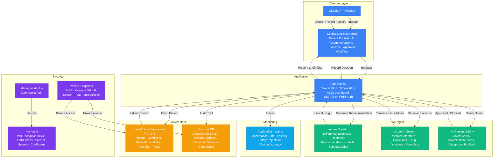

# Architecture — Play 46: Healthcare Clinical AI

## Overview

HIPAA-compliant clinical decision support system with mandatory human-in-the-loop validation for all AI-generated medical recommendations. Clinicians interact through a secure web portal that presents patient context (FHIR R4 records from Azure Health Data Services), AI-powered differential diagnosis suggestions, evidence-based treatment recommendations, and medication interaction alerts. Azure AI Search provides RAG-based retrieval over indexed medical literature, clinical practice guidelines, drug formularies, and institutional protocols — grounding every AI recommendation in published medical evidence with citations. Azure OpenAI generates clinical insights contextualized to the specific patient: lab trends, active conditions, current medications, allergies, and care history. Azure AI Content Safety screens all AI outputs for clinical safety — blocking hallucinated drug dosages, dangerous treatment combinations, and recommendations contradicting known allergies. Every recommendation enters a human-in-the-loop workflow: the clinician reviews, accepts, modifies, or rejects each suggestion, and their decision is immutably recorded in Cosmos DB alongside the AI's original recommendation, evidence citations, and patient context snapshot for full regulatory auditability.

## Architecture Diagram

## Data Flow

1. **Patient Context Loading**: Clinician selects a patient in the Clinical Decision Portal → App Service authenticates via SMART on FHIR and retrieves the patient bundle from Azure Health Data Services: demographics, active conditions (ICD-10), current medications (RxNorm), recent lab results (LOINC), allergies, procedures, and active care plans → Patient context structured into a clinical summary for AI consumption → Sensitive PHI handled entirely within the VNET — never logged to Application Insights
2. **Evidence Retrieval**: Based on the patient's active conditions and the clinician's query (e.g., "Treatment options for Type 2 Diabetes with CKD Stage 3"), App Service queries Azure AI Search → Semantic search over indexed clinical guidelines (UpToDate, institutional protocols), drug databases (FDA labels, formulary), and medical literature → Top-k relevant evidence chunks retrieved with citations (source, publication date, evidence grade) → Evidence grounded in published, peer-reviewed sources — no AI-generated medical claims without citation
3. **AI Recommendation Generation**: App Service constructs a RAG prompt combining: patient context (conditions, labs, medications, allergies), retrieved evidence, and the clinical question → Azure OpenAI generates: differential diagnosis with probability rankings, evidence-based treatment options with pros/cons, medication recommendations with dosage ranges, potential drug interactions, and contraindications based on patient allergies → Response structured as actionable clinical cards — each recommendation linked to its supporting evidence
4. **Safety Screening**: Every AI-generated recommendation screened through Content Safety before display → Clinical safety checks: (a) medication dosages within FDA-approved ranges, (b) no recommendations contradicting documented allergies, (c) drug-drug interaction verification against the patient's active medications, (d) no hallucinated drug names or non-existent treatments → Blocked recommendations logged with the specific safety violation → AI-generated confidence score attached to each recommendation (high/medium/low) to guide clinician attention
5. **Human-in-the-Loop Decision**: Approved recommendations presented to the clinician in the Portal → Each recommendation displayed as a card with: AI suggestion, evidence citations, confidence level, and action buttons (Accept / Modify / Reject) → Clinician reviews and makes a clinical decision → Decision recorded immutably in Cosmos DB: original AI recommendation, clinician's action, modification details (if any), timestamp, clinician ID, patient context snapshot, and evidence references → Accepted recommendations can optionally generate FHIR CarePlan or MedicationRequest resources back to Health Data Services → Audit trail satisfies HIPAA, Joint Commission, and institutional compliance requirements

## Service Roles

| Service | Layer | Role |
|---------|-------|------|
| Azure OpenAI | AI | Clinical reasoning, differential diagnosis, treatment recommendations, note summarization |
| Azure AI Search | AI | Evidence retrieval over medical literature, guidelines, drug databases, formularies |
| Azure AI Content Safety | Safety | Clinical output screening, hallucination detection, dangerous recommendation blocking |
| Azure Health Data Services (FHIR) | Data | Patient records (FHIR R4), clinical data repository, interoperability layer |
| App Service | Compute | Clinical UI, HITL approval workflow, SMART on FHIR auth, audit dashboard |
| Cosmos DB | Data | Immutable decision audit trail, clinician actions, evidence citations, compliance records |
| Key Vault | Security | PHI encryption keys, FHIR credentials, SMART secrets, SSL certificates |
| Managed Identity | Security | Zero-secret authentication across all Azure services |
| Private Endpoints | Security | Network isolation for FHIR, Cosmos DB, and AI Search — no public access |
| Application Insights | Monitoring | Recommendation acceptance rate, response latency, safety rejection metrics |

## Security Architecture

- **HIPAA Compliance**: All PHI handled within Azure's HIPAA-eligible services — BAA (Business Associate Agreement) in place for Health Data Services, Cosmos DB, Key Vault, and App Service
- **Private Endpoints**: FHIR, Cosmos DB, AI Search, and Azure OpenAI accessible only via private endpoints — zero public internet exposure for clinical data
- **PHI Encryption**: Patient data encrypted at rest with customer-managed keys (CMK) stored in Key Vault Premium HSM — double encryption for enterprise tier
- **SMART on FHIR**: Clinician authentication via SMART on FHIR protocol — OAuth 2.0 with Azure AD integration, scoped access tokens, and patient-level consent
- **Managed Identity**: App Service authenticates to all backend services via managed identity — no credentials stored in application configuration
- **Audit Immutability**: Decision audit trail in Cosmos DB uses append-only writes — clinician decisions, AI recommendations, and evidence citations cannot be modified or deleted
- **Data Minimization**: Application Insights traces contain zero PHI — only de-identified metrics (latency, counts, error codes) logged for observability
- **Access Control**: Role-based access: Physician (view/decide), Nurse (view only), Admin (audit reports), IT (system health) — enforced via Azure AD groups
- **Data Residency**: All data stored in a single regulatory-compliant Azure region — no cross-region replication unless explicitly required and approved by compliance team
- **Break-Glass Access**: Emergency access procedure for IT administrators — requires MFA + manager approval + full audit logging of accessed records

## Scaling

| Metric | Dev | Production | Enterprise |
|--------|-----|-----------|------------|
| Concurrent clinicians | 5 | 100 | 1,000+ |
| Patients in FHIR store | 10K | 500K | 5M+ |
| Clinical queries/day | 50 | 5,000 | 50,000+ |
| AI recommendations/day | 50 | 5,000 | 50,000+ |
| Evidence index size | 1GB | 25GB | 100GB+ |
| HITL decisions/day | 30 | 3,000 | 30,000+ |
| Recommendation latency P95 | 8s | 4s | 2s |
| Safety screening latency P95 | 3s | 1s | 500ms |
| Audit retention | 1 year | 7 years | 10 years |
| App Service instances | 1 | 2-4 | 4-8 |
