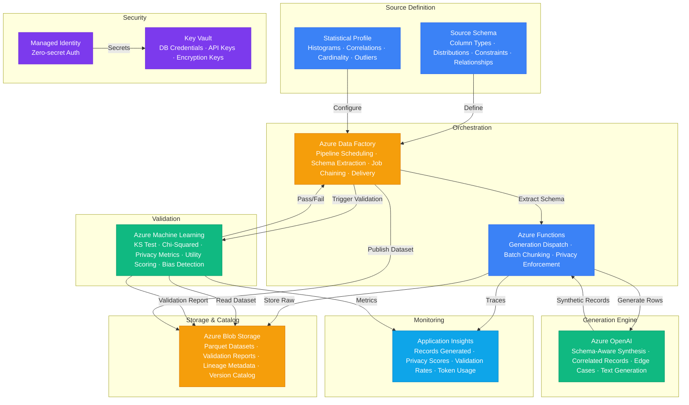

# Architecture — Play 47: Synthetic Data Factory

## Overview

Privacy-preserving synthetic data generation platform that produces statistically faithful datasets without exposing real PII or sensitive records. Data engineers define source schemas and statistical profiles — column distributions, correlations, cardinality constraints, and domain-specific invariants — which the platform uses to generate synthetic records that preserve the statistical properties of the original data while guaranteeing no real records are reproduced. Azure OpenAI handles schema-aware generation: given a table schema, sample distributions, and privacy constraints, GPT-4o generates synthetic rows that match column types, value ranges, inter-column correlations, and referential integrity across related tables. Azure Machine Learning runs the validation pipeline — statistical tests (Kolmogorov-Smirnov, chi-squared, Jensen-Shannon divergence) verify distribution fidelity, privacy metrics (k-anonymity, l-diversity, differential privacy ε) confirm no real records are recoverable, and utility scores measure whether ML models trained on synthetic data achieve comparable performance to those trained on real data. Azure Data Factory orchestrates the end-to-end pipeline: source profiling → schema extraction → generation dispatching → validation → dataset publishing. Generated datasets land in Azure Blob Storage with full lineage metadata — which source schema, generation parameters, privacy scores, and validation results — enabling reproducible, auditable synthetic data for ML training, software testing, analytics demos, and regulatory compliance.

## Architecture Diagram

## Data Flow

1. **Schema Profiling**: Data engineers register source schemas with the platform — table definitions, column types, value ranges, uniqueness constraints, and foreign key relationships → Azure Data Factory connects to source databases (via managed VNET integration) and extracts statistical profiles: histograms per column, correlation matrices, cardinality distributions, null rates, and outlier characteristics → Profiles stored in Blob Storage as JSON metadata — source data never copied or retained, only statistical summaries
2. **Generation Planning**: Functions receives the schema and profile → Plans generation in batches (e.g., 1000 rows per batch) to stay within OpenAI token limits → Constructs schema-aware prompts: column definitions, value distributions to match, inter-column correlations to preserve, and privacy constraints (minimum k-anonymity level, maximum re-identification risk) → For multi-table schemas, plans referential integrity: generate parent table first, then child tables with valid foreign keys → Edge case amplification: if the source profile shows rare classes (<1% prevalence), the generation plan oversamples these to improve downstream ML model fairness
3. **Synthetic Generation**: Functions dispatches batches to Azure OpenAI → GPT-4o generates synthetic rows matching the schema: correct data types, value ranges within distribution bounds, correlated columns (e.g., age-income correlation preserved), and domain-specific invariants (e.g., valid postal codes, realistic date sequences) → For text fields (names, addresses, medical notes), generates contextually appropriate synthetic text that reads naturally but matches no real person → Generated rows streamed to Blob Storage in Parquet format with generation metadata (batch ID, model version, prompt hash)
4. **Privacy Validation**: Azure ML pipeline triggered after generation completes → Statistical fidelity tests: KS test per column (p-value > 0.05 = distribution match), chi-squared for categorical columns, Jensen-Shannon divergence for overall distribution similarity → Privacy tests: k-anonymity verification (each quasi-identifier combination appears ≥ k times), l-diversity check (sensitive attributes have ≥ l distinct values per equivalence class), nearest-neighbor distance to real data (must exceed threshold to prevent record recovery) → Utility test: train a reference ML model on synthetic data and compare accuracy to a model trained on real data — utility score = synthetic accuracy / real accuracy → Validation report stored alongside the dataset with pass/fail per metric
5. **Dataset Publishing**: If all validation tests pass, ADF publishes the dataset to the versioned catalog in Blob Storage → Catalog entry includes: dataset ID, schema version, record count, generation date, privacy scores, utility scores, and lineage reference → Downstream consumers (ML teams, QA teams, analytics) access datasets via storage SDKs or mounted data stores → Failed validations trigger re-generation with adjusted parameters (tighter distribution constraints, higher privacy noise) → Full lineage chain: source schema → generation config → raw output → validation report → published dataset

## Service Roles

| Service | Layer | Role |
|---------|-------|------|
| Azure OpenAI | Generation | Schema-aware synthetic record synthesis, text generation, edge-case amplification |
| Azure Machine Learning | Validation | Statistical fidelity tests, privacy metric evaluation, utility scoring, bias detection |
| Azure Data Factory | Orchestration | Pipeline scheduling, schema extraction, job chaining, dataset delivery |
| Azure Functions | Compute | Generation dispatch, batch chunking, privacy constraint enforcement |
| Azure Blob Storage | Data | Dataset storage (Parquet), validation reports, lineage metadata, version catalog |
| Key Vault | Security | Database credentials, API keys, encryption keys for schema metadata |
| Managed Identity | Security | Zero-secret authentication across all Azure services |
| Application Insights | Monitoring | Records generated, privacy scores, validation pass rates, token consumption |

## Security Architecture

- **No Source Data Retention**: Only statistical profiles extracted from source databases — raw PII never copied, stored, or cached in the synthetic data pipeline
- **Managed Identity**: Functions, ADF, and ML authenticate to all services via managed identity — no credentials in code or configuration
- **Key Vault**: Source database credentials, OpenAI API keys, and storage keys stored in Key Vault with RBAC-based access policies
- **Network Isolation**: ADF connects to source databases via managed VNET integration and private endpoints — no public internet exposure for data plane
- **Privacy by Design**: Every generated dataset must pass k-anonymity, l-diversity, and nearest-neighbor distance checks before publishing — failed datasets are quarantined
- **Encryption**: All datasets encrypted at rest (AES-256) and in transit (TLS 1.2+) — customer-managed keys available for enterprise tier
- **Audit Trail**: Every generation run logged with: who triggered it, source schema reference, generation parameters, privacy scores, and approval status
- **Access Control**: RBAC roles: Data Engineer (configure schemas, trigger runs), Data Consumer (download published datasets), Admin (manage pipeline configuration)

## Scaling

| Metric | Dev | Production | Enterprise |
|--------|-----|-----------|------------|
| Records generated/run | 1,000 | 100,000 | 10,000,000+ |
| Concurrent generation jobs | 1 | 5 | 20 |
| Source schemas registered | 5 | 50 | 500+ |
| Validation pipeline duration | 5min | 15min | 45min |
| Generation throughput | 100 rows/min | 5,000 rows/min | 50,000 rows/min |
| Dataset catalog size | 10 datasets | 200 datasets | 5,000+ datasets |
| Privacy validation pass rate | N/A | >95% | >99% |
| Utility score target | N/A | >0.85 | >0.92 |
| Storage retention | 30 days | 1 year | 3 years |
| Lineage depth | 1 hop | Full chain | Full chain + cross-dataset |
