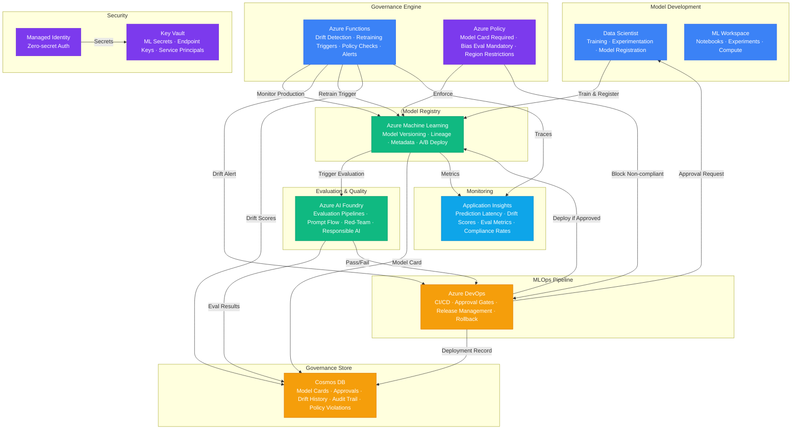

# Architecture — Play 48: AI Model Governance

## Overview

Enterprise AI model lifecycle governance platform with automated drift detection, mandatory approval gates, and full regulatory auditability. The platform manages every model from registration through retirement — enforcing organizational policies at each stage: model cards required before deployment, bias evaluation mandatory, drift monitoring activated on promotion, and champion-challenger evaluation before replacing production models. Azure Machine Learning provides the model registry with versioning, lineage tracking, and deployment orchestration. Azure AI Foundry runs automated evaluation pipelines — groundedness, relevance, coherence, safety, and fairness metrics computed on every model version before promotion eligibility. Azure DevOps implements the MLOps pipeline: CI/CD for model training, evaluation gates that block deployment if metrics fall below thresholds, approval workflows requiring human sign-off for production promotion, and rollback automation if post-deployment drift exceeds tolerance. Azure Functions powers the drift detection engine — scheduled statistical comparisons between training data distributions and live production data, with automatic alerts and retraining triggers when drift exceeds configurable thresholds. Cosmos DB stores the governance metadata: model cards, approval records, evaluation histories, drift scores, policy violations, and compliance audit trails with immutable retention. Azure Policy enforces guardrails at the infrastructure level — policies prevent deploying models without registered model cards, require specific evaluation scores, and restrict deployment to approved regions.

## Architecture Diagram

## Data Flow

1. **Model Registration**: Data scientist trains a model in the Azure ML workspace (notebooks, automated ML, or custom training scripts) → Registers the model in the ML model registry with: model artifacts, training dataset reference, hyperparameters, framework version, and intended use case → Registration triggers a mandatory model card creation workflow — the scientist must document: model purpose, training data description, known limitations, fairness considerations, and performance baselines → Model card stored in Cosmos DB with the model version as the partition key
2. **Automated Evaluation**: Model registration triggers the AI Foundry evaluation pipeline → Standard evaluation suite runs: accuracy metrics (precision, recall, F1), fairness metrics (demographic parity, equalized odds across protected attributes), responsible AI checks (explainability scores, feature importance analysis), and for LLM-based models: groundedness, relevance, coherence, fluency, and safety scores → Red-team evaluation (optional, enterprise tier): adversarial prompts tested for jailbreak resistance, prompt injection vulnerability, and output safety → Evaluation results stored in Cosmos DB with pass/fail status per metric → Models failing any mandatory threshold are blocked from promotion — the data scientist receives detailed feedback on which metrics need improvement
3. **Approval & Deployment**: Models passing evaluation enter the DevOps approval pipeline → Azure Policy checks enforce: model card exists and is complete, bias evaluation passed, intended deployment region is approved, and the model endpoint has monitoring configured → Human approvers (ML lead, compliance officer) review the model card, evaluation results, and intended deployment scope → Approved models deployed via blue-green strategy: new model version deployed alongside the current champion → Champion-challenger evaluation runs for a configurable soak period (24h-7d): both models receive identical traffic, and statistical comparison determines if the challenger outperforms → Promotion or rollback decision recorded in Cosmos DB with full justification
4. **Drift Detection**: Azure Functions runs scheduled drift monitoring on all production models → Data drift: compares the statistical distribution of incoming features against training data profiles using Population Stability Index (PSI) and Kolmogorov-Smirnov tests → Prediction drift: monitors output distribution changes — if the model's prediction distribution shifts significantly from the baseline, it signals concept drift → Performance drift: compares live prediction accuracy against ground truth (when available) using delayed feedback loops → Drift scores stored in Cosmos DB time series → Threshold breaches trigger: (a) alert to model owner, (b) automatic retraining pipeline if auto-retrain is enabled, (c) automatic rollback to previous version if drift exceeds critical threshold
5. **Audit & Compliance**: Every governance action recorded immutably in Cosmos DB: model registrations, evaluation results, approval decisions, deployment events, drift alerts, retraining triggers, and retirement records → Compliance dashboard shows: models in production, last evaluation date, current drift scores, policy compliance status, and upcoming review dates → Regulatory reports auto-generated: model inventory (EU AI Act Article 13), risk assessments, bias evaluations, and incident history → Model retirement workflow: models scheduled for decommission enter a wind-down period with traffic ramp-down before endpoint deletion

## Service Roles

| Service | Layer | Role |
|---------|-------|------|
| Azure Machine Learning | Registry | Model versioning, lineage tracking, deployment orchestration, A/B testing |
| Azure AI Foundry | Evaluation | Automated evaluation pipelines, prompt flow, red-team testing, responsible AI |
| Azure DevOps | MLOps | CI/CD pipelines, approval gates, release management, rollback automation |
| Azure Functions | Governance | Drift detection, retraining triggers, policy enforcement, alerting |
| Azure Policy | Governance | Infrastructure-level guardrails, deployment restrictions, compliance enforcement |
| Cosmos DB | Data | Model cards, approval records, drift history, evaluation results, audit trail |
| Key Vault | Security | ML workspace secrets, endpoint keys, service principal credentials |
| Managed Identity | Security | Zero-secret authentication across all Azure services |
| Application Insights | Monitoring | Prediction latency, drift score trends, evaluation metrics, compliance rates |

## Security Architecture

- **Managed Identity**: ML workspaces, Functions, and DevOps pipelines authenticate to all services via managed identity — no credentials in pipeline definitions
- **Key Vault**: Model endpoint keys, Cosmos DB credentials, and DevOps service principal secrets stored in Key Vault with time-limited access policies
- **RBAC Separation**: Data Scientist (train/register), ML Engineer (deploy/monitor), Compliance Officer (approve/audit), Admin (policy management) — enforced via Azure AD groups
- **Model Artifact Encryption**: Model binaries encrypted at rest in the ML workspace storage with customer-managed keys for enterprise tier
- **Policy as Code**: All governance policies defined as Azure Policy definitions in version control — changes require PR review and approval before assignment
- **Immutable Audit Trail**: Cosmos DB governance records use append-only writes with time-to-live disabled — no modification or deletion of audit records
- **Network Isolation**: ML workspace, Cosmos DB, and AI Foundry accessible only via private endpoints in production — no public internet access to governance data
- **Deployment Approval Chain**: Production deployments require at least two approvers from different organizational roles — preventing single-person deployment decisions

## Scaling

| Metric | Dev | Production | Enterprise |
|--------|-----|-----------|------------|
| Models in registry | 10 | 200 | 2,000+ |
| Models in production | 2 | 30 | 300+ |
| Evaluation runs/day | 5 | 100 | 1,000+ |
| Drift checks/day | 1 | 24 (hourly) | 288 (5-min intervals) |
| Deployments/week | 2 | 20 | 200+ |
| Governance records/month | 100 | 10,000 | 500,000+ |
| Approval workflow SLA | N/A | 4 hours | 1 hour |
| Drift detection latency | 1 hour | 5 min | 1 min |
| Audit retention | 1 year | 5 years | 10 years |
| Concurrent data scientists | 2 | 20 | 200+ |
