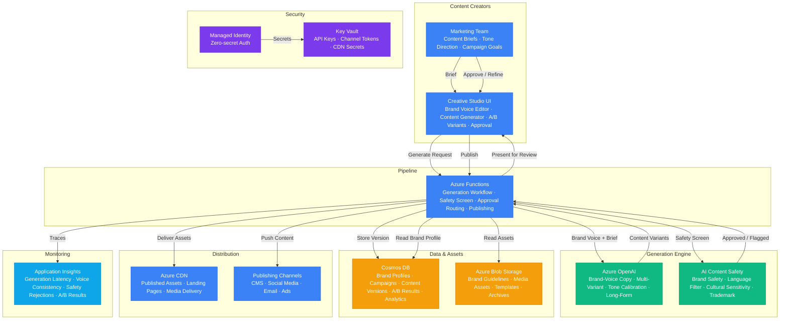

# Architecture — Play 49: Creative AI Studio

## Overview

AI-powered creative content generation platform with brand voice consistency, multi-channel publishing, and content safety screening. Marketing teams and content creators use the studio to produce on-brand copy at scale — blog articles, social media posts, email campaigns, product descriptions, ad copy, and landing page content — all calibrated to the organization's unique brand voice, tone, and style guidelines. Azure OpenAI serves as the generation engine: brand voice profiles (system prompts capturing tone, vocabulary, formatting rules, and do/don't guidelines) ensure every piece of generated content sounds authentically on-brand. The platform supports multi-variant generation — producing 3-10 variations of each content piece for A/B testing — and iterative refinement where creators can request tone adjustments ("make it more casual," "add urgency," "shorter for mobile") without losing brand consistency. Azure AI Content Safety screens all generated content for brand safety: inappropriate language, cultural insensitivity, potential trademark conflicts, and off-brand messaging are flagged before content enters the approval workflow. Azure Functions orchestrates the content pipeline — from generation request through safety screening, human approval, and automated publishing to downstream channels (CMS, social media schedulers, email platforms). Cosmos DB stores brand voice profiles, campaign configurations, content versions with full revision history, A/B test results, and performance analytics. Azure CDN delivers published content assets globally with low latency.

## Architecture Diagram

## Data Flow

1. **Brand Voice Configuration**: Brand managers configure voice profiles in the studio — tone attributes (professional/casual/playful/authoritative), vocabulary preferences (industry jargon vs plain language), formatting rules (sentence length, paragraph structure, CTA patterns), and explicit do/don't guidelines → Voice profiles stored in Cosmos DB as structured JSON with versioning → System prompts generated from profiles: each generation request includes the brand voice as context, ensuring all AI outputs align with organizational identity → Multiple voice profiles supported: different brands, sub-brands, regional adaptations, and channel-specific variations (LinkedIn vs Instagram vs email)
2. **Content Generation**: Creator submits a content brief: topic, target audience, desired length, channel (blog/social/email), and any specific requirements → Functions loads the appropriate brand voice profile from Cosmos DB and brand guidelines from Blob Storage → Constructs a generation prompt combining: brand voice system prompt + content brief + channel-specific formatting rules + any reference examples → Azure OpenAI generates 3-5 content variants with different angles, hooks, and CTAs while maintaining consistent brand voice → For long-form content (blog posts, whitepapers), generation uses structured outlines with section-by-section expansion → All variants stored in Cosmos DB with generation metadata: prompt hash, model version, token count, and brand voice version
3. **Safety & Brand Screening**: Every generated variant passes through Azure AI Content Safety → Standard safety checks: hate speech, violence, self-harm, sexual content → Brand-specific checks via custom blocklists: competitor brand mentions, off-limits topics, legally restricted claims (e.g., health claims for non-medical products), and culturally insensitive phrases for target markets → Trademark screening: detects potential unauthorized use of third-party brand names or slogans → Flagged content returned to the creator with specific violation details — they can request regeneration or manual override with justification → Approved content moves to the review queue with a safety score attached
4. **Review & Refinement**: Approved variants presented to the creator in the studio with side-by-side comparison → Creator can: approve as-is, request tone adjustments ("make the opening more engaging"), modify specific sections, or regenerate with different parameters → Iterative refinement maintains brand voice consistency — adjustment prompts include the original brand voice context → A/B variant selection: creator picks top 2-3 variants for testing → Content version history maintained in Cosmos DB — every revision tracked with who requested it, what changed, and the AI's response
5. **Publishing & Analytics**: Approved content published to downstream channels via Functions → CMS integration: content pushed to WordPress, Contentful, or custom CMS via API → Social media: scheduled posts dispatched to Buffer, Hootsuite, or native APIs → Email: campaign copy delivered to Mailchimp, SendGrid, or marketing automation platforms → Published assets (images, PDFs, landing pages) served via Azure CDN for global low-latency access → Performance data flows back: click rates, engagement metrics, conversion rates stored in Cosmos DB → A/B test results analyzed to identify which variant styles, tones, and CTAs perform best — feeding back into brand voice refinement

## Service Roles

| Service | Layer | Role |
|---------|-------|------|
| Azure OpenAI | Generation | Brand-voice content creation, multi-variant generation, tone calibration |
| Azure AI Content Safety | Safety | Brand safety screening, inappropriate content filtering, trademark detection |
| Azure Functions | Compute | Pipeline orchestration, generation workflow, approval routing, publishing |
| Cosmos DB | Data | Brand voice profiles, campaign configs, content versions, A/B results, analytics |
| Azure Blob Storage | Data | Brand guidelines, media assets, template libraries, content archives |
| Azure CDN | Distribution | Global content delivery, published assets, landing pages |
| Key Vault | Security | API keys, publishing channel tokens, CDN secrets |
| Managed Identity | Security | Zero-secret authentication across all Azure services |
| Application Insights | Monitoring | Generation latency, voice consistency scores, safety rejections, content performance |

## Security Architecture

- **Managed Identity**: Functions authenticates to all backend services via managed identity — no credentials in application code
- **Key Vault**: OpenAI keys, Content Safety credentials, and publishing channel API tokens stored in Key Vault with scoped access policies
- **Brand Asset Protection**: Brand guidelines and style documents stored in Blob Storage with RBAC — only Brand Managers can modify voice profiles
- **Content Versioning**: Every content version immutably stored in Cosmos DB — full revision history with attribution prevents unauthorized content modification
- **Publishing Channel Security**: API tokens for CMS, social media, and email platforms rotated automatically via Key Vault secret rotation
- **CDN Security**: Custom domain with managed SSL, origin shielding, and geo-filtering for region-restricted content
- **Access Control**: Creator (generate/edit), Brand Manager (voice profiles/approve), Publisher (push to channels), Admin (platform configuration)
- **IP Protection**: Generated content never used for model training — Azure OpenAI data processing policy ensures organizational content privacy

## Scaling

| Metric | Dev | Production | Enterprise |
|--------|-----|-----------|------------|
| Content pieces generated/day | 20 | 500 | 10,000+ |
| Brand voice profiles | 1 | 10 | 100+ |
| Active campaigns | 2 | 20 | 200+ |
| A/B variants per piece | 2 | 5 | 10 |
| Publishing channels | 1 | 5 | 20+ |
| Generation latency P95 | 8s | 4s | 2s |
| Safety screening latency P95 | 3s | 1s | 500ms |
| Content approval cycle | N/A | 2 hours | 30 min |
| CDN bandwidth/month | 50GB | 500GB | 2TB+ |
| Content archive retention | 30 days | 1 year | 5 years |
