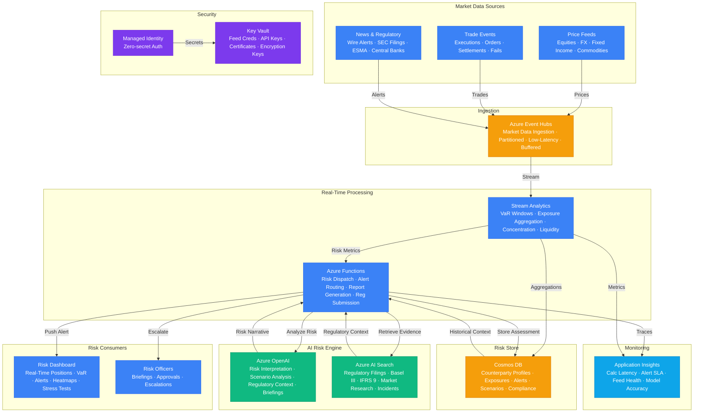

# Play 50 — Financial Risk Intelligence

AI-powered financial risk platform — explainable credit risk scoring (ECOA/GDPR-compliant), three-tier real-time fraud detection (rules→ML→LLM), market sentiment analysis, regulatory reporting (Basel III, SOX), fairness testing across protected attributes, and immutable audit trails.

## Architecture

| Component | Azure Service | Purpose |
|-----------|--------------|---------|
| Risk Analysis | Azure OpenAI (GPT-4o) | Credit scoring, edge-case fraud analysis |
| Fraud ML Model | Local (scikit-learn) | Fast statistical fraud scoring (<10ms) |
| Fraud Rules | Custom engine | Velocity, amount, geo-impossible checks (<1ms) |
| Audit Trail | Azure Cosmos DB | Immutable, SOX-compliant decision logging |
| Event Stream | Azure Event Hubs | Real-time transaction ingestion |
| Risk Engine | Azure Container Apps | Scoring API with auto-scaling |
| Secrets | Azure Key Vault | API keys, connection strings |



📐 [Full architecture details](architecture.md)

## How It Differs from Related Plays

| Aspect | Play 35 (Compliance Engine) | **Play 50 (Financial Risk)** | Play 45 (Event AI) |
|--------|---------------------------|------------------------------|---------------------|
| Domain | General regulatory compliance | **Financial services** | Any event stream |
| Decisions | Compliance gap detection | **Credit approve/decline + fraud block/allow** | Anomaly detection |
| Regulation | GDPR, SOC 2, EU AI Act | **ECOA, GDPR Art.22, Basel III, SOX** | N/A |
| Explainability | Compliance report | **Per-decision factor list (ECOA adverse)** | Alert reason |
| Fairness | General bias testing | **Protected attribute testing (4/5 rule)** | N/A |
| Latency | Batch analysis | **< 100ms real-time (fraud rules+ML)** | < 500ms streaming |
| Audit | Compliance trail | **7-year immutable audit (SOX)** | Event logs |

## DevKit Structure

```
50-financial-risk-intelligence/
├── agent.md                                    # Root orchestrator with handoffs
├── .github/
│   ├── copilot-instructions.md                 # Domain knowledge (<150 lines)
│   ├── agents/
│   │   ├── builder.agent.md                    # Credit scoring + fraud + sentiment
│   │   ├── reviewer.agent.md                   # Explainability + bias + compliance
│   │   └── tuner.agent.md                      # Thresholds + fairness + cost
│   ├── prompts/
│   │   ├── deploy.prompt.md                    # Deploy risk engine
│   │   ├── test.prompt.md                      # Test scoring + fraud scenarios
│   │   ├── review.prompt.md                    # Regulatory audit
│   │   └── evaluate.prompt.md                  # Accuracy + fairness metrics
│   ├── skills/
│   │   ├── deploy-financial-risk-intelligence/ # Three-tier fraud + credit + audit
│   │   ├── evaluate-financial-risk-intelligence/ # AUC-ROC, recall, fairness, compliance
│   │   └── tune-financial-risk-intelligence/   # Thresholds, fairness, explainability
│   └── instructions/
│       └── financial-risk-intelligence-patterns.instructions.md
├── config/                                     # TuneKit
│   ├── openai.json                             # Risk model (temp=0, seed=42)
│   ├── guardrails.json                         # Fraud thresholds, fairness, audit
│   └── agents.json                             # Audit retention, regulatory rules
├── infra/                                      # Bicep IaC
│   ├── main.bicep
│   └── parameters.json
└── spec/                                       # SpecKit
    └── fai-manifest.json
```

## Quick Start

```bash
# 1. Deploy risk engine infrastructure
/deploy

# 2. Test credit scoring + fraud detection scenarios
/test

# 3. Run regulatory compliance audit
/review

# 4. Measure accuracy + fairness
/evaluate
```

## Key Metrics

| Metric | Target | Description |
|--------|--------|-------------|
| Credit AUC-ROC | > 0.80 | Score discriminative power |
| Fraud Recall | > 95% | True fraud detected |
| Fraud FPR | < 2% | Legitimate transactions blocked |
| Disparate Impact | > 0.80 | Fair lending 4/5 rule compliance |
| Adverse Action Notice | 100% | ECOA mandatory on declines |
| Fraud Detection Latency | < 100ms | Rules + ML tiers combined |

## Estimated Cost

| Service | Dev/mo | Prod/mo | Enterprise/mo |
|---------|--------|---------|---------------|
| Azure OpenAI | $60 | $600 | $2,200 |
| Azure AI Search | $0 | $250 | $800 |
| Cosmos DB | $5 | $200 | $700 |
| Azure Event Hubs | $12 | $90 | $1,200 |
| Azure Functions | $0 | $200 | $600 |
| Azure Stream Analytics | $25 | $150 | $600 |
| Key Vault | $1 | $10 | $25 |
| Application Insights | $0 | $40 | $120 |
| **Total** | **$103** | **$1,540** | **$6,245** |

> Estimates based on Azure retail pricing. Actual costs vary by region, usage, and enterprise agreements.

💰 [Full cost breakdown](cost.json)

## WAF Alignment

| Pillar | Implementation |
|--------|---------------|
| **Responsible AI** | Explainable scoring, fairness testing, ECOA adverse action notices |
| **Security** | Immutable Cosmos DB audit trail, no raw PII in logs, Key Vault |
| **Reliability** | Three-tier fraud (rules→ML→LLM), deterministic scoring (temp=0, seed=42) |
| **Cost Optimization** | LLM only for uncertain zone (<10%), local ML model, rule pre-screening |
| **Operational Excellence** | SOX audit trail, Basel III model cards, weekly fairness testing |
| **Performance Efficiency** | <1ms rules + <10ms ML = <100ms avg fraud decision |
