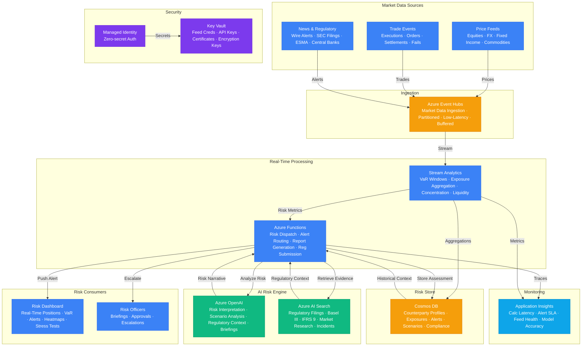

# Architecture — Play 50: Financial Risk Intelligence

## Overview

AI-powered financial risk analysis platform with real-time market monitoring, regulatory-grounded risk assessments, and automated alert escalation for trading desks and risk management teams. The platform ingests real-time market data — price feeds, trade executions, order book updates, news wires, and regulatory announcements — through Azure Event Hubs, processing millions of events per second. Azure Stream Analytics performs real-time risk aggregation: windowed Value-at-Risk (VaR) calculations, position concentration monitoring, counterparty exposure tracking, and liquidity threshold detection using sliding and tumbling windows. When risk metrics breach configurable thresholds, Azure Functions dispatches analysis to Azure OpenAI — the AI model interprets the risk event in context of regulatory frameworks (Basel III, IFRS 9), historical precedents, counterparty profiles, and current market conditions, generating detailed risk narratives with severity assessments and recommended actions. Azure AI Search provides RAG-based retrieval over indexed regulatory filings (SEC 10-K, ESMA reports), risk frameworks, market research, and historical incident databases — grounding every AI-generated risk assessment in published financial evidence with citations. Cosmos DB stores the risk intelligence: counterparty profiles, exposure calculations, alert histories, scenario results, and regulatory compliance records with sub-10ms reads for trading-floor latency requirements. The platform supports stress testing scenarios — users define hypothetical market shocks and the system projects portfolio impact with AI-generated commentary on cascading risks and mitigation strategies.

## Architecture Diagram

## Data Flow

1. **Market Data Ingestion**: Real-time market data feeds stream into Azure Event Hubs — price ticks (equities, FX, fixed income, commodities), trade execution reports, order book snapshots, settlement notifications, and trade fails → News wire services and regulatory announcement feeds (SEC EDGAR, ESMA publications, central bank communications) also ingested as structured events → Event Hubs partitions by asset class and counterparty for parallel processing → Data buffered with 7-day retention for replay and audit → Consumer groups enable parallel consumption: real-time risk engine + batch analytics + compliance archive
2. **Real-Time Risk Aggregation**: Stream Analytics reads from Event Hubs and performs windowed risk calculations → Sliding window VaR: computes portfolio Value-at-Risk using 5-minute, 1-hour, and 1-day windows with configurable confidence levels (95%, 99%) → Position concentration: tumbling windows detect when single-name, sector, or geographic exposure exceeds predefined thresholds → Counterparty exposure: tracks aggregated exposure per counterparty in real-time, including netting agreements and collateral offsets → Liquidity monitoring: detects bid-ask spread widening, volume drops, and market depth deterioration that signal liquidity risk → Aggregated risk metrics written to Cosmos DB and threshold breaches emitted to Functions for AI analysis
3. **AI Risk Interpretation**: Functions receives threshold breach events from Stream Analytics → Loads counterparty profile, historical exposure trends, and relevant regulatory context from Cosmos DB → Queries Azure AI Search for: applicable regulatory frameworks (Basel III capital requirements, IFRS 9 expected credit loss rules), similar historical incidents (e.g., past counterparty defaults, market stress events), and current market research relevant to the asset class → Constructs a RAG prompt combining: risk event data, regulatory context, historical precedents, and counterparty profile → Azure OpenAI generates a risk narrative: root cause analysis, regulatory implications, severity assessment (critical/high/medium/low), potential cascade risks, and recommended mitigation actions with citations to regulatory sources → Risk assessment stored in Cosmos DB with full evidence chain
4. **Alert Escalation & Briefing**: Risk assessments classified by severity and routed accordingly → Critical: immediate push notification to the risk officer and trading desk via WebSocket dashboard + SMS/email fallback → High: 15-minute batched alert with AI-generated risk briefing summarizing multiple related alerts → Medium/Low: included in daily risk report with trend analysis → Risk officers can: acknowledge alerts, override AI severity assessments (with justification), trigger stress test scenarios, or escalate to senior management → Stress testing: risk officer defines hypothetical shocks (e.g., "interest rates +200bps", "counterparty X default", "oil price -30%") → system projects portfolio impact using current positions and AI-generated commentary on cascading second-order effects
5. **Regulatory Compliance**: All risk assessments, threshold breaches, and officer actions immutably recorded in Cosmos DB → Regulatory reports auto-generated: daily VaR reports, counterparty exposure summaries, large exposure notifications, and stress test results in regulatory submission formats → Basel III compliance: capital adequacy ratios calculated in real-time, with AI interpretation of shortfalls and remediation options → IFRS 9: expected credit loss calculations updated on every counterparty credit event, with AI-generated loss provision narratives for financial statements → Full audit trail: who was alerted, when they acknowledged, what action was taken, and regulatory submission timestamps

## Service Roles

| Service | Layer | Role |
|---------|-------|------|
| Azure OpenAI | AI | Risk interpretation, scenario analysis, regulatory context, executive briefings |
| Azure AI Search | AI | Regulatory filing retrieval, framework search, historical incident lookup |
| Azure Event Hubs | Ingestion | Market data feeds, trade events, news wires, regulatory announcements |
| Azure Stream Analytics | Processing | Real-time VaR, exposure aggregation, concentration monitoring, liquidity detection |
| Azure Functions | Compute | Risk dispatch, alert routing, report generation, regulatory submission |
| Cosmos DB | Data | Counterparty profiles, exposures, alert history, scenario results, compliance records |
| Key Vault | Security | Market feed credentials, API keys, regulatory certificates, encryption keys |
| Managed Identity | Security | Zero-secret authentication across all Azure services |
| Application Insights | Monitoring | Calculation latency, alert delivery SLA, feed health, model accuracy |

## Security Architecture

- **Financial-Grade Encryption**: All financial data encrypted at rest with customer-managed keys (HSM-backed) and in transit with TLS 1.3 — meets SOC 2 Type II and PCI DSS requirements
- **Managed Identity**: Functions, Stream Analytics, and all compute authenticate to data services via managed identity — no credentials in code or configuration
- **Key Vault Premium HSM**: Market data feed credentials, trading system API keys, and regulatory submission certificates stored in HSM-backed Key Vault with time-limited access
- **Network Isolation**: Event Hubs, Cosmos DB, AI Search, and Azure OpenAI accessible only via private endpoints — zero public internet exposure for financial data
- **RBAC Separation**: Trader (view positions), Risk Analyst (view/analyze), Risk Officer (approve/escalate/override), Compliance (audit/report), Admin (system configuration)
- **Data Residency**: All financial data stored in a single regulatory-compliant region — no cross-border data transfer without explicit compliance approval
- **Immutable Audit**: Cosmos DB risk records use append-only writes with no TTL — regulatory retention requirements (7+ years) enforced at the storage level
- **Market Data Security**: Price feed connections encrypted end-to-end with dedicated VNET peering to exchange data centers where supported
- **Break-Glass Procedure**: Emergency risk override requires dual approval (Risk Officer + Compliance) with full audit logging and post-incident review

## Scaling

| Metric | Dev | Production | Enterprise |
|--------|-----|-----------|------------|
| Market events/second | 100 | 100,000 | 5,000,000+ |
| Event Hubs throughput units | 1 | 4-8 | 20-50 (Premium PU) |
| Streaming Analytics SU | 1 | 6-12 | 24-48 |
| VaR calculation latency P95 | 10s | 1s | 200ms |
| AI risk analysis latency P95 | 10s | 4s | 1.5s |
| Risk assessments/day | 10 | 500 | 10,000+ |
| Counterparties monitored | 20 | 500 | 10,000+ |
| Stress test scenarios/day | 1 | 10 | 100+ |
| Regulatory reports/month | 1 | 30 | 200+ |
| Audit retention | 1 year | 7 years | 10 years |
