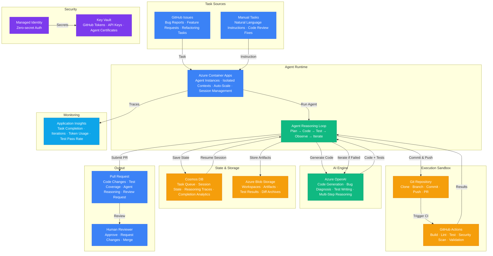

# Play 51 — Autonomous Coding Agent

Autonomous issue-to-PR pipeline — analyzes GitHub issues, indexes codebase, creates implementation plans, generates multi-file code changes, auto-generates tests, self-heals failing CI, and creates PRs with full descriptions. Human-in-the-loop approval gates with optional auto-merge for small bug fixes.

## Architecture

| Component | Technology | Purpose |
|-----------|-----------|---------|
| Code Generation | Azure OpenAI (GPT-4o) | Implementation, test generation, self-healing |
| Codebase Index | Custom (imports/exports/structure) | Understand repo before coding |
| GitHub Integration | GitHub API + webhooks | Issue reading, branch/PR creation |
| Agent Runtime | Azure Container Apps | Pipeline orchestration |
| CI Integration | GitHub Actions | Test execution, lint verification |
| Secrets | Azure Key Vault | GitHub PAT, OpenAI key |



📐 [Full architecture details](architecture.md)

## How It Differs from Related Plays

| Aspect | Play 24 (Code Review) | **Play 51 (Autonomous Coding)** | Play 37 (AI DevOps) |
|--------|----------------------|--------------------------------|---------------------|
| Direction | Reviews existing code | **Generates new code from issues** | Incident response |
| Input | Pull request diff | **GitHub issue description** | Alert/incident |
| Output | Review comments | **Complete PR (code + tests + description)** | Runbook execution |
| Trigger | PR created | **Issue labeled `auto-fix`** | Alert fired |
| Scope | Read-only analysis | **Write: creates branches, commits, PRs** | Remediation commands |
| Testing | Reviews test quality | **Generates tests for changed code** | Verifies resolution |

## DevKit Structure

```
51-autonomous-coding-agent/
├── agent.md                                  # Root orchestrator with handoffs
├── .github/
│   ├── copilot-instructions.md               # Domain knowledge (<150 lines)
│   ├── agents/
│   │   ├── builder.agent.md                  # Issue→plan→code→test→PR pipeline
│   │   ├── reviewer.agent.md                 # Code quality, test coverage, scope
│   │   └── tuner.agent.md                    # Plan accuracy, iterations, cost
│   ├── prompts/
│   │   ├── deploy.prompt.md                  # Deploy agent + GitHub webhook
│   │   ├── test.prompt.md                    # Resolve sample issue end-to-end
│   │   ├── review.prompt.md                  # Audit code quality + scope
│   │   └── evaluate.prompt.md               # Measure resolution rate + cost
│   ├── skills/
│   │   ├── deploy-autonomous-coding-agent/   # Pipeline + codebase index + webhook
│   │   ├── evaluate-autonomous-coding-agent/ # Resolution, quality, tests, PRs, cost
│   │   └── tune-autonomous-coding-agent/     # Model per task, scope, auto-merge
│   └── instructions/
│       └── autonomous-coding-agent-patterns.instructions.md
├── config/                                   # TuneKit
│   ├── openai.json                           # Model per task (code=gpt-4o, tests=mini)
│   ├── guardrails.json                       # Max files, scope, quality gates
│   └── agents.json                           # Auto-merge, indexing, branch naming
├── infra/                                    # Bicep IaC
│   ├── main.bicep
│   └── parameters.json
└── spec/                                     # SpecKit
    └── fai-manifest.json
```

## Quick Start

```bash
# 1. Deploy agent + configure GitHub webhook
/deploy

# 2. Resolve a sample issue end-to-end
/test

# 3. Audit code quality and scope
/review

# 4. Measure resolution rate and cost
/evaluate
```

## Key Metrics

| Metric | Target | Description |
|--------|--------|-------------|
| Resolution Rate | > 70% | Issues fully resolved to merged PR |
| Code Compiles | > 95% | Generated code passes linter |
| Test Generated | > 90% | Tests created for changed code |
| PR Acceptance | > 60% | PRs approved by human reviewer |
| Avg Iterations | < 2.5 | Self-healing cycles |
| Cost per PR | < $1.00 | API + compute cost |

## Estimated Cost

| Service | Dev/mo | Prod/mo | Enterprise/mo |
|---------|--------|---------|---------------|
| Azure OpenAI | $80 | $700 | $2,500 |
| GitHub Actions | $0 | $80 | $300 |
| Azure Container Apps | $10 | $100 | $400 |
| Azure Blob Storage | $5 | $30 | $100 |
| Cosmos DB | $5 | $75 | $350 |
| Key Vault | $1 | $5 | $15 |
| Application Insights | $0 | $30 | $100 |
| **Total** | **$101** | **$1,020** | **$3,765** |

> Estimates based on Azure retail pricing. Actual costs vary by region, usage, and enterprise agreements.

💰 [Full cost breakdown](cost.json)

## WAF Alignment

| Pillar | Implementation |
|--------|---------------|
| **Reliability** | Self-healing CI (3 attempts), existing test preservation, scope guards |
| **Security** | GitHub PAT in Key Vault, no credential in code, scope-limited PRs |
| **Cost Optimization** | gpt-4o-mini for tests+PR descriptions, cached codebase index |
| **Operational Excellence** | Webhook automation, PR labels, auto-assignment to reviewer |
| **Performance Efficiency** | One file at a time with verification, parallel test execution |
| **Responsible AI** | Max 10 files/PR scope guard, human approval before merge |
