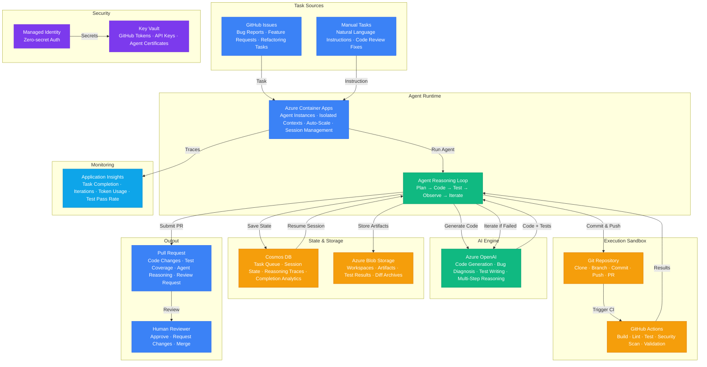

# Architecture — Play 51: Autonomous Coding Agent

## Overview

Self-directed AI coding agent that autonomously completes software engineering tasks — from issue description to tested, reviewed pull request — with minimal human intervention. The agent receives task descriptions (GitHub issues, Jira tickets, or natural language instructions), decomposes them into implementation steps, writes code, generates tests, runs the test suite in a sandboxed environment, iterates on failures, and submits a pull request with a detailed description of changes made and reasoning applied. Azure OpenAI powers the reasoning engine: GPT-4o performs multi-step agentic loops with tool-use capabilities — reading repository files, searching codebases, writing code, analyzing test output, and deciding next actions based on feedback. Azure Container Apps hosts the agent runtime — each task runs in an isolated container with the repository cloned, dependencies installed, and a full development environment available. GitHub Actions provides the execution sandbox: agent-generated code runs through the project's existing CI/CD pipeline — linting, building, testing, and security scanning — in an isolated environment that prevents unintended side effects. The agent observes test results, build errors, and lint warnings, then iterates: fixing failures, adjusting code, and re-running validation until all checks pass or the iteration budget is exhausted. Cosmos DB manages task state: the task queue, agent session history, reasoning traces (every thought-action-observation step), and completion analytics. The platform enforces safety guardrails — file modification scope limits, prohibited operations (no credential access, no production deployment), maximum iteration caps, and mandatory human review before merge.

## Architecture Diagram

## Data Flow

1. **Task Intake**: A new GitHub issue is labeled "agent-task" or a developer submits a natural language instruction via the agent API → Container Apps picks up the task from the queue in Cosmos DB → Agent provisions an isolated execution context: clones the target repository, installs dependencies, and creates a feature branch → Task metadata recorded: repository, branch, issue reference, requester, priority, and iteration budget (max reasoning loops allowed)
2. **Planning & Decomposition**: The agent reads the task description, relevant code files, existing tests, and project documentation → Azure OpenAI performs task decomposition: breaks the task into sequential implementation steps (e.g., "1. Add data model, 2. Create API endpoint, 3. Write unit tests, 4. Update documentation") → For each step, the agent identifies: which files to modify, what changes are needed, and what tests will verify correctness → Plan stored in Cosmos DB as the session's reasoning trace — every thought-action-observation triple is recorded for auditability
3. **Code Generation & Iteration**: For each planned step, the agent generates code using Azure OpenAI → The agent reads relevant source files, understands the existing code patterns (naming conventions, architectural patterns, framework usage), and generates code that fits naturally into the codebase → Generated code committed to the feature branch → Agent triggers the project's CI pipeline via GitHub Actions: linting, compilation/build, unit tests, integration tests, and security scanning → Agent observes CI results: if tests pass, moves to the next step; if tests fail, reads error output, diagnoses the issue, generates a fix, and re-runs CI → Iteration continues until: all steps complete and CI passes, or the iteration budget (e.g., 10 loops per step) is exhausted → Failed tasks escalated to a human developer with the agent's diagnosis and partial progress
4. **Test Validation**: The agent generates tests alongside implementation code — unit tests for new functions, integration tests for API endpoints, and regression tests for bug fixes → Tests follow the project's existing testing patterns (framework, directory structure, naming conventions) → CI pipeline runs the full test suite: existing tests must not regress, and new tests must pass → Code coverage metrics tracked: the agent aims for meaningful coverage of new code paths, not arbitrary coverage percentages → If the agent's changes break existing tests, it analyzes the failure, determines if the breakage is expected (intentional behavior change) or a bug in its implementation, and fixes accordingly
5. **Pull Request & Review**: Once all CI checks pass, the agent creates a pull request → PR description includes: summary of changes, files modified, reasoning for key decisions, test coverage report, and a link to the original issue → The agent adds inline comments on non-obvious code decisions to help the reviewer → PR assigned to the appropriate reviewer(s) based on CODEOWNERS or configurable routing rules → Human reviewer can: approve and merge, request changes (agent receives feedback and iterates), or reject with explanation → Reviewer feedback stored in Cosmos DB to improve future agent performance → Completion analytics tracked: task type, iteration count, token consumption, time to completion, and reviewer satisfaction

## Service Roles

| Service | Layer | Role |
|---------|-------|------|
| Azure OpenAI | AI | Code generation, bug diagnosis, test writing, multi-step agentic reasoning |
| Azure Container Apps | Compute | Agent runtime hosting, isolated execution contexts, session management |
| GitHub Actions | DevOps | CI/CD sandbox for build, lint, test, security scan validation |
| Cosmos DB | Data | Task queue, session state, reasoning traces, completion analytics |
| Azure Blob Storage | Data | Repository workspaces, build artifacts, test results, diff archives |
| Key Vault | Security | GitHub tokens, API keys, agent authentication certificates |
| Managed Identity | Security | Zero-secret authentication across all Azure services |
| Application Insights | Monitoring | Task completion rate, iteration count, token usage, test pass rate |

## Security Architecture

- **Sandboxed Execution**: Agent-generated code runs only in isolated GitHub Actions runners — no access to production systems, databases, or internal networks
- **Scoped Repository Access**: GitHub App token with minimum required permissions — contents:write for code, pull_requests:write for PRs, actions:read for CI results — no admin, settings, or secrets access
- **File Modification Limits**: Configurable allowlist/blocklist for file paths — agent cannot modify CI/CD configs, security policies, deployment scripts, or credential files
- **Iteration Budget**: Maximum reasoning loops enforced per task and per step — prevents runaway token consumption and infinite retry loops
- **Managed Identity**: Container Apps authenticates to Cosmos DB, Blob Storage, and Key Vault via managed identity — no credentials in agent code
- **Key Vault**: GitHub tokens, OpenAI API keys, and agent certificates stored in Key Vault with automatic rotation
- **No Credential Access**: Agent explicitly blocked from accessing secrets, environment variables containing credentials, and Key Vault in the execution context — it works with code only
- **Human-in-the-Loop**: All agent-generated code requires human review and approval before merge — no direct commits to protected branches
- **Audit Trail**: Every agent action (file read, code generation, test execution, PR creation) logged in Cosmos DB with full reasoning traces for post-incident analysis
- **Network Isolation**: Container Apps runtime runs in a managed VNET — agent can access GitHub and Azure services only, no arbitrary internet access

## Scaling

| Metric | Dev | Production | Enterprise |
|--------|-----|-----------|------------|
| Concurrent agent instances | 1 | 5 | 20+ |
| Tasks completed/day | 3 | 30 | 300+ |
| Avg iterations per task | 5 | 8 | 8-12 |
| Avg tokens per task | 20K | 50K | 80K |
| Task completion rate | N/A | >75% | >85% |
| CI runs per task | 2 | 4 | 6 |
| PR merge rate (human-approved) | N/A | >60% | >70% |
| Time to PR (median) | 30min | 15min | 10min |
| Reasoning trace retention | 7 days | 90 days | 1 year |
| Supported repositories | 1 | 10 | 100+ |
