# Play 52 — AI API Gateway V2

Intelligent AI API gateway — multi-provider routing (Azure OpenAI, Anthropic, Google) with priority-based failover, semantic caching via Redis (embedding similarity), circuit breakers, complexity-based model routing (simple→mini, complex→4o), per-consumer token metering, rate limiting tiers, and cost attribution dashboards.

## Architecture

```mermaid
graph TB
    subgraph API Consumers
        WebApp[Web Applications<br/>SPA · Server-Side · Mobile BFF]
        Partners[Partner APIs<br/>B2B Integration · Third-Party Apps]
        Internal[Internal Services<br/>Microservices · Batch Jobs · Agents]
    end

    subgraph Gateway Layer
        APIM[Azure API Management<br/>Rate Limiting · Routing · Auth · Transformation]
        Policies[Gateway Policies<br/>Complexity Detection · Model Selection · Quota Check]
    end

    subgraph Caching Layer
        Redis[Azure Cache for Redis<br/>Semantic Cache · Rate Counters · Circuit Breaker]
        Embeddings[Embedding Index<br/>Vector Similarity · 0.95 Threshold · TTL Management]
    end

    subgraph AI Backend Pool
        GPT4o[Azure OpenAI GPT-4o<br/>Complex Reasoning · Code Gen · Analysis]
        GPT4oMini[Azure OpenAI GPT-4o-mini<br/>Classification · Extraction · FAQ]
        EmbedModel[Embedding Model<br/>text-embedding-3-large · Cache Key Generation]
    end

    subgraph Configuration
        AppConfig[App Configuration<br/>Routing Rules · Rate Limits · Feature Flags · Cache TTL]
    end

    subgraph Analytics & Audit
        CosmosDB[Cosmos DB<br/>Usage Tracking · Cost Attribution · Chargeback · Audit Logs]
    end

    subgraph Security
        KV[Key Vault<br/>API Keys · Subscription Keys · TLS Certs]
        MI[Managed Identity<br/>Zero-secret Auth]
    end

    subgraph Monitoring
        AppInsights[Application Insights<br/>Distributed Tracing · Latency · Cache Hit Ratio]
        Monitor[Azure Monitor<br/>Dashboards · Alerts · Token Consumption · SLA Tracking]
    end

    WebApp -->|API Request| APIM
    Partners -->|API Request| APIM
    Internal -->|API Request| APIM
    APIM -->|Evaluate| Policies
    Policies -->|Check Cache| Redis
    Redis -->|Vector Search| Embeddings
    Embeddings -->|Cache Hit| APIM
    Policies -->|Simple Query| GPT4oMini
    Policies -->|Complex Query| GPT4o
    Policies -->|Generate Key| EmbedModel
    EmbedModel -->|Store| Redis
    GPT4o -->|Response| APIM
    GPT4oMini -->|Response| APIM
    APIM -->|Log Usage| CosmosDB
    AppConfig -->|Hot Reload| Policies
    MI -->|Secrets| KV
    APIM -->|Traces| AppInsights
    AppInsights -->|Metrics| Monitor

    style WebApp fill:#3b82f6,color:#fff,stroke:#2563eb
    style Partners fill:#3b82f6,color:#fff,stroke:#2563eb
    style Internal fill:#3b82f6,color:#fff,stroke:#2563eb
    style APIM fill:#10b981,color:#fff,stroke:#059669
    style Policies fill:#10b981,color:#fff,stroke:#059669
    style Redis fill:#f59e0b,color:#fff,stroke:#d97706
    style Embeddings fill:#f59e0b,color:#fff,stroke:#d97706
    style GPT4o fill:#10b981,color:#fff,stroke:#059669
    style GPT4oMini fill:#10b981,color:#fff,stroke:#059669
    style EmbedModel fill:#10b981,color:#fff,stroke:#059669
    style AppConfig fill:#0ea5e9,color:#fff,stroke:#0284c7
    style CosmosDB fill:#f59e0b,color:#fff,stroke:#d97706
    style KV fill:#7c3aed,color:#fff,stroke:#6d28d9
    style MI fill:#7c3aed,color:#fff,stroke:#6d28d9
    style AppInsights fill:#0ea5e9,color:#fff,stroke:#0284c7
    style Monitor fill:#0ea5e9,color:#fff,stroke:#0284c7
```



> Full architecture details: [`architecture.md`](./architecture.md)

## How It Differs from Related Plays

| Aspect | Play 14 (Cost-Optimized Gateway) | **Play 52 (AI Gateway V2)** |
|--------|----------------------------------|----------------------------|
| Providers | Azure OpenAI only | **Multi-provider (OpenAI + Anthropic + Google)** |
| Caching | Exact-match | **Semantic caching (embedding similarity)** |
| Routing | Cost-based model selection | **Complexity-based + priority failover** |
| Resilience | Basic retry | **Circuit breakers with half-open recovery** |
| Metering | Basic token counting | **Per-consumer with cost attribution** |
| Rate Limiting | Simple RPM | **Tiered (Free/Dev/Pro/Enterprise) + burst** |

## DevKit Structure

```
52-ai-api-gateway-v2/
├── agent.md                              # Root orchestrator with handoffs
├── .github/
│   ├── copilot-instructions.md           # Domain knowledge (<150 lines)
│   ├── agents/
│   │   ├── builder.agent.md              # Gateway + routing + caching
│   │   ├── reviewer.agent.md             # Failover + security + rate limits
│   │   └── tuner.agent.md                # Cache TTL + routing + cost
│   ├── prompts/
│   │   ├── deploy.prompt.md              # Deploy gateway + providers
│   │   ├── test.prompt.md                # Test failover + cache
│   │   ├── review.prompt.md              # Audit security + circuits
│   │   └── evaluate.prompt.md            # Measure cost savings
│   ├── skills/
│   │   ├── deploy-ai-api-gateway-v2/     # APIM + Redis + multi-provider
│   │   ├── evaluate-ai-api-gateway-v2/   # Cache hit, failover, cost, latency
│   │   └── tune-ai-api-gateway-v2/       # Provider priority, cache, circuits
│   └── instructions/
│       └── ai-api-gateway-v2-patterns.instructions.md
├── config/                               # TuneKit
│   ├── openai.json                       # Provider endpoints, model costs
│   ├── guardrails.json                   # Cache, circuit breaker, rate limits
│   └── model-comparison.json             # Cost/quality/latency per provider
├── infra/                                # Bicep IaC
│   ├── main.bicep
│   └── parameters.json
└── spec/                                 # SpecKit
    └── fai-manifest.json
```

## Quick Start

```bash
# 1. Deploy gateway with providers
/deploy

# 2. Test failover and caching
/test

# 3. Audit security and circuit breakers
/review

# 4. Measure cost savings and cache hit rate
/evaluate
```

## Key Metrics

| Metric | Target | Description |
|--------|--------|-------------|
| Failover Success | > 99% | Automatic provider switch on failure |
| Cache Hit Rate | > 30% | Semantic cache responses served |
| Cost Reduction | > 50% | vs single-provider no-cache baseline |
| P95 Latency (cached) | < 500ms | Cached response delivery |
| Error Rate | < 1% | 4xx + 5xx responses |
| Rate Limit Accuracy | 100% | Quota enforcement per consumer |

## Cost Estimate

| Service | Dev | Prod | Enterprise |
|---------|-----|------|------------|
| Azure API Management | $50 | $280 | $1,400 |
| Azure OpenAI | $60 | $600 | $3,000 |
| Azure Cache for Redis | $40 | $160 | $700 |
| Azure Monitor | $0 | $50 | $150 |
| Azure App Configuration | $0 | $35 | $70 |
| Cosmos DB | $5 | $75 | $350 |
| Key Vault | $1 | $5 | $15 |
| Application Insights | $0 | $30 | $100 |
| **Total** | **$156** | **$1,235** | **$5,785** |

> Detailed breakdown with SKUs and optimization tips: [`cost.json`](./cost.json) · [Azure Pricing Calculator](https://azure.microsoft.com/pricing/calculator/)

## WAF Alignment

| Pillar | Implementation |
|--------|---------------|
| **Reliability** | Multi-provider failover, circuit breakers, half-open recovery |
| **Security** | Provider keys in Key Vault, per-consumer API keys, APIM policies |
| **Cost Optimization** | Complexity routing (mini for simple), semantic caching, provider arbitrage |
| **Performance Efficiency** | <10ms cache lookup, parallel provider health checks |
| **Operational Excellence** | Per-consumer metering, cost dashboards, usage analytics |
| **Responsible AI** | Rate limiting prevents abuse, content safety at gateway level |
