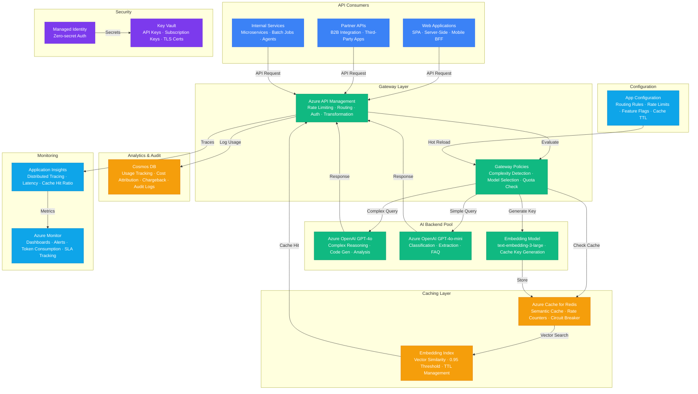

# Architecture — Play 52: AI API Gateway V2

## Overview

Advanced AI API gateway with semantic caching, intelligent model routing, per-consumer quota management, and real-time cost attribution. Azure API Management serves as the unified entry point — all AI consumers (web apps, mobile clients, partner APIs, internal microservices) access Azure OpenAI through a single managed gateway that enforces rate limits, routes requests to the optimal model based on complexity and cost tier, and caches semantically similar responses to eliminate redundant inference. APIM policies inspect incoming prompts: simple requests (classification, short extraction, FAQ) route to GPT-4o-mini, while complex requests (multi-step reasoning, code generation, long-form analysis) route to GPT-4o — reducing costs by 40-60% without quality degradation for simple tasks. Azure Cache for Redis provides the semantic cache layer: before forwarding a request to Azure OpenAI, the gateway computes an embedding of the prompt and searches Redis for cached responses with cosine similarity above 0.95 — cache hits return instantly without consuming any OpenAI tokens. Redis also manages rate-limit counters (sliding window per consumer), circuit breaker state per backend, and distributed locking for quota enforcement across gateway instances. Cosmos DB stores per-consumer usage analytics: token consumption, request counts, model distribution, error rates, and cost attribution — enabling chargeback reporting for enterprise customers. Azure App Configuration provides hot-reloadable gateway settings: routing rules, rate-limit thresholds, cache TTL, feature flags for canary model rollouts, and consumer tier definitions — all changeable without gateway restart. Application Insights and Azure Monitor provide end-to-end observability: distributed tracing from consumer through gateway to AI backend, cache hit ratio dashboards, model routing decisions, P95 latency breakdowns, and cost-per-request attribution.

## Architecture Diagram

## Data Flow

1. **Request Ingestion**: API consumer sends an AI request to APIM with subscription key and optional metadata (model preference, priority, max tokens) → APIM validates the subscription key, checks consumer tier (free/standard/premium), and applies rate-limit policies using Redis sliding-window counters → If rate limit exceeded, APIM returns 429 with Retry-After header and remaining quota information → Request metadata enriched with correlation ID, consumer ID, and timestamp for end-to-end tracing
2. **Semantic Cache Check**: APIM policy extracts the user prompt and sends it to the embedding model (text-embedding-3-large) to generate a vector representation → The embedding is used to query Redis for cached responses: RediSearch performs approximate nearest-neighbor search against stored prompt embeddings → If a cached response exists with cosine similarity ≥ 0.95, APIM returns the cached response immediately — zero OpenAI token consumption, sub-10ms latency → Cache hit/miss recorded in Application Insights for cache effectiveness monitoring → Cached responses include original model, timestamp, and confidence score in response headers
3. **Intelligent Model Routing**: On cache miss, APIM policies analyze the prompt to determine routing: token count, prompt complexity signals (multi-step instructions, code blocks, reasoning keywords), and consumer tier preferences → Simple requests (< 200 tokens, single-turn, classification/extraction patterns) route to GPT-4o-mini → Complex requests (multi-step reasoning, code generation, analysis, long-form output) route to GPT-4o → Consumer tier overrides: premium consumers can force GPT-4o for all requests; free tier restricted to GPT-4o-mini → Backend selection considers circuit breaker state — if primary backend is degraded, failover to secondary region
4. **Response Processing**: AI backend returns the completion → APIM caches the response: generates an embedding of the prompt, stores it in Redis with the response payload and a configurable TTL (default 1 hour, adjustable per consumer) → Response transformed: token usage injected into headers (X-Token-Usage, X-Model-Used, X-Cache-Status) → Usage record written to Cosmos DB: consumer ID, model used, token count, latency, cache status, cost attribution → Response returned to consumer with consistent schema regardless of backend model
5. **Analytics & Chargeback**: Cosmos DB aggregates usage data per consumer, per model, per time period → Dashboards show: total token consumption, cost per consumer, model distribution (% GPT-4o vs GPT-4o-mini), cache hit ratio, average latency, error rates → Chargeback reports generated monthly: itemized token usage, model costs, and gateway overhead per consumer → Anomaly detection alerts on unusual patterns: sudden usage spikes, error rate increases, or cache hit ratio drops → App Configuration enables real-time tuning: adjust rate limits, modify routing rules, toggle feature flags for new model deployments — all without gateway downtime

## Service Roles

| Service | Layer | Role |
|---------|-------|------|
| Azure API Management | Gateway | Request routing, rate limiting, authentication, response transformation |
| Azure OpenAI (GPT-4o) | AI | Complex reasoning, code generation, multi-step analysis |
| Azure OpenAI (GPT-4o-mini) | AI | Classification, extraction, FAQ, simple completions |
| Azure OpenAI (Embeddings) | AI | Prompt embedding generation for semantic cache keys |
| Azure Cache for Redis | Caching | Semantic response cache, rate-limit counters, circuit breaker state |
| Cosmos DB | Data | Usage analytics, cost attribution, chargeback, audit logs |
| Azure App Configuration | Platform | Dynamic routing rules, feature flags, rate-limit thresholds |
| Key Vault | Security | API keys, subscription keys, TLS certificates |
| Managed Identity | Security | Zero-secret authentication across all Azure services |
| Application Insights | Monitoring | Distributed tracing, latency analysis, cache hit ratio |
| Azure Monitor | Monitoring | Dashboards, alerts, SLA tracking, cost-per-request attribution |

## Security Architecture

- **Subscription Key Authentication**: Every API consumer authenticated via APIM subscription key — keys scoped to specific products (free/standard/premium) with independent rate limits and model access
- **OAuth 2.0 / JWT Validation**: Enterprise consumers authenticate via Microsoft Entra ID — APIM validates JWT tokens, extracts consumer identity, and applies tenant-specific policies
- **Managed Identity**: APIM authenticates to Azure OpenAI, Redis, Cosmos DB, and Key Vault via managed identity — no API keys in gateway policies or configuration
- **Key Vault Integration**: Consumer subscription keys, OpenAI endpoints, Redis connection strings, and TLS certificates stored in Key Vault with automatic rotation
- **Network Isolation**: APIM deployed in internal VNET mode for enterprise — AI backends accessible only via private endpoints, no public internet exposure
- **Content Safety**: Gateway policies can invoke Azure AI Content Safety before forwarding to OpenAI — block harmful prompts at the gateway level, before consuming inference tokens
- **Audit Logging**: Every request logged to Cosmos DB with consumer identity, prompt hash (not full prompt for privacy), model used, token count, and response latency
- **DDoS Protection**: Azure DDoS Protection Standard on APIM public IP — combined with rate limiting for defense-in-depth against abuse

## Scaling

| Metric | Dev | Production | Enterprise |
|--------|-----|-----------|------------|
| API consumers | 5 | 50 | 500+ |
| Requests/second | 10 | 500 | 5,000+ |
| Cache hit ratio | N/A | 30-40% | 40-50% |
| Avg latency (cache hit) | 5ms | 5ms | 3ms |
| Avg latency (cache miss) | 2s | 1.5s | 800ms |
| Models deployed | 2 | 3 | 5+ |
| APIM units | 1 | 2 | 4+ |
| Redis memory | 1GB | 6GB | 12GB+ |
| Monthly token savings (cache) | N/A | 30% | 45% |
| Usage data retention | 7 days | 90 days | 1 year |
