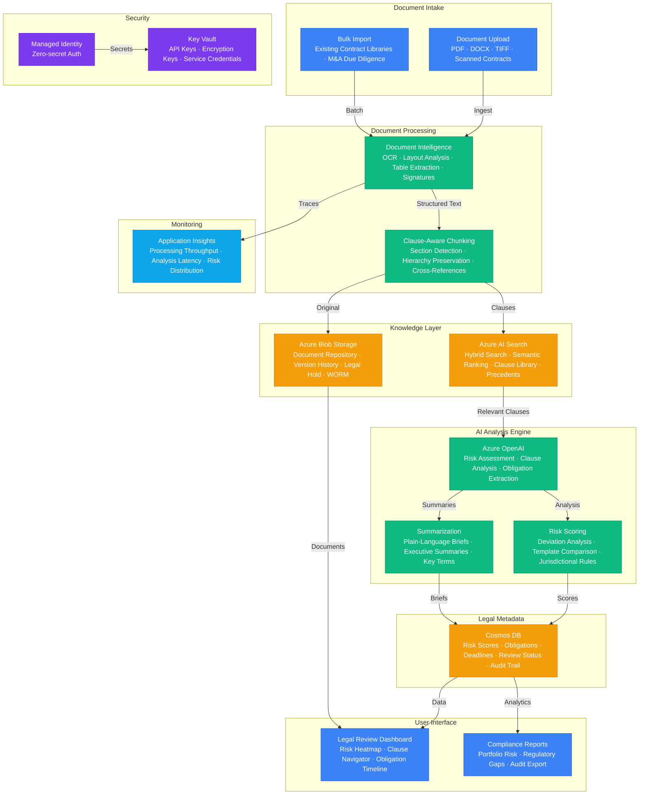

# Play 53 — Legal Document AI

AI-powered legal document analysis — contract review, clause extraction with layout-aware parsing, risk scoring against industry benchmarks, redlining suggestions, version comparison, jurisdiction-aware analysis, UPL-safe disclaimers on every output, and attorney-client privilege markers.

## Architecture



> Full architecture details: [`architecture.md`](./architecture.md)

## How It Differs from Related Plays

| Aspect | Play 06 (Document Intelligence) | **Play 53 (Legal Document AI)** | Play 38 (Doc Understanding V2) |
|--------|-------------------------------|-------------------------------|-------------------------------|
| Domain | General document processing | **Legal contracts specifically** | Multi-page entity linking |
| Output | Extracted fields | **Clause risk scores + redline suggestions** | Structured extraction |
| Compliance | PII redaction | **UPL compliance + privilege markers** | Confidence thresholds |
| Benchmark | Schema-based | **Industry-standard clause benchmarks** | Entity linking accuracy |
| Legal Safety | N/A | **"Not legal advice" on every output** | N/A |
| Jurisdiction | N/A | **State/country-aware analysis** | N/A |

## DevKit Structure

```
53-legal-document-ai/
├── agent.md                              # Root orchestrator with handoffs
├── .github/
│   ├── copilot-instructions.md           # Domain knowledge (<150 lines)
│   ├── agents/
│   │   ├── builder.agent.md              # Clause extraction + risk + redline
│   │   ├── reviewer.agent.md             # UPL + privilege + PII
│   │   └── tuner.agent.md                # Clause library + benchmarks + cost
│   ├── prompts/
│   │   ├── deploy.prompt.md              # Deploy legal pipeline
│   │   ├── test.prompt.md                # Review sample contracts
│   │   ├── review.prompt.md              # Audit UPL compliance
│   │   └── evaluate.prompt.md            # Measure extraction accuracy
│   ├── skills/
│   │   ├── deploy-legal-document-ai/     # Doc Intel + clause + risk + redline
│   │   ├── evaluate-legal-document-ai/   # Clauses, risk, UPL, redline quality
│   │   └── tune-legal-document-ai/       # Clause library, benchmarks, UPL
│   └── instructions/
│       └── legal-document-ai-patterns.instructions.md
├── config/                               # TuneKit
│   ├── openai.json                       # Legal model (temp=0), redline config
│   ├── guardrails.json                   # Risk benchmarks, UPL rules
│   └── agents.json                       # Clause library, jurisdiction rules
├── infra/                                # Bicep IaC
│   ├── main.bicep
│   └── parameters.json
└── spec/                                 # SpecKit
    └── fai-manifest.json
```

## Quick Start

```bash
# 1. Deploy legal AI pipeline
/deploy

# 2. Review sample contracts
/test

# 3. Audit UPL compliance
/review

# 4. Measure extraction accuracy
/evaluate
```

## Key Metrics

| Metric | Target | Description |
|--------|--------|-------------|
| Clause Detection | > 90% | Expected clauses found |
| Risk Calibration | > 80% | Scores match attorney assessment |
| UPL Compliance | 100% | Disclaimers + privilege markers |
| Redline Relevance | > 85% | Suggestions address identified risk |
| Critical Risk Detection | > 95% | High-severity risks caught |
| Cost per Contract | < $3.00 | 20-page MSA review |

## Cost Estimate

| Service | Dev | Prod | Enterprise |
|---------|-----|------|------------|
| Azure OpenAI | $100 | $900 | $3,500 |
| Azure AI Search | $0 | $250 | $1,000 |
| Azure Document Intelligence | $0 | $100 | $400 |
| Azure Blob Storage | $5 | $40 | $150 |
| Cosmos DB | $5 | $75 | $350 |
| Key Vault | $1 | $5 | $15 |
| Application Insights | $0 | $30 | $100 |
| Container Apps | $10 | $80 | $350 |
| **Total** | **$121** | **$1,480** | **$5,865** |

> Detailed breakdown with SKUs and optimization tips: [`cost.json`](./cost.json) · [Azure Pricing Calculator](https://azure.microsoft.com/pricing/calculator/)

## WAF Alignment

| Pillar | Implementation |
|--------|---------------|
| **Responsible AI** | UPL disclaimers, privilege markers, "not legal advice" on every output |
| **Security** | PII de-identification, Key Vault for secrets, no PII in LLM context |
| **Reliability** | Deterministic scoring (temp=0), clause-by-clause processing |
| **Cost Optimization** | gpt-4o-mini for classification, batch clause extraction, redline threshold |
| **Operational Excellence** | Clause library per contract type, jurisdiction rules, version comparison |
| **Performance Efficiency** | Layout extraction for structure, 5-section batching, cached benchmarks |
