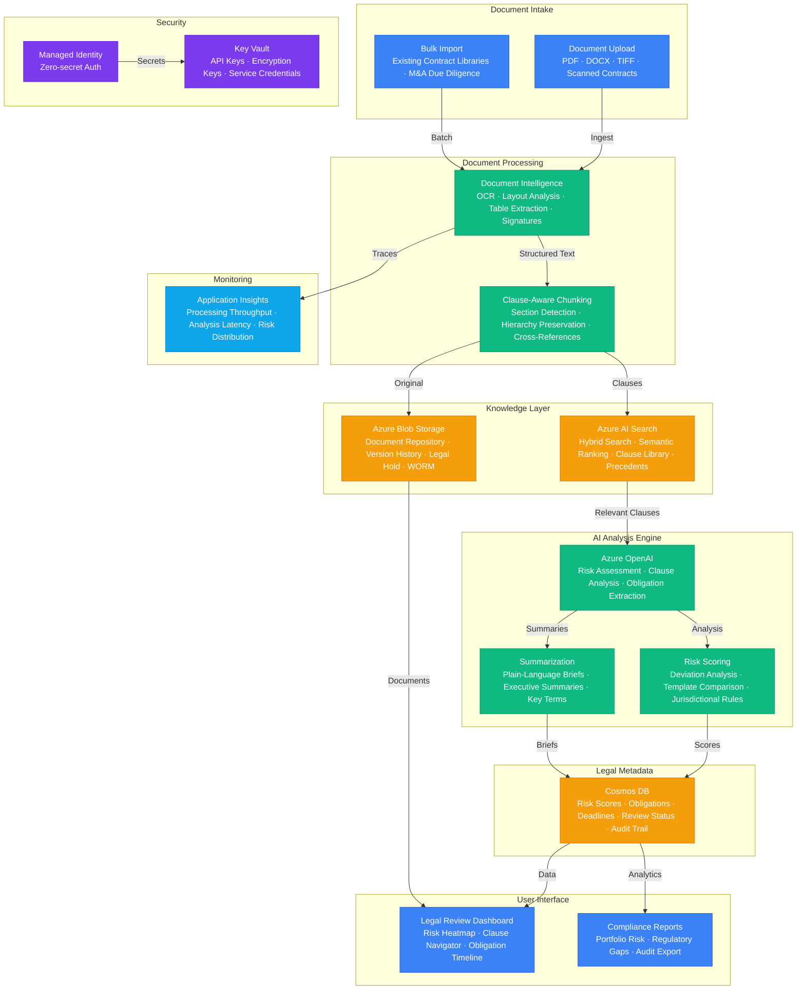

# Architecture — Play 53: Legal Document AI

## Overview

AI-powered legal document analysis platform that automatically reviews contracts, identifies risks, extracts obligations, and provides regulatory compliance assessments. The system ingests legal documents (contracts, agreements, regulatory filings, court decisions) through Azure Document Intelligence for OCR and structured extraction — converting scanned PDFs, DOCX files, and TIFF images into machine-readable text with preserved layout structure including tables, signatures, and multi-column formatting. Extracted content is chunked using clause-aware boundaries that respect legal document structure (recitals, definitions, representations, covenants, indemnification, termination) and indexed in Azure AI Search with both keyword and vector embeddings for hybrid retrieval. Azure OpenAI powers the legal reasoning engine: GPT-4o analyzes contracts for risk factors (unfavorable liability clauses, missing limitation caps, unusual termination triggers, non-standard indemnification), extracts obligations and deadlines into structured timelines, identifies parties and their roles, compares clauses against organizational standard templates, and generates plain-language summaries for non-legal stakeholders. The system provides a risk scoring framework: each clause receives a risk score (low/medium/high/critical) based on deviation from standard templates, jurisdictional requirements, and industry best practices. Cosmos DB stores analysis metadata — risk scores, extracted obligations, reviewer assignments, audit trail of AI decisions, and cross-contract relationship mapping for portfolio-level risk visibility. Azure Blob Storage serves as the legal document repository with immutable storage for legal hold compliance and WORM (Write Once Read Many) policies for regulatory requirements.

## Architecture Diagram

## Data Flow

1. **Document Ingestion**: Legal documents uploaded via the review dashboard or bulk-imported from existing contract management systems → Azure Document Intelligence processes each document: OCR for scanned documents, layout analysis to identify sections/tables/signatures, custom models for specific legal formats (e.g., loan agreements, NDAs) → Extracted structured output includes: full text with positional metadata, table contents, signature blocks, dates, and party names → Original documents stored in Azure Blob Storage with immutable storage policies for legal hold compliance, versioning enabled for amendment tracking
2. **Clause-Aware Chunking & Indexing**: Extracted text is chunked using clause-aware boundaries — the system identifies legal section headers (recitals, definitions, representations & warranties, covenants, indemnification, limitation of liability, termination, governing law) and chunks along natural clause boundaries → Each chunk is enriched with metadata: section type, clause number, cross-references to other sections, defined terms used, and parent document ID → Chunks indexed in Azure AI Search with dual indexing: keyword index for legal citation lookup (case numbers, statute references, defined terms) and vector index for semantic similarity search (finding similar clauses across contracts) → Semantic ranker configured with legal domain boosting for precision on legal terminology
3. **Risk Analysis Pipeline**: When a contract is submitted for review, the system retrieves standard template clauses from AI Search for the contract type (NDA, MSA, SaaS agreement, employment contract) → Azure OpenAI compares each clause against the standard template: identifies deviations, missing protections, unusual language, and non-standard obligations → Risk scoring engine evaluates each deviation: severity (how far from standard), impact (financial exposure, liability scope), and jurisdictional considerations → Obligations extracted as structured data: obligated party, action required, deadline/trigger, consequences of non-compliance → Cross-contract analysis: identifies conflicting obligations across related agreements (e.g., exclusivity conflicts between vendor agreements)
4. **Legal Review Workflow**: Analysis results presented in the legal review dashboard: risk heatmap showing high-risk sections, clause navigator with AI annotations, obligation timeline with upcoming deadlines → Attorneys review AI findings: approve, modify risk scores, add comments, flag for senior review → AI-generated plain-language summaries for non-legal stakeholders: executive brief, key terms summary, and critical risk highlights → Review decisions and annotations stored in Cosmos DB with full audit trail — who reviewed, when, what changes were made, and AI confidence scores for each finding
5. **Portfolio Analytics & Compliance**: Cosmos DB aggregates analysis data across all contracts for portfolio-level visibility: total risk exposure by category (liability, IP, termination, data privacy), upcoming obligation deadlines, and regulatory compliance gaps → Compliance reports generated: GDPR data processing agreement coverage, industry-specific regulatory requirements, standard clause adoption rates → Anomaly alerts: contracts with unusually high risk scores, approaching deadlines with unmet obligations, or expired agreements requiring renewal → Historical trend analysis: risk posture improvement over time, common negotiation patterns, and clause standardization progress

## Service Roles

| Service | Layer | Role |
|---------|-------|------|
| Azure Document Intelligence | Processing | OCR, layout analysis, table extraction, signature detection |
| Azure OpenAI | AI | Risk assessment, clause analysis, obligation extraction, summarization |
| Azure AI Search | Knowledge | Hybrid search across contract libraries, clause comparison, precedent retrieval |
| Azure Blob Storage | Data | Document repository, version history, legal hold, WORM compliance |
| Cosmos DB | Data | Risk scores, obligations, deadlines, review status, audit trail |
| Container Apps | Compute | Processing pipeline runtime, API layer, review interface backend |
| Key Vault | Security | API keys, encryption keys, service credentials |
| Managed Identity | Security | Zero-secret authentication across all Azure services |
| Application Insights | Monitoring | Processing throughput, analysis latency, risk score distribution |

## Security Architecture

- **Data Encryption**: All legal documents encrypted at rest with customer-managed keys (CMK) in Key Vault — meets regulatory requirements for sensitive legal data handling
- **Immutable Storage**: Azure Blob Storage with WORM policies for legal hold — documents cannot be modified or deleted during hold period, satisfying litigation and regulatory retention requirements
- **Access Control**: Role-based access control with legal team hierarchy — junior associates see assigned contracts only, senior partners see portfolio-wide analytics, compliance officers see audit trails
- **Managed Identity**: All service-to-service authentication via managed identity — no API keys in application code or configuration
- **Network Isolation**: Private endpoints for all PaaS services — AI Search, Blob Storage, Cosmos DB, and OpenAI accessible only within the VNET
- **Audit Trail**: Every AI analysis decision, human review action, and document access logged in Cosmos DB — immutable audit records for regulatory compliance and malpractice defense
- **PII Handling**: Personal information detected and redacted before logging — names, addresses, SSNs, and financial details masked in telemetry while preserved in encrypted document storage
- **Content Safety**: Azure AI Content Safety filters on all OpenAI requests — prevents prompt injection attempts that could alter legal analysis outcomes

## Scaling

| Metric | Dev | Production | Enterprise |
|--------|-----|-----------|------------|
| Contracts analyzed/month | 50 | 1,000 | 10,000+ |
| Avg pages per contract | 20 | 30 | 50+ |
| Clause extraction accuracy | N/A | >90% | >95% |
| Risk assessment latency | 3min | 2min | 1min |
| Search index size | 50MB | 25GB | 100GB+ |
| Document storage | 50GB | 500GB | 2TB+ |
| Concurrent reviewers | 2 | 20 | 200+ |
| Obligation tracking | 100 | 5,000 | 50,000+ |
| Audit retention | 30 days | 1 year | 7 years |
| Contract types supported | 3 | 15 | 50+ |
