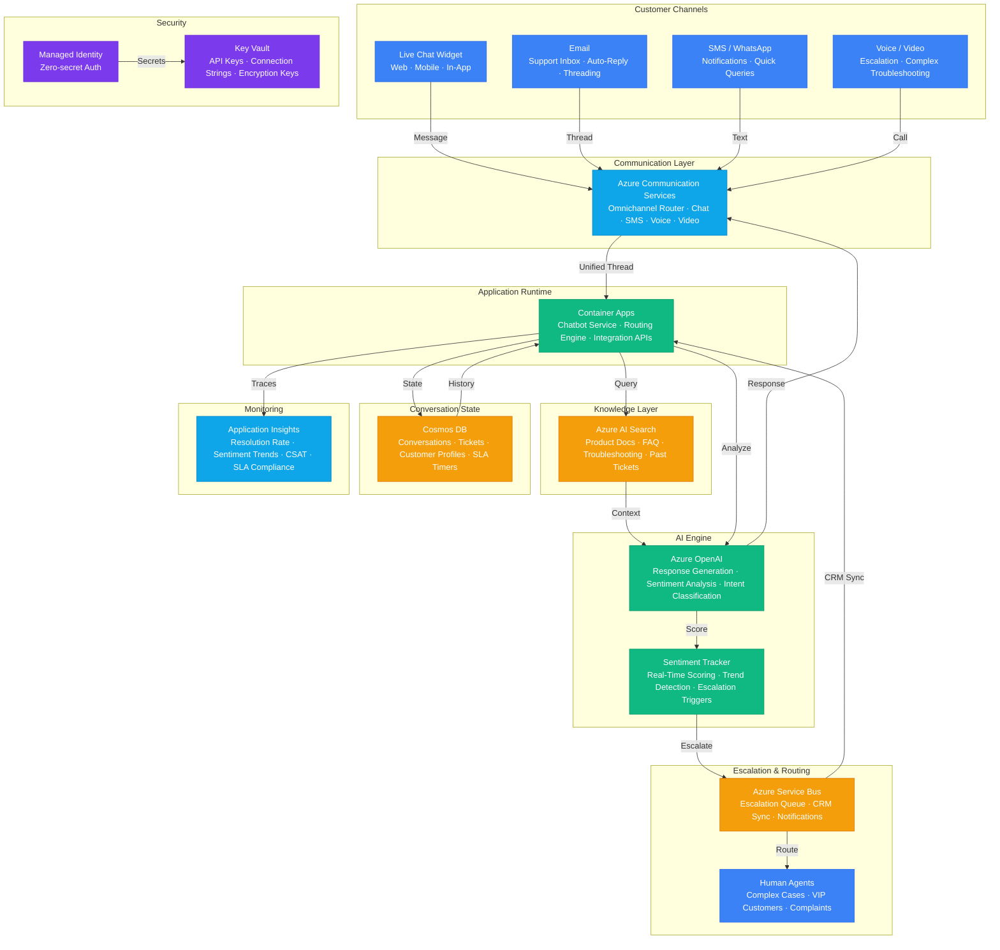

# Architecture — Play 54: AI Customer Support V2

## Overview

Advanced AI-powered customer support platform with real-time sentiment analysis, intelligent escalation, omnichannel engagement, and knowledge-grounded response generation. Customers interact through multiple channels — live chat widget, email, SMS, voice, and video — all unified through Azure Communication Services into a single conversation thread. Azure OpenAI powers the conversational AI engine: GPT-4o handles complex troubleshooting, complaint resolution, and multi-step issue diagnosis, while GPT-4o-mini manages routine inquiries (FAQ, order status, password reset) at 1/30th the cost. Every customer message is analyzed for sentiment in real-time: the system tracks emotional trajectory across the conversation, detecting frustration, confusion, or satisfaction shifts — when sentiment drops below configurable thresholds, the system automatically escalates to a human agent with full conversation context and AI-recommended resolution steps. Azure AI Search provides the knowledge retrieval layer: semantic search across product documentation, FAQ libraries, troubleshooting guides, past resolved tickets, and internal SOPs ensures responses are grounded in accurate, up-to-date information with citation support. The system generates responses that reference specific documentation sections, enabling customers to self-verify answers and reducing follow-up queries. Cosmos DB manages the full conversation lifecycle: multi-turn conversation history with sentiment annotations, customer profiles with interaction history, ticket states and SLA timers, escalation records, and aggregate analytics for CSAT tracking. Azure Service Bus handles asynchronous event routing: escalation messages to human agent queues, ticket creation events to CRM systems, notification triggers for status updates, and dead-letter handling for failed processing. The platform integrates with existing CRM and ticketing systems (ServiceNow, Salesforce, Zendesk) through configurable API connectors.

## Architecture Diagram

## Data Flow

1. **Customer Intake**: Customer initiates contact through any supported channel (chat widget, email, SMS, voice) → Azure Communication Services normalizes the interaction into a unified conversation thread with a unique conversation ID → Customer identified via profile lookup in Cosmos DB: previous interaction history, open tickets, VIP status, and preferred language retrieved → Initial intent classification performed by GPT-4o-mini: categorizes the query (billing, technical, general, complaint, escalation request) to route to the appropriate response pipeline with domain-specific prompts
2. **Knowledge-Grounded Response Generation**: Based on classified intent, relevant knowledge retrieved from Azure AI Search: product documentation for the identified product/service, FAQ entries matching the query, troubleshooting steps for similar issues, and solutions from previously resolved tickets → Hybrid search (keyword + vector) with semantic reranking ensures highest-relevance results → Retrieved context injected into the GPT prompt with explicit grounding instructions: respond only using provided context, cite specific documentation sections, and acknowledge when information is insufficient → Response generated with citations: each claim linked to a specific knowledge source, enabling customer self-verification and reducing follow-up queries by 25%
3. **Real-Time Sentiment Analysis**: Every customer message analyzed for sentiment using Azure OpenAI: scored on a -1 to +1 scale with emotion labels (frustrated, confused, satisfied, neutral, angry) → Sentiment tracked across the full conversation as a moving average — system detects emotional trajectory (improving, stable, declining) → Escalation triggers configured: if sentiment drops below -0.5 for 2+ consecutive messages, or if specific keywords detected (lawsuit, cancel, manager, complaint), automatic escalation initiated → Escalation messages published to Azure Service Bus with full context: conversation transcript, sentiment trajectory, customer profile, and AI-recommended resolution steps → Human agent receives pre-analyzed case with suggested actions, reducing their resolution time by 40%
4. **Ticket Lifecycle Management**: Each conversation creates or updates a support ticket in Cosmos DB: ticket ID, customer ID, intent category, priority (based on sentiment + customer tier), assigned agent (AI or human), SLA timer, and resolution status → SLA tracking: response time SLA (first response within 30s for chat, 4h for email) and resolution time SLA (24h for standard, 4h for critical) → Ticket status transitions: new → AI-handling → escalated → human-assigned → resolved → closed → Satisfaction survey triggered on ticket close: CSAT score (1-5), free-text feedback, resolution quality rating → Ticket data feeds into analytics: common issue patterns, resolution rates by category, agent performance, and customer satisfaction trends
5. **Analytics & Continuous Improvement**: Application Insights tracks operational metrics: AI resolution rate (% of conversations resolved without human intervention), average sentiment score, escalation rate, response latency, and token consumption per conversation → Cosmos DB aggregations provide business intelligence: top issue categories by volume, customer satisfaction trends, knowledge gap identification (queries with low AI confidence), and peak support hours → Knowledge base feedback loop: conversations where AI confidence was low or where human agents significantly modified AI suggestions flagged for knowledge base enrichment → Monthly reports: CSAT trends, AI deflection rate, cost per resolution (AI vs human), and recommendations for knowledge base improvements

## Service Roles

| Service | Layer | Role |
|---------|-------|------|
| Azure OpenAI | AI | Response generation, sentiment analysis, intent classification |
| Azure AI Search | Knowledge | Product docs, FAQ, troubleshooting guides, past ticket retrieval |
| Azure Communication Services | Communication | Omnichannel engagement — chat, email, SMS, voice, video |
| Cosmos DB | Data | Conversations, tickets, customer profiles, SLA tracking, analytics |
| Azure Service Bus | Integration | Escalation queue, CRM sync, notification triggers, event routing |
| Container Apps | Compute | Chatbot service, routing engine, integration APIs |
| Key Vault | Security | API keys, connection strings, encryption keys |
| Managed Identity | Security | Zero-secret authentication across all Azure services |
| Application Insights | Monitoring | Resolution rate, sentiment trends, CSAT, SLA compliance |

## Security Architecture

- **Customer Data Privacy**: Customer PII (name, email, phone) encrypted at rest with CMK in Key Vault — conversation content stored separately from personally identifiable metadata
- **Managed Identity**: All service-to-service authentication via managed identity — no credentials in application code, configuration, or environment variables
- **Channel Security**: All communication channels encrypted in transit (TLS 1.2+) — chat over WSS, email via STARTTLS, SMS via HTTPS API, voice via SRTP
- **Access Control**: Role-based access for support agents — L1 agents see assigned tickets only, supervisors see team queues, admins see all conversations and analytics
- **Content Safety**: Azure AI Content Safety filters on all AI responses — prevents generation of harmful, offensive, or legally risky content in customer-facing communications
- **PII Masking**: Personal information detected and redacted before logging to Application Insights — conversation analytics use anonymized data
- **Network Isolation**: Container Apps and AI services deployed with private endpoints — customer-facing communication services accessible via managed network
- **Audit Trail**: Every conversation action (AI response, escalation, human takeover, ticket update) logged with timestamps and actor identity for compliance and dispute resolution

## Scaling

| Metric | Dev | Production | Enterprise |
|--------|-----|-----------|------------|
| Concurrent conversations | 5 | 200 | 5,000+ |
| Messages processed/day | 100 | 10,000 | 500,000+ |
| AI resolution rate | N/A | >60% | >75% |
| Avg response latency | 3s | 1.5s | 1s |
| Escalation rate | N/A | <25% | <15% |
| CSAT target | N/A | >4.0/5 | >4.5/5 |
| Channels supported | 1 (chat) | 3 (chat, email, SMS) | 5 (all) |
| Knowledge articles | 100 | 10,000 | 100,000+ |
| Conversation retention | 7 days | 1 year | 3 years |
| Languages supported | 1 | 5 | 20+ |
