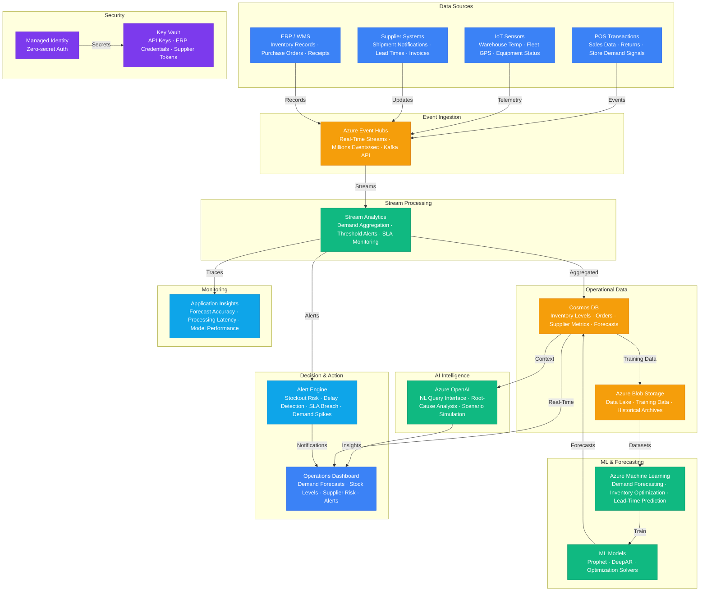

# Play 55 — Supply Chain AI

AI-powered supply chain intelligence — demand forecasting (Prophet ML + LLM anomaly explanation), supplier risk scoring (multi-factor weighted), inventory optimization (safety stock + EOQ), logistics routing, procurement anomaly detection, and external signal integration (weather, holidays, promotions, economic indicators).

## Architecture

> Full architecture details: [`architecture.md`](./architecture.md)

## How It Differs from Related Plays

| Aspect | Play 45 (Real-Time Event AI) | **Play 55 (Supply Chain AI)** | Play 27 (Data Pipeline) |
|--------|---------------------------|------------------------------|------------------------|
| Domain | Any event stream | **Supply chain specifically** | General data processing |
| Forecasting | Anomaly detection | **Demand forecasting with CI** | ETL/transformation |
| ML Model | Streaming Z-score | **Prophet time-series + LLM** | No ML |
| Output | Enriched events + alerts | **Forecasts + risk scores + inventory plans** | Transformed data |
| External Data | N/A | **Weather, holidays, economic indicators** | N/A |
| Optimization | N/A | **Safety stock, EOQ, reorder point** | N/A |

## Key Metrics

| Metric | Target | Description |
|--------|--------|-------------|
| Forecast MAPE | < 15% | Mean Absolute Percentage Error |
| CI Calibration | > 90% | Actuals within 95% confidence interval |
| Supplier Risk Accuracy | > 80% | Risk scores match historical outcomes |
| Service Level | > 95% | Orders filled from stock |
| Stockout Rate | < 3% | Out-of-stock occurrences |
| Carrying Cost Reduction | > 15% | vs manual inventory planning |

## Cost Estimate

| Service | Dev | Prod | Enterprise |
|---------|-----|------|------------|
| Azure OpenAI | $80 | $600 | $2,500 |
| Azure Machine Learning | $50 | $300 | $1,200 |
| Cosmos DB | $5 | $150 | $600 |
| Azure Event Hubs | $10 | $75 | $350 |
| Azure Stream Analytics | $25 | $100 | $300 |
| Azure Blob Storage | $5 | $40 | $120 |
| Key Vault | $1 | $5 | $15 |
| Application Insights | $0 | $40 | $120 |
| **Total** | **$176** | **$1,310** | **$5,205** |

> Detailed breakdown with SKUs and optimization tips: [`cost.json`](./cost.json) · [Azure Pricing Calculator](https://azure.microsoft.com/pricing/calculator/)

## WAF Alignment

| Pillar | Implementation |
|--------|---------------|
| **Reliability** | Confidence intervals, reforecast triggers, lead time buffers |
| **Cost Optimization** | Prophet (free ML), gpt-4o-mini for risk, ADX Dev tier |
| **Performance Efficiency** | Weekly batch forecast, event-driven reforecast on anomalies |
| **Operational Excellence** | MAPE tracking, supplier reassessment schedule, audit trail |
| **Security** | Key Vault for API keys, no PII in supply chain data |
| **Responsible AI** | LLM explains anomalies (not black-box), human reviews risk recommendations |
