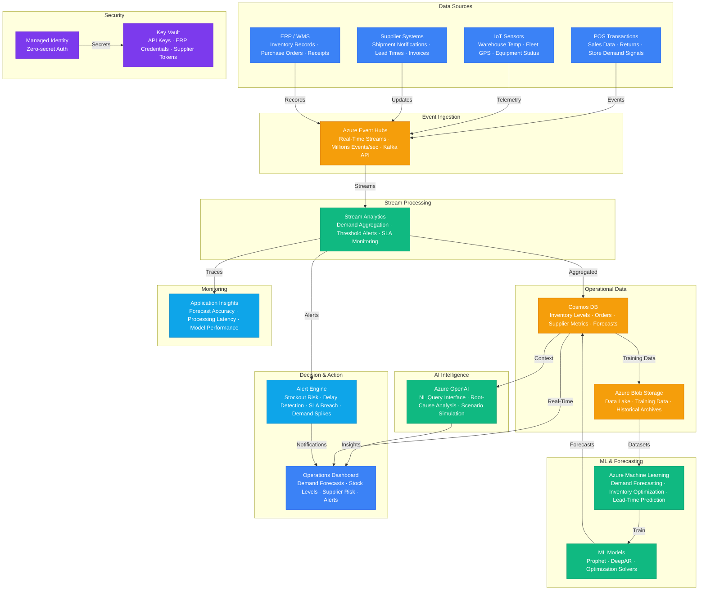

# Architecture — Play 55: Supply Chain AI

## Overview

AI-powered supply chain optimization platform that combines demand forecasting, inventory optimization, supplier risk assessment, and real-time logistics monitoring. The system ingests supply chain signals from multiple sources — POS transactions, IoT sensors (warehouse temperature, fleet GPS), supplier shipment notifications, market indicators, and ERP systems — through Azure Event Hubs at scale, processing millions of events per second. Azure Stream Analytics performs real-time event processing: demand signal aggregation, inventory threshold alerting, logistics delay detection, and supplier SLA monitoring with windowed aggregations feeding near-real-time operational dashboards. Azure Machine Learning powers the forecasting and optimization models: time-series demand forecasting (ARIMA, Prophet, DeepAR) predicts product demand at SKU/location granularity, inventory optimization models determine optimal reorder points and safety stock levels, lead-time prediction models account for supplier variability and logistics delays, and route optimization algorithms minimize transportation costs while meeting delivery windows. Azure OpenAI provides the intelligence layer: natural-language query interface for supply chain managers ("What's causing the inventory shortfall in the Northeast warehouse?"), supplier risk assessment from unstructured reports (news, financial filings, ESG disclosures), anomaly root-cause explanation when the system detects unexpected demand patterns, and scenario simulation narration for what-if planning ("What happens if Supplier X is delayed by 2 weeks?"). Cosmos DB serves as the operational data store: real-time inventory levels across facilities, order tracking, supplier performance metrics, demand forecast results, and logistics events — with global distribution for multi-region supply chains requiring low-latency reads from any geography. Azure Blob Storage provides the data lake layer: historical demand data spanning years, supplier performance archives, logistics records, ML training datasets, and compliance documentation.

## Architecture Diagram

## Data Flow

1. **Signal Ingestion**: Supply chain events flow from multiple sources into Azure Event Hubs: POS systems emit transaction-level sales data with SKU, quantity, location, and timestamp; IoT sensors stream warehouse conditions (temperature, humidity for perishables) and fleet GPS coordinates for shipment tracking; suppliers send electronic shipment notifications, updated lead times, and invoice data via EDI/API; ERP systems publish inventory adjustments, purchase order confirmations, and receipt events → Event Hubs captures all streams with event-time preservation and at-least-once delivery guarantee → Events partitioned by source type and geographic region for parallel downstream processing
2. **Real-Time Processing**: Azure Stream Analytics consumes Event Hubs streams and applies windowed aggregations: 15-minute tumbling windows for demand signal summarization (sales velocity per SKU per location), 5-minute sliding windows for logistics delay detection (shipments not progressing within expected timeframes), and session windows for IoT anomaly detection (extended temperature excursions in cold-chain) → Threshold-based alerts generated in real-time: inventory levels approaching reorder point, supplier shipments delayed beyond SLA, demand spikes exceeding forecast by 2+ standard deviations, and equipment sensor anomalies → Aggregated results written to Cosmos DB for operational dashboards and as features for ML model input
3. **Demand Forecasting & Optimization**: Azure Machine Learning runs scheduled forecasting pipelines: daily short-term forecasts (7-14 days) using DeepAR for high-frequency SKUs, weekly medium-term forecasts (4-12 weeks) using Prophet with seasonality and holiday effects, and monthly strategic forecasts (6-18 months) using ensemble models → Forecasts generated at SKU × location × time granularity, with prediction intervals (P10/P50/P90) for uncertainty quantification → Inventory optimization models consume demand forecasts and calculate: optimal reorder quantities (Economic Order Quantity adjusted for demand variability), safety stock levels (service-level-based, accounting for lead-time uncertainty), and reorder trigger points → Lead-time prediction models estimate supplier delivery windows based on historical performance, current capacity signals, and logistics conditions → Results written to Cosmos DB and surfaced on operations dashboards
4. **AI-Powered Intelligence**: Supply chain managers interact with Azure OpenAI through a natural-language interface: "Why is inventory for SKU-4521 at the Dallas warehouse below safety stock?" → The system retrieves relevant context from Cosmos DB (current inventory, recent demand, supplier status, forecast data) and generates an explained root-cause analysis → Supplier risk assessment: OpenAI analyzes unstructured data (news articles, financial filings, ESG reports) to generate risk scores and early warnings for key suppliers → Scenario simulation: managers describe what-if scenarios ("What if we lose Supplier B for 6 weeks?"), the system runs optimization models with adjusted constraints and OpenAI narrates the impact and recommended actions → Anomaly explanation: when Stream Analytics detects unusual patterns (unexpected demand spike, supply disruption), OpenAI explains the likely causes and recommends immediate actions
5. **Decision Support & Action**: Operations dashboard presents a unified view: demand forecasts with confidence intervals, current inventory positions vs optimal levels, supplier performance scorecards, logistics tracking with delay predictions, and AI-generated alerts with recommended actions → Alert engine prioritizes notifications: critical (stockout imminent, supplier failure), warning (approaching reorder point, lead-time increasing), and informational (forecast accuracy drift, seasonal pattern shift) → Recommended actions can trigger automated workflows: auto-generate purchase orders when inventory hits reorder point, reroute shipments when delays detected, activate backup suppliers when primary supplier risk exceeds threshold → Performance tracking: forecast accuracy (MAPE, bias), inventory turnover, service level achievement, and supply chain cost vs budget

## Service Roles

| Service | Layer | Role |
|---------|-------|------|
| Azure OpenAI | AI | Natural-language queries, root-cause analysis, supplier risk, scenario simulation |
| Azure Machine Learning | AI/ML | Demand forecasting, inventory optimization, lead-time prediction |
| Azure Event Hubs | Ingestion | Real-time supply chain event capture from POS, IoT, suppliers, ERP |
| Azure Stream Analytics | Processing | Event aggregation, threshold alerting, SLA monitoring |
| Cosmos DB | Data | Operational store — inventory, orders, forecasts, supplier metrics |
| Azure Blob Storage | Data | Data lake — historical data, training datasets, compliance archives |
| Key Vault | Security | API keys, ERP credentials, supplier integration tokens |
| Managed Identity | Security | Zero-secret authentication across all Azure services |
| Application Insights | Monitoring | Forecast accuracy, processing latency, model performance tracking |

## Security Architecture

- **Data Encryption**: All supply chain data encrypted at rest (CMK for sensitive pricing and supplier data) and in transit (TLS 1.2+) — meets SOC 2 and ISO 27001 requirements
- **Managed Identity**: All service-to-service authentication via managed identity — no credentials in application code, ML notebooks, or pipeline configurations
- **Network Isolation**: Event Hubs, Cosmos DB, ML workspace, and Blob Storage accessible only via private endpoints within the VNET — no public internet exposure for operational data
- **RBAC**: Role-based access control at granular level — demand planners see forecasts and inventory, procurement sees supplier data, logistics sees shipment tracking, executives see aggregated KPIs
- **Supplier Data Isolation**: Supplier-specific data partitioned in Cosmos DB — suppliers accessing their own performance portal see only their data, enforced at the API layer with tenant-scoped tokens
- **Audit Trail**: All AI recommendations, forecast overrides, and purchase order triggers logged with actor identity and timestamp — immutable audit records for supply chain compliance
- **PII Protection**: Personal information in supplier contacts and customer orders masked in analytics — only aggregated, anonymized data used for ML training
- **IoT Security**: Device provisioning via Azure IoT Hub DPS with X.509 certificates — sensor data authenticated and encrypted from edge to cloud

## Scaling

| Metric | Dev | Production | Enterprise |
|--------|-----|-----------|------------|
| Events ingested/second | 100 | 10,000 | 1,000,000+ |
| SKUs tracked | 500 | 50,000 | 500,000+ |
| Warehouse locations | 2 | 20 | 200+ |
| Forecast refresh frequency | Weekly | Daily | Hourly (fast-movers) |
| Forecast accuracy (MAPE) | N/A | <15% | <10% |
| Inventory optimization cycle | Weekly | Daily | Real-time |
| Suppliers monitored | 10 | 200 | 5,000+ |
| Alert latency | 5min | 30s | <10s |
| Historical data retention | 6 months | 3 years | 10 years |
| Concurrent dashboard users | 3 | 50 | 500+ |
