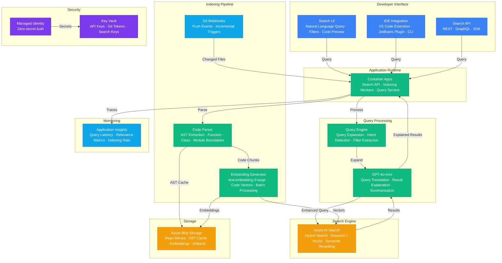

# Architecture — Play 56: Semantic Code Search

## Overview

Semantic code search platform that enables developers to find code using natural-language queries ("find the retry logic with exponential backoff", "where is user authentication handled", "show me the database connection pooling configuration") instead of relying solely on exact text matching. The system indexes codebases at function and class granularity by parsing source code into Abstract Syntax Trees (ASTs), extracting meaningful code units (functions, classes, methods, modules), and generating vector embeddings using Azure OpenAI's text-embedding-3-large model. These embeddings capture the semantic meaning of code — what the code does, not just what it looks like — enabling similarity-based retrieval that matches natural-language intent to code functionality. Azure AI Search provides the hybrid search engine: keyword index for exact matches (function names, class names, identifiers, imports) combined with vector index for semantic similarity queries, with semantic reranking to surface the most relevant results. The search experience includes faceted filtering by programming language, repository, file path, and code construct type (function, class, interface, configuration). When a developer issues a query, GPT-4o-mini performs query expansion (adding related technical terms and synonyms), retrieves candidate code chunks via hybrid search, and generates contextual explanations for each result — describing what the code does, how it relates to the query, and suggesting related code locations. The indexing pipeline operates incrementally: Git webhooks trigger re-indexing of only changed files on each push, making the system efficient for actively developed repositories. Azure Blob Storage stores repository mirrors, parsed AST outputs, and pre-computed embeddings for fast re-indexing and disaster recovery.

## Architecture Diagram

## Data Flow

1. **Repository Indexing**: Git webhooks fire on push events to monitored repositories → The indexing pipeline clones or updates the repository mirror in Azure Blob Storage → Source files filtered by language and path configuration (include/exclude patterns) → Language-specific AST parsers (Tree-sitter for multi-language support) analyze each file: extract functions, classes, methods, interfaces, type definitions, and module-level declarations → Each extracted code unit becomes a search chunk with metadata: function name, parameters, return type, docstring, file path, line numbers, language, repository, and surrounding context (imports, parent class) → AST parse results cached in Blob Storage to enable fast incremental re-indexing — only changed files need re-parsing
2. **Embedding Generation**: Each code chunk is converted to a vector embedding using Azure OpenAI text-embedding-3-large → Embedding input combines: the raw code, the function/class name, the docstring (if present), and a structured summary of parameters and return types → Reduced-dimension embeddings (1024 dimensions instead of 3072) used for optimal quality-to-cost ratio → Embeddings generated in batches for efficiency (100 chunks per API call) → Both the code chunk text and its embedding are indexed in Azure AI Search: text fields for keyword search (name, identifier, import), vector field for semantic similarity, and metadata fields for faceted filtering (language, repo, path, construct type) → Pre-computed embeddings stored in Blob Storage alongside AST cache for disaster recovery and re-indexing without re-computing
3. **Query Processing**: Developer enters a natural-language query ("find database connection pooling configuration") → Query engine extracts explicit filters (language:python, repo:backend-api) from the query string → GPT-4o-mini performs query expansion: adds related technical terms (connection pool → pool size, max connections, idle timeout, SQLAlchemy pool, pgBouncer) and generates a code-oriented search query → Expanded query submitted to Azure AI Search as a hybrid search: keyword component matches against function names and identifiers, vector component matches the query embedding against code chunk embeddings → Semantic reranker re-scores the combined results for final relevance ordering → Top-K results (default 10) returned with code snippets, file paths, relevance scores, and metadata
4. **Result Enrichment**: GPT-4o-mini generates contextual explanations for top search results: what the code does in plain language, how it relates to the original query, and notable implementation details → For each result, the system provides: highlighted code snippet with relevant lines emphasized, file path with deep link to the source repository, function signature and docstring, related code locations ("also see: ConnectionManager class in db/manager.py") → Search results presented in the developer-facing UI with syntax highlighting, language-appropriate formatting, and one-click navigation to the source file → Popular queries and their results cached with 1-hour TTL to reduce repeat processing
5. **Incremental Updates**: Git webhooks trigger on every push event — the system compares the changed file list against the current index → Only changed files are re-parsed: AST diff identifies added, modified, or deleted code units → Modified chunks get new embeddings generated and updated in the search index → Deleted code units removed from the index → New files processed through the full parse → embed → index pipeline → Incremental processing typically completes within 30-60 seconds of a push event for typical commits (5-20 changed files), keeping the search index near-real-time current → Full re-indexing scheduled weekly as a consistency check to catch any drift between the index and repository state

## Service Roles

| Service | Layer | Role |
|---------|-------|------|
| Azure OpenAI (Embeddings) | AI | Code vector generation using text-embedding-3-large |
| Azure OpenAI (GPT-4o-mini) | AI | Query expansion, result explanation, code summarization |
| Azure AI Search | Search | Hybrid code search — keyword + vector with semantic reranking |
| Azure Blob Storage | Data | Repository mirrors, AST cache, embeddings, indexing artifacts |
| Container Apps | Compute | Search API, indexing workers, query processing service |
| Key Vault | Security | API keys, Git tokens, search service keys |
| Managed Identity | Security | Zero-secret authentication across all Azure services |
| Application Insights | Monitoring | Query latency, relevance metrics (MRR, NDCG), indexing rate |

## Security Architecture

- **Repository Access Control**: Git tokens scoped with read-only permissions — the indexing pipeline can clone and read repositories but cannot push, merge, or modify any code
- **Search ACL**: Search results filtered by user repository access — developers only see code from repositories they have permission to access, enforced at the query layer via token-based access validation
- **Managed Identity**: All service-to-service authentication via managed identity — no API keys in application code or worker configurations
- **Secret Scanning**: Indexed code chunks scanned for secrets (API keys, passwords, tokens) before indexing — matched patterns redacted from the search index and flagged for repository owner notification
- **Network Isolation**: Search service and storage accessible only via private endpoints within the VNET — search API exposed through Container Apps with authentication required
- **Key Vault**: Git access tokens, OpenAI API keys, and search service keys stored in Key Vault with automatic rotation
- **Audit Logging**: Search queries logged with user identity for access pattern monitoring — enables detection of unusual search behavior (credential hunting, excessive code download)
- **Content Filtering**: Code chunks containing sensitive patterns (credentials, internal URLs, PII in comments) excluded from search results based on configurable filter rules

## Scaling

| Metric | Dev | Production | Enterprise |
|--------|-----|-----------|------------|
| Repositories indexed | 3 | 50 | 500+ |
| Code chunks indexed | 10K | 1M | 10M+ |
| Search index size | 50MB | 25GB | 100GB+ |
| Languages supported | 3 | 10 | 20+ |
| Query latency (P95) | 500ms | 200ms | 100ms |
| Queries/day | 50 | 5,000 | 100,000+ |
| Incremental index latency | 2min | 30s | 15s |
| Full re-index time | 5min | 2h | 12h |
| Embedding dimensions | 1024 | 1024 | 1024 |
| Concurrent users | 3 | 100 | 1,000+ |
