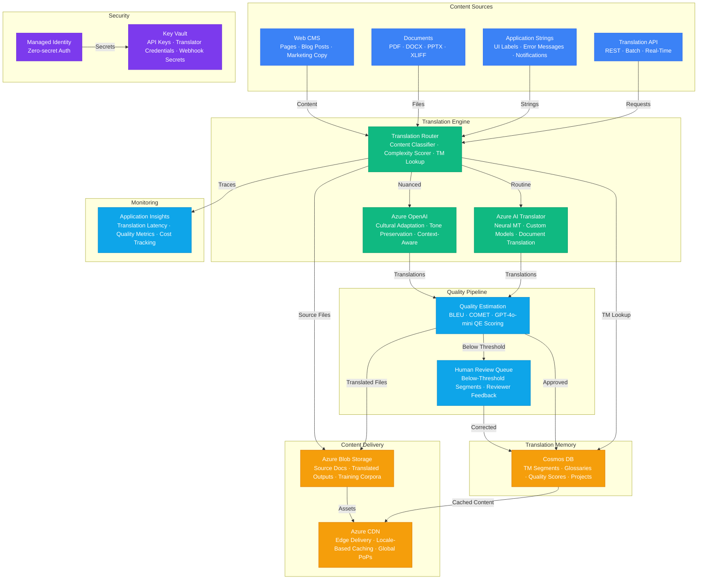

# Architecture — Play 57: AI Translation Engine

## Overview

Neural machine translation platform that combines Azure AI Translator for high-volume document and text translation with Azure OpenAI for culturally adapted, context-aware translations requiring nuance, tone preservation, and idiomatic expression handling. The system maintains a translation memory (TM) in Cosmos DB that stores previously translated segments at sentence and paragraph granularity, enabling fuzzy matching (Levenshtein + semantic similarity) to leverage past translations — reducing costs by 30-60% and ensuring terminology consistency across projects. Multilingual glossaries enforce brand-specific terms, product names, and domain terminology: when translating "Azure Landing Zone" in a technical document, the glossary ensures the term is either preserved or translated using the approved localized equivalent, never paraphrased. Azure AI Translator handles the bulk translation workload: document translation with layout preservation (PDF, DOCX, PPTX retain their formatting, tables, and images), custom translator models trained on domain-specific parallel corpora (legal contracts, medical records, technical manuals) for specialized vocabulary, and language detection for incoming content. Azure OpenAI handles the premium translation tier: literary and marketing content requiring cultural adaptation (adapting humor, metaphors, and cultural references for target audiences), tone-sensitive translations (formal vs casual register), and complex multi-context translations where a single source term has different meanings depending on context. The cultural adaptation layer goes beyond word-for-word translation: it adjusts date formats, currency symbols, measurement units, color symbolism, and imagery references for target cultures. Translated content flows through a quality pipeline: automated quality estimation (QE) scoring using GPT-4o-mini flags segments below threshold for human review, BLEU and COMET metrics track translation quality over time, and a feedback loop from human reviewers continuously improves both TM entries and custom model training data. Azure CDN delivers translated web content and localized assets from edge locations worldwide, ensuring sub-50ms delivery regardless of the user's geography.

## Architecture Diagram

## Data Flow

1. **Content Intake & Classification**: Content arrives from multiple sources — web CMS pages, uploaded documents (PDF, DOCX, PPTX, XLIFF), application UI strings, and direct API calls → The translation router classifies each request by content type (technical, marketing, legal, casual), complexity (simple substitution vs cultural adaptation), and target language pair → Content is segmented into translation units (sentences or paragraphs depending on content type) → Each segment is hashed and looked up in the translation memory: exact matches (100% TM leverage) are returned immediately without any AI processing, fuzzy matches (70-99% similarity) are presented to the translator as suggestions with differences highlighted, and no-match segments proceed to the translation engines
2. **Translation Routing & Execution**: The router directs segments to the appropriate translation engine based on content classification → Routine content (UI strings, product descriptions, support articles, technical documentation) routes to Azure AI Translator: neural machine translation with custom models trained on domain-specific parallel corpora produces high-quality translations at scale; glossary enforcement ensures brand terms, product names, and technical terminology are translated consistently → Nuanced content (marketing copy, literary text, legal contracts with cultural implications, customer-facing communications requiring tone adaptation) routes to Azure OpenAI: GPT-4o receives the source text along with cultural context (target market, audience demographics, brand voice guidelines), glossary constraints, and style instructions; the model produces culturally adapted translations that go beyond word-for-word accuracy to capture intent, humor, and cultural appropriateness → Document translation preserves source formatting: tables, headers, images with embedded text, footnotes, and cross-references maintain their layout in the translated output
3. **Quality Assurance Pipeline**: Every translated segment passes through automated quality estimation → GPT-4o-mini performs QE scoring: evaluates fluency (does it read naturally?), adequacy (does it convey the source meaning?), terminology compliance (are glossary terms used correctly?), and cultural appropriateness (are idioms and references suitable for the target culture?) → BLEU and COMET metrics computed against reference translations when available → Segments scoring above the quality threshold (configurable per content type — higher for legal/medical, lower for casual) are approved and stored in the translation memory → Below-threshold segments are routed to a human review queue with the AI translation, QE scores, and specific flagged issues → Human reviewer corrections are fed back: corrected segments update the TM, glossary violations trigger glossary refinement, and systematic errors generate training data for custom model retraining
4. **Translation Memory & Glossary Management**: Cosmos DB stores the translation memory as segment pairs (source → target) with metadata: translation source (Translator, OpenAI, human), quality score, usage count, domain, project, and timestamp → Glossary entries include: source term, approved translations per target language, context rules (when to use which translation variant), prohibited translations (common mistranslations to block), and term ownership (which team manages the glossary) → TM lookup uses a tiered matching strategy: exact match first, then fuzzy match with configurable threshold (default 70%), then terminology-only match for glossary enforcement → TM maintenance: entries older than 2 years without usage are archived, entries with low quality scores are flagged for review, and duplicate entries are merged with the highest-quality version retained
5. **Content Delivery & Distribution**: Translated content is stored in Azure Blob Storage organized by project, language, and version → Web content (translated CMS pages, localized UI strings) is published to Azure CDN with locale-based cache keys (e.g., `/en-US/product`, `/ja-JP/product`) → CDN edge locations serve translated content with sub-50ms latency globally → Cache invalidation triggered on translation updates: when a page is re-translated, the corresponding CDN cache entries for all affected locales are purged → Translated documents available for download via signed URLs with configurable expiry → Translation project status, word counts, cost tracking, and quality metrics surfaced on operations dashboard

## Service Roles

| Service | Layer | Role |
|---------|-------|------|
| Azure OpenAI | AI | Cultural adaptation, tone-sensitive translations, quality estimation |
| Azure AI Translator | AI | Neural machine translation, custom models, document translation with layout preservation |
| Cosmos DB | Data | Translation memory, multilingual glossaries, quality scores, project metadata |
| Azure CDN | Delivery | Edge-cached translated content, locale-based routing, global low-latency delivery |
| Azure Blob Storage | Data | Source documents, translated outputs, training corpora, TM export files |
| Key Vault | Security | Translator API keys, OpenAI keys, webhook secrets, vendor credentials |
| Managed Identity | Security | Zero-secret authentication across all Azure services |
| Application Insights | Monitoring | Translation latency, quality metrics (BLEU/COMET), TM leverage, cost analytics |

## Security Architecture

- **Data Sovereignty**: Translation requests routed to region-appropriate Azure AI Translator endpoints — EU content processed in EU regions, ensuring GDPR compliance for personal data in translated documents
- **Managed Identity**: All service-to-service authentication via managed identity — no API keys in application code or translation pipeline configurations
- **Content Encryption**: Source and translated documents encrypted at rest (AES-256) and in transit (TLS 1.2+) — customer-managed keys available for regulated industries handling sensitive translations (legal, medical, financial)
- **Access Control**: RBAC at project level — translators see only assigned projects, glossary editors can modify only their domain glossaries, project managers see all projects in their business unit
- **PII Handling**: Automated PII detection in source content before translation — names, addresses, and identifiers can be tokenized before sending to translation APIs and restored in translated output
- **Audit Logging**: All translation requests logged with source content hash, target language, translation engine used, quality score, and operator identity — immutable audit trail for compliance reporting
- **Glossary Protection**: Glossary entries versioned with change tracking — unauthorized modifications detected and reverted, with alerts to glossary owners
- **Network Isolation**: Translation APIs and Cosmos DB accessible only via private endpoints — CDN origin pull authenticated via managed identity

## Scaling

| Metric | Dev | Production | Enterprise |
|--------|-----|-----------|------------|
| Languages supported | 5 | 25 | 100+ |
| Words translated/day | 10K | 500K | 10M+ |
| Documents/day | 10 | 500 | 10,000+ |
| TM segments stored | 5K | 500K | 10M+ |
| Glossary terms | 200 | 5,000 | 100,000+ |
| Translation latency (P95) | 3s | 1s | 500ms |
| TM leverage ratio | N/A | 35% | 55%+ |
| Quality score (COMET) | N/A | >0.80 | >0.85 |
| CDN edge locations | 5 | 50 | 100+ |
| Concurrent translation jobs | 3 | 50 | 500+ |
