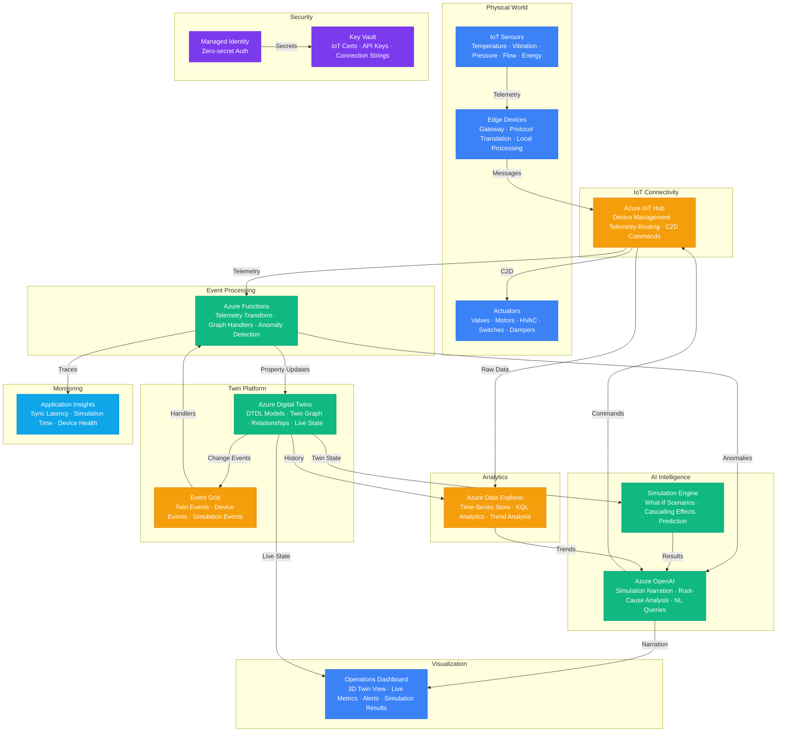

# Architecture — Play 58: Digital Twin Agent

## Overview

AI-powered digital twin platform that creates virtual replicas of physical assets, facilities, and systems — synchronized in real-time with IoT sensor data — and augments them with predictive simulation and natural-language intelligence. Azure Digital Twins provides the core twin graph: DTDL (Digital Twins Definition Language) models define the ontology of physical assets (turbines, HVAC systems, production lines, buildings), their properties (temperature, vibration, throughput, energy consumption), and their relationships (turbine-3 is-part-of production-line-A, which is-located-in building-2). IoT Hub connects physical sensors and actuators to the cloud: devices send telemetry (temperature every 5 seconds, vibration every 1 second, energy consumption every minute) and receive commands (adjust setpoint, trigger maintenance mode, activate backup system). Azure Functions processes the event stream: telemetry ingestion functions transform raw sensor data into DTDL property updates, graph event handlers propagate state changes through twin relationships (if a chiller fails, all rooms it serves are marked as "cooling-degraded"), anomaly detection functions evaluate thresholds and patterns, and simulation trigger functions schedule and execute predictive scenarios. Azure OpenAI provides the intelligence layer: GPT-4o powers predictive simulation narration — when the system runs a what-if scenario ("What happens if Pump 7 fails during peak production?"), it executes the simulation against the twin graph, computes cascading effects through relationships, and GPT-4o generates a natural-language explanation of the predicted impact, timeline, and recommended preventive actions. The natural-language query interface lets facility managers ask questions about twin state in plain language: "Which machines on Floor 3 are showing early signs of bearing wear?" triggers a KQL query against Azure Data Explorer's historical telemetry, correlates with the current twin state, and returns an AI-narrated analysis. Azure Data Explorer stores the time-series telemetry history — billions of sensor readings queryable with sub-second KQL queries for trend analysis, anomaly baseline computation, and simulation input data preparation.

## Architecture Diagram

## Data Flow

1. **IoT Telemetry Ingestion**: Physical sensors (temperature, vibration, pressure, flow rate, energy consumption) transmit readings to edge gateways that perform protocol translation (Modbus, OPC-UA, MQTT → IoT Hub MQTT/AMQP) and local pre-processing (unit conversion, outlier filtering, downsampling) → Edge devices send telemetry messages to Azure IoT Hub with device identity, timestamp, and sensor readings → IoT Hub routes messages to two destinations: Azure Functions for real-time twin updates and Azure Data Explorer for time-series storage → Device twin metadata (firmware version, configuration, connectivity status) maintained in IoT Hub for device fleet management → Device Provisioning Service (DPS) handles zero-touch enrollment of new sensors using X.509 certificates
2. **Digital Twin Synchronization**: Azure Functions receive IoT Hub telemetry messages and transform raw sensor data into DTDL property updates → Each sensor reading maps to a specific twin property: sensor-temp-3A → twin "Room-301" property "temperature" = 22.5°C → Property updates applied to the Azure Digital Twins graph via the SDK → Event Grid captures twin change notifications and triggers downstream handlers → Relationship-aware propagation: when a twin's state changes, graph traversal functions update related twins — if a chiller twin's status changes to "degraded", all rooms connected via "cooled-by" relationships have their "cooling-status" property updated to "at-risk" → Twin state changes persisted to Azure Data Explorer for historical trend analysis → Synchronization latency target: IoT sensor reading to twin property update < 5 seconds in production
3. **Anomaly Detection & Analysis**: Azure Functions evaluate twin property updates against dynamic thresholds — thresholds computed from Azure Data Explorer baselines (rolling 30-day statistics) rather than static limits → Anomaly types: point anomalies (single reading outside expected range), trend anomalies (gradual drift suggesting degradation), pattern anomalies (unusual behavior sequences correlating across multiple twins) → When an anomaly is detected, the function packages context: current twin state, recent telemetry history from ADX, related twin states, and maintenance records → Azure OpenAI performs root-cause analysis: given the anomaly context, GPT-4o identifies probable causes ("Vibration increase on Pump-7 correlates with bearing temperature rise over the past 72 hours — pattern consistent with early-stage bearing wear"), estimates time to failure, and recommends actions ("Schedule bearing inspection within 5 business days; continue monitoring at 1-minute intervals")
4. **Predictive Simulation**: Facility managers trigger what-if scenarios via the dashboard or natural-language interface ("What happens if we increase production line B throughput by 20%?") → The simulation engine snapshots the current twin graph state, applies the scenario modifications (increase throughput property on all Line-B twins), and propagates effects through the relationship graph: higher throughput → increased energy consumption (calculated via twin model equations), higher cooling demand (relationship to HVAC twins), potential bottleneck at packaging station (capacity twin comparison) → Cascading effects computed across all affected twins with confidence intervals → Azure OpenAI narrates the simulation results in natural language: predicted impacts, timeline, risk factors, recommended preparation steps, and alternative scenarios to consider → Simulation results stored in ADX for comparison across scenarios and trend analysis of simulation accuracy vs actual outcomes
5. **Natural-Language Interface & Visualization**: Operations dashboard displays the twin graph as an interactive 3D model (or 2D floorplan) with live sensor overlays — color-coded by status (green/yellow/red), with drill-down to individual twin properties and historical charts → Facility managers query the system in natural language: "Which assets on Floor 3 have the highest maintenance risk this month?" → The query engine translates to: ADX query for recent anomaly patterns + ADT query for current twin states + relationship traversal for Floor-3 assets → Azure OpenAI synthesizes results into a prioritized report with risk scores, reasoning, and recommended actions → Cloud-to-device commands: AI-recommended adjustments (reduce setpoint, activate backup, switch to maintenance mode) can be sent from the dashboard through IoT Hub to physical actuators, with human approval required for safety-critical operations

## Service Roles

| Service | Layer | Role |
|---------|-------|------|
| Azure OpenAI | AI | Simulation narration, root-cause analysis, NL queries, maintenance recommendations |
| Azure IoT Hub | IoT | Device connectivity, telemetry ingestion, cloud-to-device commands, DPS |
| Azure Digital Twins | Platform | Twin graph, DTDL models, live state synchronization, relationship management |
| Azure Functions | Compute | Telemetry transformation, graph event handlers, anomaly detection, simulation triggers |
| Event Grid | Integration | Twin change events, device events, simulation events routing |
| Azure Data Explorer | Analytics | Time-series telemetry storage, KQL queries, trend analysis, anomaly baselines |
| Key Vault | Security | IoT certificates, API keys, connection strings, device credentials |
| Managed Identity | Security | Zero-secret authentication across all Azure services |
| Application Insights | Monitoring | Sync latency, simulation time, device health, function performance |

## Security Architecture

- **Device Security**: IoT device authentication via X.509 certificates provisioned through DPS — devices cannot connect without valid certificates, and compromised certificates can be revoked per-device or per-enrollment group
- **Managed Identity**: All service-to-service authentication via managed identity — no connection strings or API keys in function code, twin update logic, or simulation services
- **Network Isolation**: IoT Hub, Digital Twins, Data Explorer, and Functions accessible only via private endpoints within the VNET — no public internet exposure for the twin platform
- **RBAC**: Role-based access at twin level — operators see twins for their facility/floor, engineers can modify twin models and run simulations, executives see aggregated KPIs across all facilities
- **Command Authorization**: Cloud-to-device commands (actuator control) require multi-factor approval for safety-critical operations — AI can recommend but cannot autonomously execute commands that affect physical systems without human confirmation
- **Data Encryption**: Telemetry encrypted in transit (TLS 1.2+) and at rest (CMK for regulated facilities) — sensor data classified by sensitivity level and retention policies applied accordingly
- **Audit Trail**: All twin modifications, simulation executions, and actuator commands logged with operator identity, timestamp, and authorization chain — immutable audit for industrial compliance (IEC 62443)
- **Edge Security**: Edge gateway firmware integrity validated via secure boot — local telemetry buffer encrypted at rest to prevent tampering during connectivity interruptions

## Scaling

| Metric | Dev | Production | Enterprise |
|--------|-----|-----------|------------|
| Digital twins | 50 | 5,000 | 50,000+ |
| IoT devices | 20 | 2,000 | 50,000+ |
| Telemetry messages/second | 10 | 5,000 | 100,000+ |
| Twin sync latency (P95) | 10s | 5s | 2s |
| Simulation scenarios/day | 5 | 50 | 500+ |
| Historical data retention | 30 days | 1 year | 5 years |
| ADX query latency (P95) | 5s | 1s | 500ms |
| Concurrent dashboard users | 3 | 50 | 500+ |
| Facilities modeled | 1 | 5 | 50+ |
| Anomaly detection latency | 1min | 15s | 5s |
