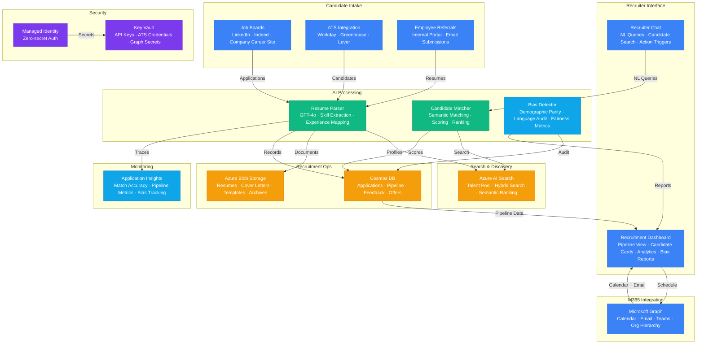

# Play 59 — AI Recruiter Agent

Bias-aware AI recruitment — resume parsing with PII redaction (name, photos, graduation years), candidate scoring on skills+experience only (never demographics), explainable factors, job description generation with bias-checked language, paired fairness testing, EEOC 4/5 rule compliance, and always human-in-the-loop decisions.

## Architecture

> Full architecture details: [`architecture.md`](./architecture.md)

## How It Differs from Related Plays

| Aspect | Play 60 (Responsible AI) | **Play 59 (AI Recruiter)** | Play 46 (Healthcare AI) |
|--------|------------------------|---------------------------|--------------------------|
| Domain | General AI fairness | **Hiring/recruitment specifically** | Healthcare clinical |
| Bias Focus | Any AI system | **Employment discrimination (EEOC)** | Clinical accuracy |
| PII Type | General PII | **Recruitment PII (names, photos, dates)** | PHI (HIPAA) |
| Regulation | EU AI Act, NIST | **EEOC, Title VII, ADA, ADEA** | HIPAA |
| Output | Fairness scorecard | **Candidate score + factors + JD** | Clinical decision support |
| Key Metric | Disparate impact ratio | **4/5 rule across demographics** | PHI recall |

## Key Metrics

| Metric | Target | Description |
|--------|--------|-------------|
| Matching Accuracy | > 80% | AI score agrees with human recruiter |
| Disparate Impact | > 0.80 | EEOC 4/5 rule compliance |
| PII Redaction | > 99% | Names, dates, photos removed |
| Score Consistency | 100% | Same resume → same score (temp=0, seed=42) |
| Protected Attribute Refs | 0 | Scoring factors never reference demographics |
| Cost per Candidate | < $0.10 | Parse + redact + score |

## Cost Estimate

| Service | Dev | Prod | Enterprise |
|---------|-----|------|------------|
| Azure OpenAI | $60 | $450 | $1,800 |
| Azure AI Search | $0 | $250 | $1,000 |
| Cosmos DB | $5 | $120 | $400 |
| Microsoft Graph | $0 | $0 | $0 |
| Azure Blob Storage | $3 | $25 | $80 |
| Key Vault | $1 | $3 | $10 |
| Application Insights | $0 | $25 | $80 |
| **Total** | **$69** | **$873** | **$3,370** |

> Detailed breakdown with SKUs and optimization tips: [`cost.json`](./cost.json) · [Azure Pricing Calculator](https://azure.microsoft.com/pricing/calculator/)

## WAF Alignment

| Pillar | Implementation |
|--------|---------------|
| **Responsible AI** | PII redaction before scoring, paired bias testing, EEOC compliance, explainable factors |
| **Security** | Resume PII never reaches LLM, Key Vault for secrets |
| **Reliability** | Deterministic scoring (temp=0, seed=42), consistent factors |
| **Cost Optimization** | gpt-4o-mini for parsing, local Presidio redaction |
| **Operational Excellence** | Fairness monitoring, score history in Cosmos DB |
| **Performance Efficiency** | Batch candidate scoring, cached JD templates |
