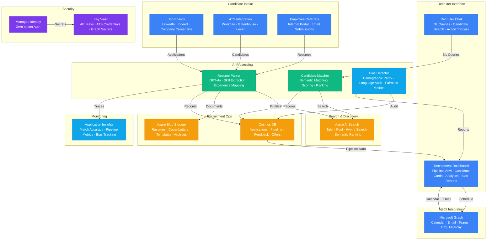

# Architecture — Play 59: AI Recruiter Agent

## Overview

AI-powered recruitment platform that transforms the hiring process through intelligent candidate-role matching, automated resume analysis, bias-aware evaluation, and end-to-end pipeline orchestration. Azure OpenAI powers the core intelligence: GPT-4o analyzes unstructured resumes — extracting skills, experience, education, certifications, and achievements into a structured candidate profile — then performs semantic matching against job requirements, scoring candidates on technical fit, experience alignment, and cultural indicators. The matching goes beyond keyword overlap: a candidate with "built distributed systems at scale" matches a requirement for "microservices architecture experience" even without exact keyword match, because the model understands the semantic relationship. Azure AI Search provides the talent pool infrastructure: hybrid search combines keyword matching (specific certifications like "AWS Solutions Architect", company names, job titles) with vector similarity for semantic skill queries ("find candidates with strong machine learning fundamentals"), faceted filtering (location, experience level, availability, visa status), and semantic reranking for relevance optimization. Cosmos DB stores the recruitment operations data: candidate application records with full pipeline history (applied → screened → phone screen → technical interview → onsite → offered → hired/rejected), interview feedback, recruiter notes, job requisition details, and offer tracking — all with low-latency reads for the real-time recruitment dashboard. Bias detection is embedded throughout the pipeline: the system monitors demographic distribution at each stage (screening, interview, offer) and flags statistically significant disparities; AI-generated evaluation summaries are audited for biased language patterns; and matching scores are calibrated to ensure protected characteristics (age, gender, ethnicity) do not influence ranking. Microsoft Graph integrates the platform with the M365 ecosystem: interview scheduling through Outlook calendar (multi-interviewer availability matching, timezone handling, rescheduling), candidate communication via email, Teams meeting creation for virtual interviews, and hiring manager approval workflows through organizational hierarchy.

## Architecture Diagram

## Data Flow

1. **Candidate Intake & Resume Parsing**: Candidates apply through job boards (LinkedIn, Indeed, company career site), ATS integrations (Workday, Greenhouse, Lever), or employee referral portals → Resumes arrive in various formats (PDF, DOCX, LinkedIn profile JSON) → GPT-4o parses each resume into a structured candidate profile: personal information (name, location, contact — PII handled per privacy policy), work experience (company, title, duration, responsibilities with semantic understanding of accomplishments), education (institution, degree, field, honors), technical skills (extracted and normalized to a canonical skill taxonomy — "React.js", "ReactJS", "React" all map to "React"), certifications (with verification status), and a free-text summary of career trajectory → Parsed profiles stored in Cosmos DB and indexed in Azure AI Search with both text fields (for keyword search) and vector embeddings (for semantic matching) → Original resume documents stored in Azure Blob Storage linked to the candidate record
2. **Candidate-Role Matching & Scoring**: When a new job requisition opens, the recruiter provides requirements (must-have skills, nice-to-have skills, experience level, location preferences, team culture notes) → The matching engine queries AI Search with a hybrid approach: keyword search for hard requirements (specific certifications, years of experience, location), vector search for semantic skill matching (requirement "distributed systems" matches candidates with "Kubernetes, microservices, event-driven architecture"), and faceted filters for categorical constraints → GPT-4o generates a detailed match analysis for top candidates: skill coverage score (which requirements are met, partially met, or missing), experience relevance score (how directly their past work relates to the role), growth trajectory assessment (career progression pattern), and a narrative summary explaining the match rationale → Candidates ranked by composite score with full transparency: recruiters can see exactly why each candidate ranks where they do and can adjust weighting factors
3. **Bias Detection & Fairness Monitoring**: The bias detection module operates at three levels → Pre-screening: before AI matching, candidate profiles are scrubbed of protected characteristics (name, photo, age indicators, graduation year) for blind evaluation — matching scores generated without demographic influence → Pipeline monitoring: at each stage transition (screening → interview → offer), the system computes demographic distribution metrics and flags statistically significant disparities using chi-squared tests and adverse impact ratio analysis → Language audit: AI-generated evaluation summaries and interview feedback are scanned for biased language patterns (gendered terms, age-related assumptions, cultural stereotypes) with specific alternatives suggested → Fairness reports generated weekly: pipeline conversion rates by demographic group, matching score distributions, language audit findings, and trend analysis over time → All bias metrics surfaced on the recruitment dashboard with drill-down capability
4. **Interview Scheduling & Communication**: When a candidate advances to the interview stage, the system coordinates through Microsoft Graph → Available time slots computed by querying Outlook calendars of all required interviewers, accounting for timezone differences, meeting room availability, and buffer time between interviews → Interview invitations sent with automatically generated interview guides: GPT-4o creates role-specific interview questions based on the job requirements and the candidate's profile (e.g., "Given your experience building real-time data pipelines at Stripe, describe a scenario where..."), behavioral questions calibrated to the seniority level, and a structured scoring rubric → Teams meeting links auto-generated for virtual interviews → Post-interview: feedback forms sent to interviewers with structured scoring sections and free-text fields → Candidate communication: personalized status updates, next-step notifications, and (for rejections) constructive feedback drafts generated by GPT-4o with empathetic tone
5. **Recruitment Analytics & Optimization**: The dashboard provides recruiters and hiring managers with real-time pipeline visibility: open requisitions, candidates at each stage, time-in-stage metrics, and bottleneck identification → Key metrics tracked: time-to-hire (from requisition open to offer accept), source effectiveness (which channels produce the best-matched candidates), funnel conversion rates, offer acceptance rate, recruiter productivity (candidates processed per day), and matching accuracy (comparing AI match scores to interview outcomes and eventual hire performance) → Bias reports integrated into the analytics view: diversity metrics at each pipeline stage, trending over quarters → AI-powered insights: "Backend Engineer requisitions from LinkedIn have 3x higher interview-to-offer conversion than Indeed — consider reallocating sourcing budget" → Data retention policies enforce compliance: candidate data retained per jurisdiction requirements (GDPR: deleted on request, EEOC: 1 year after position closure), archived to cool storage after retention period

## Service Roles

| Service | Layer | Role |
|---------|-------|------|
| Azure OpenAI (GPT-4o) | AI | Resume parsing, candidate matching, interview questions, bias language audit |
| Azure OpenAI (GPT-4o-mini) | AI | High-volume screening, FAQ responses, status communications |
| Azure AI Search | Search | Talent pool hybrid search — keyword + vector with semantic ranking |
| Cosmos DB | Data | Recruitment pipeline, applications, feedback, offers, audit records |
| Microsoft Graph | Integration | Calendar scheduling, email communication, Teams meetings, org hierarchy |
| Azure Blob Storage | Data | Resumes, cover letters, templates, interview recordings, compliance archives |
| Key Vault | Security | API keys, ATS credentials, Graph client secrets, vendor API keys |
| Managed Identity | Security | Zero-secret authentication across all Azure services |
| Application Insights | Monitoring | Match accuracy, pipeline metrics, bias tracking, recruiter productivity |

## Security Architecture

- **PII Protection**: Candidate personal information encrypted at rest (CMK) and in transit (TLS 1.2+) — PII fields (name, email, phone, address) stored separately from profile data with field-level access control; PII stripped from AI prompts for matching (blind evaluation mode)
- **Managed Identity**: All service-to-service authentication via managed identity — no API keys or credentials in application code or recruitment pipeline configurations
- **RBAC**: Role-based access at multiple levels — recruiters see candidates for their assigned requisitions, hiring managers see their team's pipeline, HR leadership sees aggregate metrics and bias reports, candidates see only their own application status
- **Data Residency**: Candidate data stored in the region where the candidate applies — EU candidates processed and stored in EU regions (GDPR compliance), configurable per jurisdiction
- **Right to Deletion**: GDPR/CCPA compliance — candidates can request deletion of all their data; the system cascades deletion across Cosmos DB, AI Search index, Blob Storage, and any cached profiles
- **Audit Trail**: All AI decisions logged: matching scores, screening results, bias flags, and recruiter overrides recorded with timestamp and reasoning — immutable audit trail for employment compliance (EEOC, EU AI Act)
- **Consent Management**: Candidate consent tracked per data processing activity — resume storage, AI analysis, background checks, and data sharing with hiring team each require explicit consent
- **Network Isolation**: AI Search, Cosmos DB, and Blob Storage accessible only via private endpoints — recruitment dashboard served through App Service with authentication required

## Scaling

| Metric | Dev | Production | Enterprise |
|--------|-----|-----------|------------|
| Candidate profiles indexed | 1K | 500K | 5M+ |
| Applications processed/day | 20 | 2,000 | 50,000+ |
| Active job requisitions | 5 | 100 | 5,000+ |
| Resume parse latency (P95) | 5s | 2s | 1s |
| Matching score latency | 3s | 1s | 500ms |
| Interviews scheduled/day | 5 | 200 | 5,000+ |
| Bias report frequency | Manual | Weekly | Daily |
| Languages supported | 1 | 5 | 20+ |
| ATS integrations | 1 | 3 | 10+ |
| Concurrent recruiters | 3 | 50 | 500+ |
