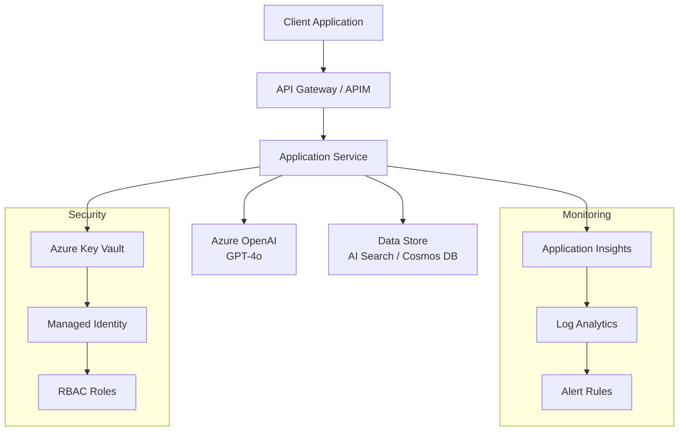

# Play 59: Ai Recruiter Agent

> **FrootAI Solution Play** — Production-grade Ai Recruiter Agent on Azure with FAI Protocol integration

[](#waf-alignment)
[](#azure-services)
[](#fai-protocol)

## Overview
This solution play implements a production-ready Ai Recruiter Agent system using Azure AI Services, following the FrootAI FAI Protocol for AI primitive unification and the Azure Well-Architected Framework (WAF) across all six pillars.

## Architecture



## Azure Services
| Service | Purpose | SKU (Prod) |
|---------|---------|------------|
| Azure OpenAI | Model inference (GPT-4o, embeddings) | S0 + GlobalStandard |
| Azure Key Vault | Secret management | Standard |
| Application Insights | Monitoring, tracing | Pay-as-you-go |
| Log Analytics | Log aggregation, KQL queries | PerGB2018 |
| Azure Storage | Data persistence | Standard_GRS |

## Prerequisites
- Azure subscription with Contributor access
- Azure CLI v2.60+ (`az --version`)
- Azure Developer CLI v1.9+ (`azd version`)
- Python 3.10+ (for evaluation pipeline)
- Node.js 20+ (for MCP integration)

## Quickstart

### 1. Clone and Navigate
```bash
git clone https://github.com/frootai/frootai.git
cd solution-plays/59-ai-recruiter-agent
```

### 2. Deploy Infrastructure
```bash
az login
azd init
azd up --environment dev
```

### 3. Verify Deployment
```bash
curl -s https://${APP_URL}/health | jq .
```

### 4. Run Evaluation
```bash
pip install -r evaluation/requirements.txt
python evaluation/eval.py --ci-gate
```

### 5. Use with Copilot
Open this folder in VS Code with GitHub Copilot. The agent chain (builder → reviewer → tuner) activates automatically.

## Configuration
All settings are in the `config/` directory:

| File | Description |
|------|-------------|
| `openai.json` | Model parameters (temperature, max_tokens, model) |
| `agents.json` | Agent behavior and handoff rules |
| `guardrails.json` | Content safety thresholds and evaluation gates |
| `model-comparison.json` | Model cost/quality comparison matrix |
| `chunking.json` | Data processing configuration |
| `search.json` | Search/retrieval settings |

## Agent Chain (DevKit)
This play includes three specialized agents:

| Agent | File | Role |
|-------|------|------|
| **Builder** | `.github/agents/builder.agent.md` | Implements features, writes code |
| **Reviewer** | `.github/agents/reviewer.agent.md` | Reviews security, quality, WAF compliance |
| **Tuner** | `.github/agents/tuner.agent.md` | Optimizes config for production |

Workflow: `@builder` → `@reviewer` → `@tuner` → Production Ready

## Evaluation Pipeline
The evaluation pipeline (`evaluation/eval.py`) measures:

| Metric | Threshold | Description |
|--------|-----------|-------------|
| Relevance | ≥ 0.80 | Response addresses the query |
| Groundedness | ≥ 0.85 | Grounded in provided context |
| Coherence | ≥ 0.80 | Logically consistent |
| Fluency | ≥ 0.85 | Grammatically correct |
| Safety | ≥ 0.95 | No harmful content |
| Latency p95 | ≤ 3s | Response time |

```bash
python evaluation/eval.py --report html --output evaluation/report.html
```

## WAF Alignment
| Pillar | Implementation |
|--------|---------------|
| **Reliability** | Retry policies, health checks, circuit breaker, graceful degradation |
| **Security** | Managed Identity, Key Vault, Content Safety, RBAC, encryption |
| **Cost Optimization** | Model routing, caching, right-sized SKUs, token budgets |
| **Operational Excellence** | Bicep IaC, CI/CD, observability, incident runbooks |
| **Performance** | Async patterns, connection pooling, CDN, streaming |
| **Responsible AI** | Content safety, groundedness, fairness, transparency |

## Cost Estimate
| Resource | Dev (monthly) | Prod (monthly) |
|----------|:------------:|:-------------:|
| Azure OpenAI (GPT-4o) | ~$50 | ~$500 |
| Azure OpenAI (Embeddings) | ~$10 | ~$100 |
| Key Vault | ~$1 | ~$5 |
| Application Insights | ~$5 | ~$50 |
| Storage | ~$2 | ~$20 |
| **Total** | **~$68** | **~$675** |

## Troubleshooting

### Common Issues
| Issue | Solution |
|-------|---------|
| `DefaultAzureCredential` fails | Run `az login`, check RBAC assignments |
| Model deployment not found | Verify deployment name in openai.json matches Azure portal |
| Rate limit (429) | Check PTU capacity, implement retry with backoff |
| Content blocked | Review Content Safety thresholds in guardrails.json |
| High latency | Enable caching, reduce max_tokens, check network path |

## FAI Protocol
This play is wired through `fai-manifest.json`:
- **Context:** Knowledge modules define what the play knows
- **Primitives:** Agents, instructions, skills, hooks wired together
- **Infrastructure:** Azure resource requirements defined in Bicep
- **Guardrails:** Quality gates and safety rules enforced at runtime

## Contributing
See [CONTRIBUTING.md](../../CONTRIBUTING.md) for guidelines. Use the agent chain:
1. `@builder` to implement changes
2. `@reviewer` to validate quality
3. `@tuner` to optimize for production

## License
MIT — see [LICENSE](../../LICENSE)


## File Structure
```
.
├── .github/                 # DevKit (agents, instructions, prompts, skills, hooks, workflows)
├── .vscode/                 # VS Code settings and MCP config
├── config/                  # All configuration files (JSON)
├── evaluation/              # Quality evaluation pipeline (eval.py, test-set.jsonl)
├── infra/                   # Azure infrastructure (Bicep, ARM, parameters)
├── mcp/                     # MCP server plugin integration
├── plugins/                 # Plugin documentation
├── spec/                    # Architecture specification
├── agent.md                 # Root agent definition
├── CHANGELOG.md             # Version history
├── fai-manifest.json        # FAI Protocol manifest (primitives, context, guardrails)
├── froot.json               # Play metadata
├── instructions.md          # Root coding instructions
├── plugin.json              # Plugin manifest
└── README.md                # This file
```

## Related Resources
- **Solution Plays Catalog:** [frootai.dev/solution-plays](https://frootai.dev/solution-plays)
- **FAI Protocol:** [frootai.dev/fai-protocol](https://frootai.dev/fai-protocol)
- **Primitives Catalog:** [frootai.dev/primitives](https://frootai.dev/primitives)
- **Learning Hub:** [frootai.dev/learning-hub](https://frootai.dev/learning-hub)
- **GitHub:** [github.com/frootai/frootai](https://github.com/frootai/frootai)

## Changelog
See [CHANGELOG.md](CHANGELOG.md) for version history.

## Support
- **Issues:** [github.com/frootai/frootai/issues](https://github.com/frootai/frootai/issues)
- **Discussions:** [github.com/frootai/frootai/discussions](https://github.com/frootai/frootai/discussions)
- **MCP Server:** `npx frootai-mcp@latest` (25 tools for AI architecture)
- **VS Code Extension:** Search "FrootAI" in VS Code Marketplace
