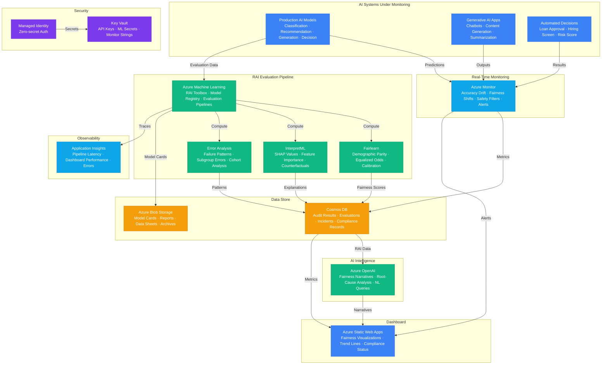

# Architecture — Play 60: Responsible AI Dashboard

## Overview

Comprehensive responsible AI monitoring platform that provides continuous fairness measurement, bias detection, model interpretability, and compliance tracking across an organization's AI portfolio. The dashboard aggregates responsible AI (RAI) metrics from multiple AI systems — classification models, recommendation engines, generative AI applications, and automated decision systems — into a unified view for data scientists, compliance officers, and executives. Azure Machine Learning powers the core RAI evaluation pipeline: Fairlearn computes group fairness metrics (demographic parity, equalized odds, calibration by subgroup) across protected attributes (age, gender, ethnicity, disability status), InterpretML generates model explanations (SHAP values for feature importance, counterfactual examples showing what would change a prediction), and Error Analysis identifies systematic failure patterns (which subpopulations experience disproportionate errors). Azure OpenAI enhances the analytical layer: GPT-4o generates human-readable fairness assessment narratives from statistical data ("The loan approval model shows a 12% demographic parity gap for applicants over 55 — equalized odds analysis suggests this stems from the model over-weighting employment length, which correlates with age"), performs bias root-cause investigation by analyzing training data distributions and feature correlations, and powers a natural-language query interface for non-technical stakeholders to explore RAI metrics without writing code. Azure Monitor collects real-time RAI signals: model accuracy drift, fairness metric shifts, content safety filter activation rates, prompt injection attempt frequencies, and custom guardrail violation counts — with alerting rules that notify the responsible AI team when metrics breach configurable thresholds. Cosmos DB stores the historical RAI data: every fairness audit result, model evaluation, incident report, compliance check, and user feedback record indexed by model, time period, and demographic group for trend analysis and regulatory reporting. The dashboard frontend (Azure Static Web Apps) presents interactive visualizations: confusion matrices sliced by demographic group, ROC curves comparing model performance across subpopulations, calibration plots, fairness metric trend lines, incident timelines, and compliance status indicators — with role-based views (data scientist sees technical details, executive sees aggregated risk scores, compliance officer sees regulatory alignment status).

## Architecture Diagram

## Data Flow

1. **AI System Telemetry Collection**: Production AI models emit predictions with associated metadata — input features (anonymized), predicted outcome, confidence score, model version, and timestamp → Generative AI applications log outputs with safety filter results, content categories, and user feedback signals → Automated decision systems record decisions with the factors that influenced the outcome → Azure Monitor ingests these signals as custom metrics and dimensions: accuracy by demographic group, prediction distribution, content safety filter activation rates, and guardrail violation counts → Real-time alerting rules evaluate incoming metrics: fairness metric deviation > 5% from baseline triggers investigation alert, content safety filter rate > threshold triggers content review, accuracy drift > configured limit triggers model retraining notification
2. **Scheduled Fairness Audits**: Azure Machine Learning pipelines run scheduled evaluations (configurable: daily for high-risk models, weekly for standard, monthly for low-risk) → Evaluation datasets sampled from recent production predictions with demographic labels joined from a secure, access-controlled demographic reference table → Fairlearn computes group fairness metrics across all monitored protected attributes: demographic parity difference (are positive prediction rates equal across groups?), equalized odds difference (are true positive and false positive rates equal?), and calibration (are confidence scores equally accurate across groups?) → InterpretML generates model explanations: global feature importance (which features drive predictions overall), local explanations (SHAP values for individual predictions), and counterfactual examples (what minimal changes to input would change the prediction?) → Error Analysis identifies systematic failure patterns: tree-based cohort analysis surfaces subpopulations with disproportionate error rates, enabling targeted model improvement → All results stored in Cosmos DB with model ID, evaluation timestamp, dataset metadata, and metric values
3. **AI-Powered RAI Narratives**: GPT-4o transforms statistical RAI metrics into actionable, human-readable narratives → For each fairness audit: generates an executive summary ("Loan approval model fairness improved 3% this quarter but still shows a 12% demographic parity gap for the 55+ age group — primary driver is employment length feature, which correlates with age"), detailed technical findings, recommended remediation actions, and regulatory impact assessment → Root-cause analysis: when fairness metrics deteriorate, GPT-4o analyzes the correlated changes — training data distribution shifts, feature importance changes, and population composition changes — to identify probable causes → Natural-language query interface: stakeholders ask questions ("Which models are highest risk for the EU AI Act audit next month?") and receive AI-generated answers grounded in the actual RAI metrics data from Cosmos DB → Narrative quality validated against factual consistency — all claims in generated narratives are traceable to specific metric values in the data store
4. **Compliance Tracking & Reporting**: The compliance module maps RAI metrics to regulatory requirements: EU AI Act (high-risk AI system documentation, human oversight, transparency), NIST AI RMF (govern, map, measure, manage), IEEE standards, and organization-specific AI governance policies → Compliance status computed per model: green (all requirements met), yellow (minor gaps, remediation plan in place), red (significant gaps, immediate action required) → Automated compliance checks: model cards complete and up-to-date? Data sheets documented? Fairness audit within recency threshold? Incident response plan defined? Human oversight mechanism in place? → Compliance reports generated for regulatory submissions: PDF exports with full audit trail, metric histories, remediation actions taken, and attestation signatures → All compliance data versioned in Cosmos DB for historical tracking — regulators can see the complete compliance trajectory for any model
5. **Dashboard Visualization & Stakeholder Views**: Azure Static Web Apps serves the dashboard with role-based views → Data Scientist view: detailed fairness metrics with statistical significance tests, model explanation visualizations (SHAP plots, ICE curves), error analysis trees, A/B comparison between model versions, and experiment tracking integration with Azure ML → Compliance Officer view: regulatory requirement checklist per model, compliance status heatmap across the AI portfolio, audit timeline with upcoming deadlines, and one-click report generation for regulatory submissions → Executive view: RAI risk scorecard across the organization (number of high/medium/low risk models), trend lines for key fairness metrics, incident count and resolution rate, and portfolio-level compliance status → All views include drill-down capability: click a metric to see the underlying data, contributing factors, and historical trend → Dashboard data refreshed from Cosmos DB aggregated rollups for performance — detailed data available on drill-down via direct queries

## Service Roles

| Service | Layer | Role |
|---------|-------|------|
| Azure OpenAI | AI | Fairness narratives, root-cause analysis, NL queries, compliance summaries |
| Azure Machine Learning | Evaluation | RAI Toolbox (Fairlearn, InterpretML, Error Analysis), model registry, evaluation pipelines |
| Azure Monitor | Monitoring | Real-time AI metrics, accuracy drift, fairness shifts, content safety, alerting |
| Cosmos DB | Data | RAI audit results, evaluations, incidents, compliance records, metric histories |
| Azure Static Web Apps | Frontend | Interactive RAI dashboard, role-based views, compliance reporting |
| Azure Blob Storage | Data | Model cards, audit reports, data sheets, compliance documentation archives |
| Key Vault | Security | API keys, ML workspace secrets, Monitor connection strings |
| Managed Identity | Security | Zero-secret authentication across all Azure services |
| Application Insights | Monitoring | Pipeline execution latency, dashboard performance, API errors |

## Security Architecture

- **Data Classification**: RAI data classified by sensitivity — demographic data is "Confidential" (encrypted, access-logged, retention-limited), aggregated fairness metrics are "Internal" (broader access for dashboards), and published model cards are "Public"
- **Managed Identity**: All service-to-service authentication via managed identity — no API keys in evaluation pipelines, dashboard backends, or monitoring configurations
- **RBAC**: Granular role-based access — data scientists access technical metrics and explanations for their models, compliance officers access compliance status across all models, executives see aggregated risk scores, and external auditors receive time-limited read-only access to specific audit periods
- **Demographic Data Protection**: Protected attribute data stored in a separate, access-controlled reference table with field-level encryption — demographic labels joined to evaluation data only within the ML compute environment and never persisted in plain text outside the evaluation pipeline
- **Audit Trail**: All dashboard access, report generation, compliance status changes, and AI narrative requests logged with user identity and timestamp — immutable audit trail for demonstrating governance oversight to regulators
- **Network Isolation**: ML workspace, Cosmos DB, and Blob Storage accessible only via private endpoints — Static Web Apps authenticates users via Entra ID before serving dashboard content
- **Data Retention**: RAI metrics retained per regulatory requirements (EU AI Act: duration of model deployment + 10 years for high-risk systems) with automated archival to cool/archive storage tiers
- **Incident Confidentiality**: RAI incident reports restricted to the responsible AI team and affected model owners — incident details not exposed to the general dashboard without explicit approval

## Scaling

| Metric | Dev | Production | Enterprise |
|--------|-----|-----------|------------|
| AI models monitored | 3 | 30 | 300+ |
| Fairness audits/month | 5 | 100 | 3,000+ |
| Predictions evaluated/day | 1K | 100K | 10M+ |
| Protected attributes tracked | 2 | 5 | 10+ |
| Dashboard concurrent users | 3 | 50 | 500+ |
| Compliance frameworks | 1 | 3 | 10+ |
| RAI metric retention | 90 days | 3 years | 10+ years |
| Alert rules configured | 5 | 50 | 500+ |
| Report generation latency | 30s | 10s | 5s |
| Narrative generation latency | 10s | 5s | 3s |
