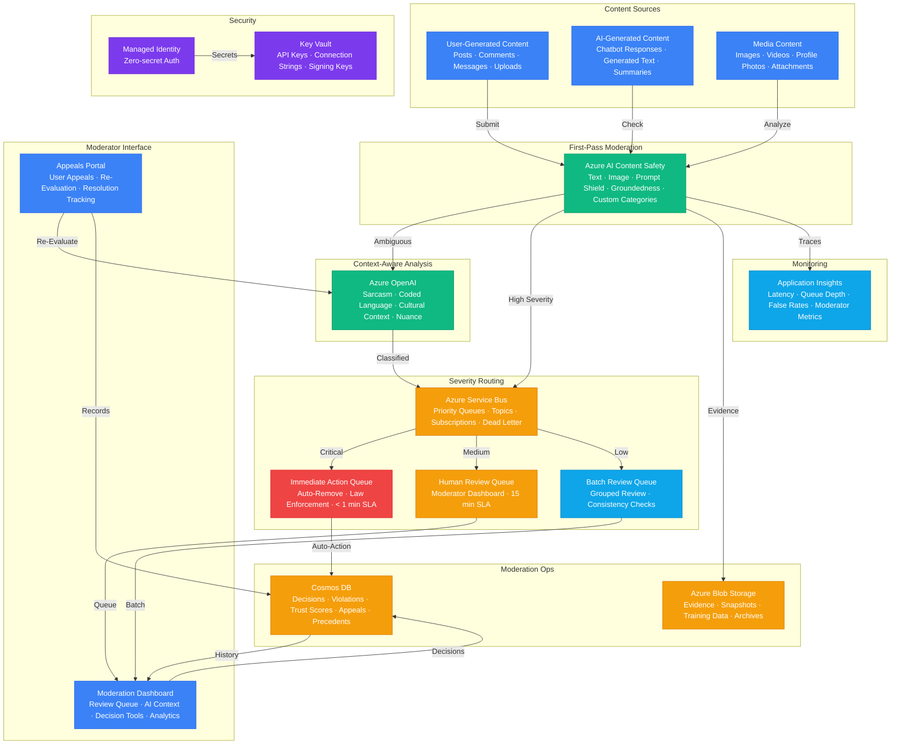

# Play 61 — Content Moderation V2

Advanced multi-modal content moderation — Azure Content Safety for text+image+video, custom category blocklists, per-category severity thresholds, severity-based routing (auto-block/human-review/flag), Service Bus review queues with SLA-based priority, appeal workflows with different-reviewer requirement, and streaming moderation.

## Architecture

> Full architecture details: [`architecture.md`](./architecture.md)

## How It Differs from Play 10 (Content Moderation v1)

| Aspect | Play 10 (v1) | **Play 61 (V2)** |
|--------|-------------|-----------------|
| Modalities | Text only | **Text + image + video** |
| Categories | Built-in only | **Built-in + custom blocklists** |
| Routing | Binary (block/allow) | **4-tier: block/review/flag/allow** |
| Review | No human review | **Service Bus queue with SLA per category** |
| Appeals | None | **Full appeal workflow with different reviewer** |
| Thresholds | Global | **Per-category severity thresholds** |
| Explanation | None | **Category + severity + policy reference** |

## Key Metrics

| Metric | Target | Description |
|--------|--------|-------------|
| Precision (violence) | > 95% | Blocked content is actually violent |
| Recall (self-harm) | > 98% | Self-harm content not missed |
| False Positive Rate | < 3% | Safe content incorrectly blocked |
| Text Latency | < 200ms | Real-time text moderation |
| Queue Wait (self-harm) | < 15 min | Critical category SLA |
| Appeal Success Rate | 5-15% | Healthy appeal overturn range |

## Cost Estimate

| Service | Dev | Prod | Enterprise |
|---------|-----|------|------------|
| Azure AI Content Safety | $0 | $200 | $800 |
| Azure OpenAI | $50 | $400 | $1,500 |
| Cosmos DB | $5 | $150 | $600 |
| Azure Service Bus | $5 | $50 | $700 |
| Azure Blob Storage | $3 | $30 | $100 |
| Key Vault | $1 | $5 | $15 |
| Application Insights | $0 | $30 | $100 |
| **Total** | **$64** | **$865** | **$3,815** |

> Detailed breakdown with SKUs and optimization tips: [`cost.json`](./cost.json) · [Azure Pricing Calculator](https://azure.microsoft.com/pricing/calculator/)

## WAF Alignment

| Pillar | Implementation |
|--------|---------------|
| **Responsible AI** | Self-harm lowest thresholds, per-category tuning, cultural context |
| **Security** | Content Safety API, Key Vault, data not stored after moderation |
| **Reliability** | Service Bus for reliable queuing, dead-letter for failed reviews |
| **Cost Optimization** | gpt-4o-mini for explanations, skip LLM for clear cases |
| **Operational Excellence** | SLA-based review routing, appeal audit trail |
| **Performance Efficiency** | <200ms text, parallel multi-modal, video frame sampling |
