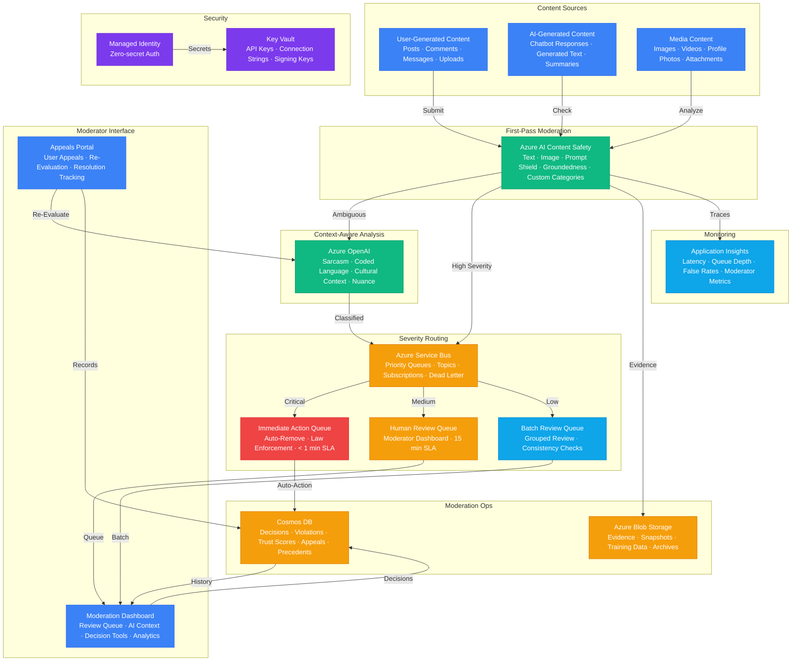

# Architecture — Play 61: Content Moderation V2

## Overview

Advanced content moderation platform that combines Azure AI Content Safety's multi-modal classification with Azure OpenAI's context-aware analysis and a severity-based routing system to handle content at scale with appropriate urgency. Azure AI Content Safety provides the first-pass moderation layer: text analysis detects hate speech, violence, sexual content, and self-harm with granular severity levels (0-7 scale), image moderation applies the same categories to visual content, Prompt Shield detects jailbreak attempts and indirect attacks in AI system inputs, groundedness detection identifies AI hallucinations in generated outputs, and protected material detection flags potential copyright violations. Content that scores in the ambiguous severity range (configurable, typically 3-4 out of 7) is escalated to Azure OpenAI for contextual analysis: GPT-4o understands sarcasm, coded language, cultural context, and nuance that pattern-matching cannot capture — distinguishing between a news article reporting on violence and violent content itself, or between medical terminology and inappropriate content. Azure Service Bus implements the severity-based routing fabric: high-severity content (terrorism, CSAM, imminent threats) enters the immediate-action queue with a < 1 minute processing SLA and automatic escalation to law enforcement reporting channels; medium-severity content (hate speech, harassment, graphic violence) routes to the human-review queue for moderator evaluation within 15 minutes; low-severity content (borderline, context-dependent, platform policy edge cases) enters the batch-review queue for scheduled evaluation. Each queue feeds a specialized processing pipeline: the immediate-action pipeline auto-removes content, preserves evidence, notifies trust & safety leadership, and generates law enforcement referral packages; the human-review pipeline presents content with AI analysis context (category, severity, confidence, similar past decisions) to trained moderators; the batch-review pipeline groups similar content for efficient bulk review with consistency checks. Cosmos DB stores the moderation operations data: every moderation decision recorded with content hash, detected categories, severity scores, action taken, and the decision rationale — building a searchable precedent database that improves consistency and supports appeal reviews. User violation histories and trust scores enable progressive enforcement: first offense triggers a warning, repeated violations escalate to temporary suspension, persistent abuse results in permanent action — with the system tracking patterns across content types and time periods.

## Architecture Diagram

## Data Flow

1. **Content Submission & First-Pass Analysis**: Content enters the moderation pipeline from three sources: user-generated content (posts, comments, messages, profile updates), AI-generated content (chatbot responses, automated summaries, generated text requiring safety verification), and media uploads (images, videos, profile photos, file attachments) → Azure AI Content Safety performs multi-modal first-pass analysis: text moderation evaluates content against four harm categories (hate, violence, sexual, self-harm) returning severity scores (0-7) per category; image moderation applies visual analysis for the same categories; Prompt Shield evaluates whether text contains jailbreak attempts or indirect attacks; groundedness detection checks AI-generated content for hallucinations; and custom category classifiers evaluate organization-specific policies (e.g., "no political content in product reviews", "no medical advice in community forums") → Content with all severity scores below the low threshold (configurable, typically 2) is approved automatically → Content with any severity score above the high threshold (typically 5) routes directly to the severity queue → Content in the ambiguous range (severity 3-4) is escalated to Azure OpenAI for context-aware analysis
2. **Context-Aware Escalation Analysis**: GPT-4o receives the content along with Content Safety scores, content metadata (user trust score, posting context, conversation thread), and similar past moderation decisions from Cosmos DB → The model performs nuanced analysis: is this sarcasm or genuine threat? ("I could kill for a pizza" vs actual threat), is this educational content or glorification? (news reporting on violence vs violent content), is this cultural expression or hate speech? (in-group reclamation of slurs vs targeted harassment), is this medical terminology or inappropriate content? (anatomical discussion vs explicit content) → GPT-4o returns: refined severity assessment with confidence score, primary content category, contextual reasoning explanation, and recommended action (approve, warn, remove, escalate to specialist) → The model also generates a human-readable moderation explanation that can be shown to the content creator if their content is flagged: "Your post was flagged because [specific reason]. To comply with community guidelines, consider [specific suggestion]" → All escalation results cached by content hash to avoid re-analyzing identical content
3. **Severity-Based Routing & Processing**: Azure Service Bus routes moderation decisions to three priority queues based on final severity classification → **Immediate Action Queue** (severity 6-7, categories: terrorism, CSAM, imminent violence threats): content auto-removed within 60 seconds, evidence package preserved in Blob Storage with legal hold, trust & safety leadership notified, law enforcement referral generated if legally required (NCMEC for CSAM, relevant authorities for terrorism), user account immediately restricted pending review → **Human Review Queue** (severity 4-5, categories: hate speech, harassment, graphic violence, explicit content): content queued for trained moderator review within 15 minutes; moderator sees the content, AI analysis context (categories, severity, confidence, similar past decisions), user violation history, and one-click action buttons (approve, warn, remove, escalate); moderator decision recorded as a precedent for future similar content → **Batch Review Queue** (severity 3, categories: borderline, context-dependent, policy edge cases): content grouped by category and similarity for efficient bulk review; consistency checks flag decisions that deviate from similar past rulings; batch review scheduled during moderator shift hours for optimal workload distribution
4. **User Trust & Progressive Enforcement**: Cosmos DB maintains a trust score for each user — new users start at a neutral score, positive moderation outcomes (content approved, appeal upheld) increase trust, violations decrease it → Trust score influences moderation pipeline behavior: high-trust users get higher auto-approval thresholds (reducing unnecessary moderation of established community members), low-trust users get stricter thresholds and faster escalation → Progressive enforcement: first violation triggers an educational warning with the AI-generated explanation, second violation within 30 days triggers content removal with a formal warning, third violation triggers temporary posting restriction (24-72 hours), persistent pattern triggers account review by senior moderator → Violation patterns tracked: the system distinguishes between users who occasionally misjudge content guidelines (educable) and users who systematically test boundaries (abusive) — different enforcement tracks applied accordingly → User trust scores and violation histories queryable by the moderation team for account-level review decisions
5. **Appeals & Continuous Improvement**: Users can appeal moderation decisions through the appeals portal — appeal includes the original content, the moderation decision, and the user's explanation of why they believe the decision was incorrect → Azure OpenAI re-evaluates the content with the additional context provided by the user: considering the appeal reasoning, any new context about the content's intent or audience, and updated precedent decisions → Appeal outcomes: upheld (moderation decision stands, explained to user), overturned (content restored, user trust score adjusted, moderation precedent updated), or partially overturned (content modified by user and re-approved) → Overturned decisions feed back into the moderation system: Content Safety custom categories retrained if systematic false positives identified, GPT-4o escalation prompts refined based on error patterns, and moderation guidelines updated for ambiguous content categories → Moderation analytics dashboard: false positive/negative rates by category, moderator consistency scores, appeal success rates by content type, queue processing times, and content trend analysis (emerging harmful content patterns, seasonal variations)

## Service Roles

| Service | Layer | Role |
|---------|-------|------|
| Azure AI Content Safety | Moderation | Multi-modal content classification — text, image, prompt shield, groundedness, custom categories |
| Azure OpenAI | AI | Context-aware escalation analysis, appeal re-evaluation, moderation explanations |
| Cosmos DB | Data | Moderation decisions, user trust scores, violation history, appeal records, precedent database |
| Azure Service Bus | Routing | Severity-based priority queues, topic subscriptions, dead-letter handling |
| Azure Blob Storage | Data | Evidence storage, content snapshots, training data, compliance archives |
| Key Vault | Security | API keys, connection strings, content hash signing keys, law enforcement credentials |
| Managed Identity | Security | Zero-secret authentication across all Azure services |
| Application Insights | Monitoring | Moderation latency, queue metrics, false rates, moderator workload analytics |

## Security Architecture

- **Evidence Chain of Custody**: Flagged content snapshots stored in immutable Blob Storage with legal hold — content hash, timestamp, moderation decision, and moderator identity form a cryptographically signed evidence chain for law enforcement referrals and legal proceedings
- **Managed Identity**: All service-to-service authentication via managed identity — no API keys in moderation pipeline, queue processors, or dashboard backends
- **Moderator Privacy**: Moderator identities not exposed to content creators in moderation decisions — moderation explanations attributed to "Community Safety Team" to protect individual moderators from harassment
- **Content Isolation**: Flagged content stored in a segregated storage account with additional access controls — only trust & safety team members with explicit clearance can access evidence storage; access logged and audited
- **RBAC**: Role-based access hierarchy — content moderators see their assigned queues, senior moderators see all queues and can override decisions, trust & safety leadership sees analytics and enforcement configuration, legal team sees law enforcement referral packages
- **Data Retention**: Moderation records retained per legal requirements — active violation records kept for account lifetime, resolved appeals archived after 2 years, law enforcement evidence retained per jurisdiction requirements (typically 7 years), auto-approved content logs purged after 90 days
- **Network Isolation**: Content Safety, Cosmos DB, and Service Bus accessible only via private endpoints — moderator dashboard served through authenticated web app with IP restrictions for geographic compliance
- **PII Protection**: User PII (name, email, IP) stored separately from moderation records — moderation decisions reference user IDs only; PII lookup requires elevated permissions and is audit-logged

## Scaling

| Metric | Dev | Production | Enterprise |
|--------|-----|-----------|------------|
| Content items moderated/day | 500 | 100,000 | 10,000,000+ |
| Moderation latency (auto, P95) | 2s | 500ms | 200ms |
| Human review queue SLA | 1h | 15min | 5min |
| Immediate action SLA | 5min | 1min | 30s |
| Content categories | 4 built-in | 4 + 5 custom | 4 + 20 custom |
| Languages supported | 3 | 20 | 50+ |
| Active moderators | 2 | 20 | 200+ |
| Appeal volume/day | 10 | 500 | 10,000+ |
| False positive rate target | <20% | <10% | <5% |
| User trust scores tracked | 1K | 500K | 50M+ |
