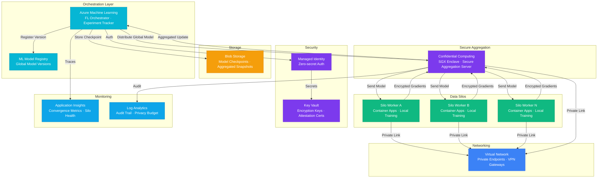

# Play 62 — Federated Learning Pipeline

Privacy-preserving distributed training — FedAvg server orchestration, client local training (data never leaves), differential privacy via Opacus, optional secure aggregation in Azure Confidential Computing enclaves, convergence monitoring, non-IID handling (FedProx/SCAFFOLD), and cross-organization collaboration protocols.

## Architecture

| Component | Technology | Purpose |
|-----------|-----------|---------|
| Fed Server | Flower (flwr) + Container Apps | Round orchestration, aggregation, convergence |
| Client Training | PyTorch + Opacus DP | Local training on private data |
| Secure Aggregation | Azure Confidential Computing (SGX) | Hardware-enclave aggregation (optional) |
| Training Orchestration | Azure ML Workspace | Experiment tracking, compute management |
| Communication | TLS 1.3 | Encrypted client↔server |
| Secrets | Azure Key Vault | API keys, enclave attestation |

🏗️ [Full architecture details](architecture.md)

## How It Differs from Related Plays

| Aspect | Play 13 (Fine-Tuning) | **Play 62 (Federated Learning)** | Play 47 (Synthetic Data) |
|--------|----------------------|--------------------------------|--------------------------|
| Data | Centralized training data | **Data stays at client nodes (never centralized)** | Generated from scratch |
| Privacy | Access controls | **Differential privacy (ε budget)** | Privacy by construction |
| Training | Single-site | **Multi-site distributed** | N/A (generation, not training) |
| Output | Fine-tuned model | **Global federated model** | Synthetic dataset |
| Parties | Single organization | **Multi-organization collaboration** | Single organization |
| Compliance | Data handling policies | **GDPR/HIPAA data sovereignty** | GDPR synthetic data |

## Key Metrics

| Metric | Target | Description |
|--------|--------|-------------|
| Rounds to Convergence | < 50 | Training rounds until stable loss |
| Global Accuracy | > 85% | Model accuracy on server test set |
| Accuracy vs Centralized | > 0.95 ratio | Federated nearly matches centralized |
| Epsilon Consumed | < budget | Total DP budget used |
| Data Isolation | 100% | No raw data transferred (non-negotiable) |
| Training Cost | Minimize | Client compute × rounds × clients |

## Cost Estimate

| Service | Dev | Prod | Enterprise |
|---------|-----|------|------------|
| Azure Machine Learning | $0 | $450 | $1,200 |
| Confidential Computing | $120 | $550 | $1,800 |
| Blob Storage | $5 | $40 | $120 |
| Container Apps | $15 | $200 | $600 |
| Key Vault | $1 | $15 | $40 |
| Virtual Network | $30 | $150 | $450 |
| Application Insights | $0 | $30 | $100 |
| Log Analytics | $0 | $20 | $60 |
| **Total** | **$171/mo** | **$1,455/mo** | **$4,370/mo** |

> Estimates based on Azure retail pricing. Actual costs vary by region, usage, and enterprise agreements.

💰 [Full cost breakdown](cost.json)

## WAF Alignment

| Pillar | Implementation |
|--------|---------------|
| **Security** | Data never leaves client, DP noise, Confidential Computing, TLS 1.3 |
| **Responsible AI** | Privacy-preserving training, gradient leakage prevention |
| **Reliability** | Convergence monitoring, non-IID handling, early stopping |
| **Cost Optimization** | Client selection, early stopping, model compression |
| **Operational Excellence** | Round tracking, client contribution monitoring, LLM convergence explanation |
| **Performance Efficiency** | Async training, FedProx for non-IID, straggler mitigation |
