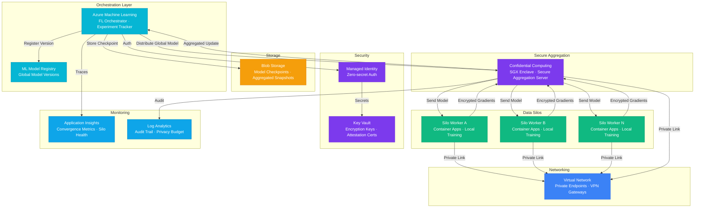

# Architecture — Play 62: Federated Learning Pipeline — Privacy-Preserving Distributed Training

## Overview

Privacy-preserving federated learning pipeline that trains AI models across distributed data silos without centralizing raw data. Each participating silo trains a local model on its private dataset and shares only encrypted gradient updates with the central aggregation server running inside a Confidential Computing enclave. The aggregation server combines updates using secure aggregation, applies differential privacy noise, and distributes the improved global model back to silos. Built on Azure Machine Learning FL SDK with Confidential Computing for trustworthy aggregation.

## Architecture Diagram

## Data Flow

1. **Initialization**: FL Orchestrator registers a new training experiment in Azure ML → Generates initial global model weights → Stores initial checkpoint in Blob Storage → Distributes global model to Confidential Computing enclave
2. **Local Training**: Enclave distributes the global model to each silo worker via private endpoints → Each silo trains on its local private data (never leaves the silo) → Silo computes gradient updates and encrypts them using the enclave's public attestation key → Encrypted gradients sent back to the enclave
3. **Secure Aggregation**: Enclave decrypts gradients inside the SGX trusted execution environment → Applies FedAvg (or FedProx) aggregation across all silo updates → Injects calibrated differential privacy noise (per privacy budget ε) → Produces updated global model weights
4. **Model Update**: Aggregated model sent back to FL Orchestrator → Orchestrator evaluates convergence (loss delta, accuracy plateau) → If not converged, triggers next training round (repeat steps 2-3) → If converged, registers final model in Model Registry with version tag
5. **Audit & Monitoring**: Every round logs: participating silos, aggregation time, convergence metrics, privacy budget consumed → Application Insights tracks training curves and silo health → Log Analytics maintains immutable audit trail for compliance → Privacy budget tracker ensures ε accumulation stays within bounds

## Service Roles

| Service | Layer | Role |
|---------|-------|------|
| Azure Machine Learning | Orchestration | FL experiment management, round scheduling, model registry |
| Confidential Computing | Aggregation | SGX enclaves for secure gradient aggregation and differential privacy |
| Container Apps | Compute | Silo worker nodes — local training on private data |
| Blob Storage | Storage | Model checkpoints, aggregated snapshots, training artifacts |
| Virtual Network | Networking | Private connectivity between silos and aggregation server |
| Key Vault | Security | Encryption keys, attestation certificates, HSM-backed secrets |
| Application Insights | Monitoring | Training convergence, silo health, token/compute spend |
| Log Analytics | Monitoring | Immutable audit trail, privacy budget tracking, compliance logs |

## Security Architecture

- **Confidential Computing**: All aggregation happens inside SGX enclaves — raw gradients never exposed outside trusted execution environment
- **Attestation**: Each silo verifies the enclave's attestation report before sending gradients — ensures code integrity
- **Differential Privacy**: Calibrated noise injection (ε-DP) at aggregation — mathematically bounds information leakage per training round
- **Managed Identity**: Orchestrator-to-enclave and silo-to-storage authentication via managed identity — zero hardcoded secrets
- **Key Vault HSM**: Encryption keys for gradient transport stored in HSM-backed Key Vault with automatic rotation
- **Network Isolation**: All silo-to-enclave traffic over private endpoints within VNet — no public internet exposure
- **Privacy Budget Enforcement**: Cumulative ε tracked per silo — training stops when budget exhausted

## Scaling

| Metric | Dev | Production | Enterprise |
|--------|-----|-----------|------------|
| Data silos | 2-3 | 5-10 | 20-100+ |
| Training rounds | 5-10 | 20-50 | 50-200 |
| Model parameters | 1M | 50-100M | 500M+ |
| Gradient size per silo | 10MB | 200MB | 1-5GB |
| Aggregation time/round | 30s | 2-5 min | 5-15 min |
| Enclave nodes | 1 | 3 | 5-10 |
| Privacy budget (ε) | 10.0 | 3.0-5.0 | 1.0-2.0 |
