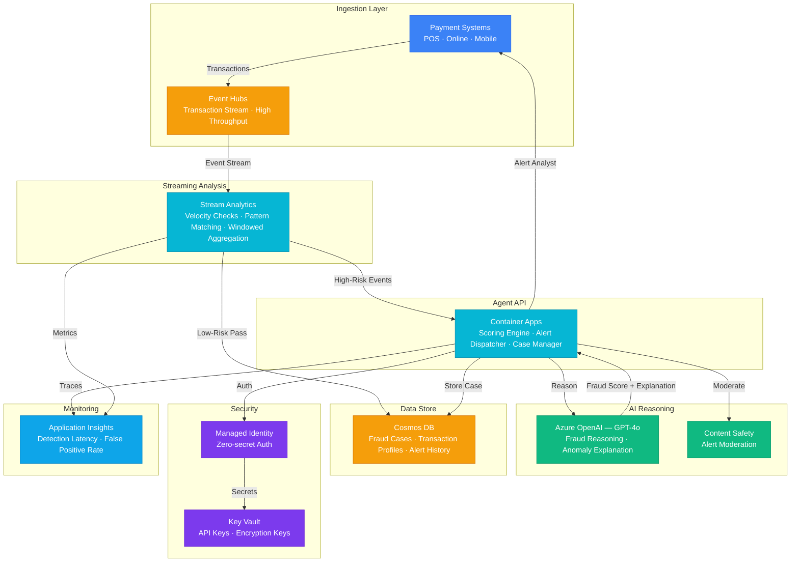

# Play 63 — Fraud Detection Agent

Real-time fraud detection — three-layer architecture: rule engine (<1ms, velocity+geo+amount), ML model (<50ms, statistical patterns+SHAP explainability), graph network analysis (fraud rings, mule accounts, coordinated attacks via Cosmos DB Gremlin), with PSD2-compliant explainable decisions and analyst feedback loop for continuous model improvement.

## Architecture

| Component | Azure Service | Purpose |
|-----------|--------------|---------|
| Rule Engine | Custom (local) | Velocity, geo-impossible, amount checks (<1ms) |
| ML Model | scikit-learn (local) | Statistical fraud scoring (<50ms) |
| Graph Analysis | Cosmos DB Gremlin API | Fraud ring, mule account, coordinated attack detection |
| Explanation | Azure OpenAI (GPT-4o-mini) | PSD2-compliant decision explanation |
| Transaction Stream | Azure Event Hubs | Real-time transaction ingestion |
| Audit Trail | Cosmos DB | Decision history, analyst feedback |
| Detection API | Azure Container Apps | Real-time scoring endpoint |

🏗️ [Full architecture details](architecture.md)

## How It Differs from Related Plays

| Aspect | Play 50 (Financial Risk) | **Play 63 (Fraud Detection)** |
|--------|------------------------|------------------------------|
| Scope | Credit risk + market analysis + fraud | **Fraud detection specialized** |
| Latency | < 100ms (scoring) | **< 55ms avg (rules+ML), <500ms with graph** |
| Graph | N/A | **Gremlin-based fraud ring detection** |
| Layers | Three-tier fraud | **Three-layer: rules→ML→graph with weighted scoring** |
| Feedback | Audit trail | **Analyst feedback → automatic model retraining** |
| Patterns | General fraud scoring | **Ring, mule, coordinated, layering detection** |

## Key Metrics

| Metric | Target | Description |
|--------|--------|-------------|
| Recall | > 95% | True fraud caught |
| False Positive Rate | < 1% | Legitimate transactions blocked |
| E2E Latency P95 | < 100ms | Rules + ML combined |
| Ring Detection | > 90% | Known fraud ring patterns |
| Explanation Compliance | 100% | PSD2 Art. 70 compliant |
| Monthly Cost | < $150 | 1M transactions/day |

## Cost Estimate

| Service | Dev | Prod | Enterprise |
|---------|-----|------|------------|
| Azure OpenAI | $40 | $350 | $1,400 |
| Event Hubs | $12 | $120 | $500 |
| Stream Analytics | $80 | $480 | $1,600 |
| Cosmos DB | $5 | $60 | $300 |
| Container Apps | $10 | $120 | $350 |
| Key Vault | $1 | $5 | $15 |
| Application Insights | $0 | $35 | $120 |
| Content Safety | $0 | $10 | $35 |
| **Total** | **$148/mo** | **$1,180/mo** | **$4,320/mo** |

> Estimates based on Azure retail pricing. Actual costs vary by region, usage, and enterprise agreements.

💰 [Full cost breakdown](cost.json)

## WAF Alignment

| Pillar | Implementation |
|--------|---------------|
| **Security** | Three-layer defense, graph analysis, velocity checks |
| **Performance Efficiency** | Rules <1ms, ML <50ms, graph only for high-risk |
| **Responsible AI** | Explainable decisions, SHAP feature importance, PSD2 compliance |
| **Reliability** | Feedback loop for model improvement, Event Hubs for reliable ingestion |
| **Cost Optimization** | Rules+ML handle 90% (free), graph for 10%, gpt-4o-mini for explanations |
| **Operational Excellence** | Analyst feedback, weekly retraining, per-type threshold tuning |
