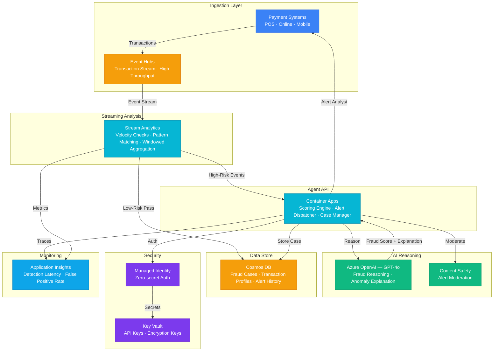

# Architecture — Play 63: Fraud Detection Agent — Real-Time Streaming Fraud Analysis

## Overview

Real-time fraud detection agent that combines streaming analytics with AI reasoning to identify, score, and explain fraudulent transactions as they occur. Transaction events flow through Event Hubs into Stream Analytics for velocity checks and pattern matching, then high-risk transactions are escalated to an Azure OpenAI-powered agent for contextual fraud reasoning and natural language explanation. Investigation state and fraud case history are persisted in Cosmos DB for analyst review and model feedback loops.

## Architecture Diagram

## Data Flow

1. **Transaction Ingestion**: Payment systems (POS, online, mobile) emit transaction events → Event Hubs ingests at high throughput with partitioned streams → Events include: amount, merchant, location, timestamp, card hash, device fingerprint
2. **Streaming Analysis**: Stream Analytics applies real-time windowed queries — velocity checks (N transactions in T seconds), geographic impossibility (two locations < travel time), amount anomalies (deviation from user baseline) → Low-risk transactions pass through and are logged to Cosmos DB → High-risk transactions (score > threshold) are escalated to the AI agent
3. **AI Fraud Reasoning**: Container Apps agent receives high-risk transactions with streaming context → Sends transaction + user profile + historical patterns to GPT-4o → GPT-4o performs multi-factor reasoning: merchant category risk, behavioral deviation, temporal patterns → Returns fraud confidence score (0-1) and natural language explanation
4. **Alert & Case Management**: Agent creates fraud case in Cosmos DB with: transaction details, AI reasoning, confidence score, recommended action → If score > 0.8: auto-block transaction, notify analyst → If score 0.5-0.8: flag for review, allow with monitoring → Content Safety moderates AI-generated explanations before analyst delivery
5. **Feedback Loop**: Analysts mark cases as confirmed fraud / false positive → Feedback stored in Cosmos DB → Periodic retraining adjusts Stream Analytics thresholds and AI prompt context → Application Insights tracks detection latency, false positive rate, and model drift

## Service Roles

| Service | Layer | Role |
|---------|-------|------|
| Event Hubs | Ingestion | High-throughput transaction stream ingestion from payment systems |
| Stream Analytics | Streaming | Real-time velocity checks, pattern matching, windowed aggregation |
| Azure OpenAI (GPT-4o) | Reasoning | Contextual fraud reasoning, anomaly explanation, adaptive rules |
| Container Apps | Compute | Fraud scoring API, alert dispatcher, case management |
| Cosmos DB | Persistence | Fraud cases, transaction profiles, alert history, analyst feedback |
| Content Safety | Safety | Moderate AI-generated fraud alerts and investigation summaries |
| Key Vault | Security | API keys, encryption keys for PII masking, connection strings |
| Application Insights | Monitoring | Detection latency, false positive rate, throughput dashboards |

## Security Architecture

- **Managed Identity**: Agent-to-OpenAI, agent-to-Cosmos, and ASA-to-Event Hubs via managed identity — zero hardcoded credentials
- **PII Masking**: Card numbers and personal data masked before AI processing — only hashed identifiers sent to GPT-4o
- **Key Vault**: All API keys and encryption secrets stored in Key Vault with automatic rotation
- **Network Isolation**: Event Hubs, Cosmos DB, and OpenAI behind private endpoints — no public internet exposure
- **PCI-DSS Alignment**: Transaction data encrypted at rest (CMK) and in transit (TLS 1.2+) — audit logs immutable
- **Rate Limiting**: AI API calls rate-limited per tenant to prevent cost abuse during attack surges
- **Prompt Injection Defense**: Transaction data treated as untrusted input — system prompts include injection-resistant framing

## Scaling

| Metric | Dev | Production | Enterprise |
|--------|-----|-----------|------------|
| Transactions/second | 100 | 10,000 | 100,000+ |
| Event Hubs throughput units | 1 | 10 | Dedicated cluster |
| Stream Analytics SUs | 1 | 6 | 20+ |
| AI escalation rate | 10% | 2-5% | 1-3% |
| Detection latency (P95) | 5s | 2s | <1s |
| Cosmos DB RU/s | Serverless | 1,000 | 5,000+ |
| Container replicas | 1 | 3-5 | 10-20 |
