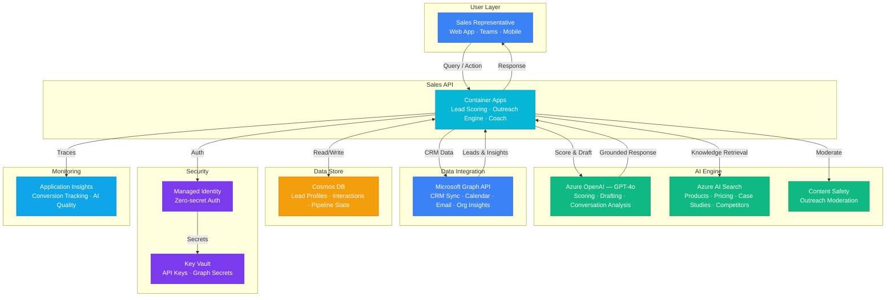

# Architecture — Play 64: AI Sales Assistant — Lead Scoring & Intelligent Outreach

## Overview

AI-powered sales copilot that augments sales teams with intelligent lead scoring, personalized outreach generation, and real-time conversation coaching. The assistant ingests lead data from CRM via Microsoft Graph, enriches profiles with organizational insights, scores leads using a multi-factor AI model, and generates personalized email drafts and talking points. Sales knowledge (products, pricing, case studies, competitor analysis) is indexed in AI Search for grounded, accurate recommendations.

## Architecture Diagram

## Data Flow

1. **Lead Ingestion**: Microsoft Graph syncs lead data from CRM (Dynamics 365 / Salesforce connector) → Organizational insights enrich lead profiles (company size, industry, decision-maker graph) → Calendar and email metadata provide engagement signals → Lead profiles stored in Cosmos DB with enrichment timestamps
2. **Lead Scoring**: Sales rep requests score for a lead or batch → Agent retrieves lead profile + interaction history from Cosmos DB → Sends multi-factor context to GPT-4o: firmographic data, engagement signals, historical conversion patterns → GPT-4o returns score (0-100), confidence level, and top 3 scoring factors with explanations
3. **Outreach Generation**: Rep selects a scored lead and requests outreach → Agent queries AI Search for relevant products, case studies, and competitor differentiators → GPT-4o generates personalized email draft: references lead's industry, pain points, relevant success stories → Content Safety moderates the draft before presenting to rep
4. **Conversation Coaching**: During or before a call, rep requests talking points → Agent retrieves deal context, previous interactions, and objection history from Cosmos DB → GPT-4o generates: opening strategy, anticipated objections with rebuttals, key value propositions, next-step recommendations → Real-time coaching tips streamed during active calls
5. **Feedback & Learning**: Rep marks outreach as sent/replied/converted → Conversion data flows back to Cosmos DB → Lead scoring model context refined with actual outcomes → Application Insights tracks conversion rates per AI-generated vs manual outreach

## Service Roles

| Service | Layer | Role |
|---------|-------|------|
| Container Apps | Compute | Sales assistant API — scoring, outreach, coaching, pipeline management |
| Azure OpenAI (GPT-4o) | Reasoning | Lead scoring, email drafting, conversation analysis, objection handling |
| Azure AI Search | Retrieval | Semantic search over sales knowledge base — products, pricing, case studies |
| Microsoft Graph API | Integration | CRM data sync, calendar, email tracking, organizational insights |
| Cosmos DB | Persistence | Lead profiles, interaction history, scoring results, pipeline state |
| Content Safety | Safety | Moderate AI-generated outreach emails and sales recommendations |
| Key Vault | Security | API keys, Graph API secrets, CRM connection strings |
| Application Insights | Monitoring | Conversion tracking, AI quality metrics, response latency |

## Security Architecture

- **Managed Identity**: API-to-OpenAI, API-to-Search, and API-to-Cosmos authentication via managed identity — zero secrets in code
- **Key Vault**: Graph API client secrets and CRM credentials stored with automatic rotation
- **Data Segregation**: Lead data partitioned by tenant — sales reps see only their assigned leads
- **PII Handling**: Personal contact details masked in AI prompts — GPT-4o receives role/company/industry, not names/emails
- **Content Moderation**: All AI-generated outreach passes Content Safety before delivery — prevents inappropriate content
- **RBAC**: Sales managers see team-wide dashboards; reps see individual pipelines only
- **Audit Trail**: Every AI-generated action logged with timestamp, rep ID, and lead ID for compliance

## Scaling

| Metric | Dev | Production | Enterprise |
|--------|-----|-----------|------------|
| Active leads | 100 | 5,000-20,000 | 100,000+ |
| Sales reps | 5 | 50-200 | 1,000+ |
| AI scoring requests/day | 50 | 2,000 | 20,000+ |
| Outreach drafts/day | 20 | 500 | 5,000+ |
| Knowledge base docs | 500 | 10,000 | 100,000+ |
| Container replicas | 1 | 2-3 | 5-10 |
| P95 response time | 5s | 3s | 2s |
