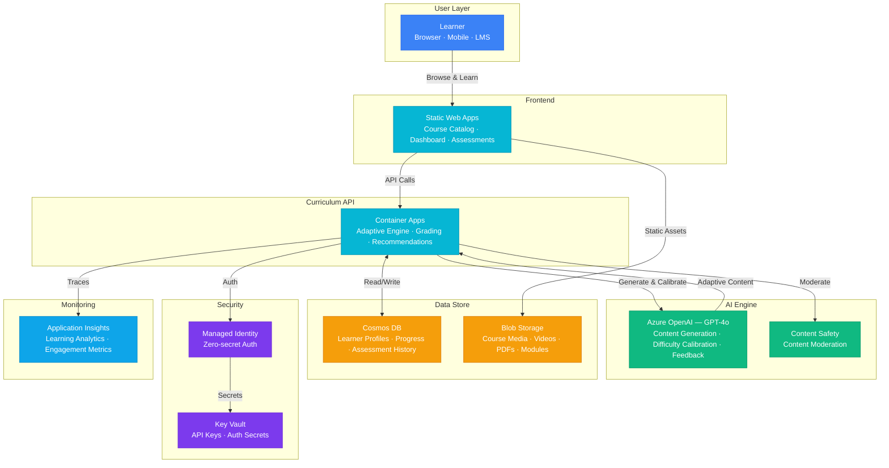

# Play 65 — AI Training Curriculum

Adaptive AI-powered learning platform — skill gap analysis against role-skill matrices, dependency-ordered learning paths (topological sort), content matched to learning style (visual/reading/hands-on), LLM-generated assessments with difficulty calibration, progress tracking in Cosmos DB, and completion optimization with gamification and microlearning.

## Architecture

| Component | Azure Service | Purpose |
|-----------|--------------|---------|
| Content Generation | Azure OpenAI (GPT-4o) | Module content, assessments |
| Path Algorithm | NetworkX (local) | Skill dependency graph, topological sort |
| Learner State | Azure Cosmos DB | Profiles, progress, scores |
| Learner Portal | Azure Static Web Apps | Dashboard, module viewer |
| Curriculum API | Azure Container Apps | Path generation, assessments, progress |
| Secrets | Azure Key Vault | API keys |

🏗️ [Full architecture details](architecture.md)

## How It Differs from Related Plays

| Aspect | Play 74 (AI Tutoring) | **Play 65 (Training Curriculum)** |
|--------|----------------------|----------------------------------|
| Scope | Individual tutoring sessions | **Full learning path across skills** |
| Duration | Single session | **Weeks/months to role readiness** |
| Assessment | In-session quizzes | **Formal pre/post skill assessments** |
| Structure | Free-form Q&A | **Dependency-ordered modules** |
| Tracking | Session memory | **Persistent learner profile + progress** |
| Goal | Understand one topic | **Achieve role competency (ML Engineer, etc.)** |

## Key Metrics

| Metric | Target | Description |
|--------|--------|-------------|
| Completion Rate | > 70% | Learners who finish their path |
| Skill Gain | > 30% | Pre-test → post-test improvement |
| Dependency Order | 100% | Prerequisites always before advanced |
| Assessment Validity | > 90% | Questions test intended skill |
| Learner Satisfaction | > 4.0/5.0 | Post-path survey |
| Cost per Learner | < $1.00 | Path + assessments + tracking |

## Cost Estimate

| Service | Dev | Prod | Enterprise |
|---------|-----|------|------------|
| Azure OpenAI | $25 | $150 | $600 |
| Cosmos DB | $3 | $40 | $130 |
| Static Web Apps | $0 | $9 | $9 |
| Container Apps | $10 | $60 | $180 |
| Blob Storage | $3 | $20 | $60 |
| Key Vault | $1 | $3 | $5 |
| Application Insights | $0 | $15 | $60 |
| Content Safety | $0 | $8 | $25 |
| **Total** | **$42/mo** | **$305/mo** | **$1,069/mo** |

> Estimates based on Azure retail pricing. Actual costs vary by region, usage, and enterprise agreements.

💰 [Full cost breakdown](cost.json)

## WAF Alignment

| Pillar | Implementation |
|--------|---------------|
| **Reliability** | Dependency graph ensures ordered learning, skip-if-passed pre-test |
| **Responsible AI** | SME review for generated content, assessment calibration |
| **Cost Optimization** | gpt-4o-mini for paths, cached assessments, pre-built content |
| **Operational Excellence** | Progress tracking, completion analytics, content refresh schedule |
| **Performance Efficiency** | Microlearning (15 min sessions), parallel content delivery |
| **Security** | Learner PII in Cosmos DB, Key Vault for secrets |
