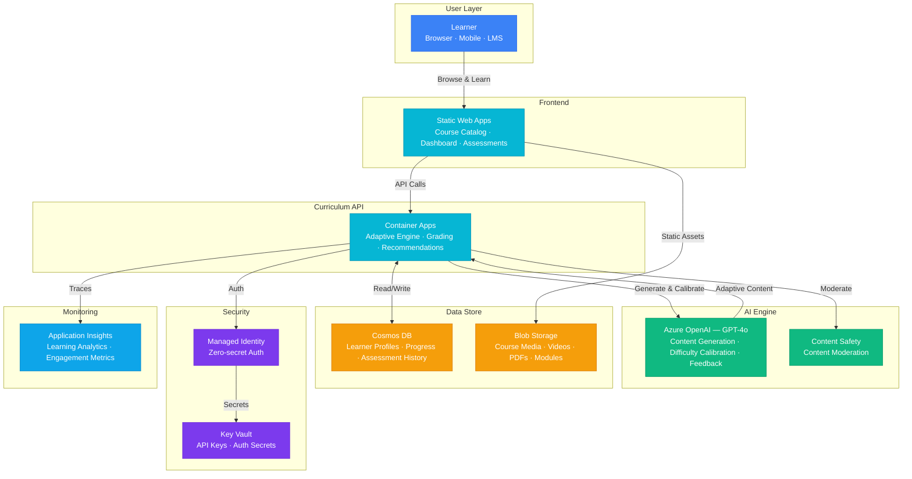

# Architecture — Play 65: AI Training Curriculum — Adaptive Learning with Difficulty Scaling

## Overview

Adaptive AI-powered training platform that personalizes learning paths and dynamically adjusts content difficulty based on individual learner performance. The system generates custom course modules, assessments, and feedback using Azure OpenAI, tracks learner progress in Cosmos DB, and serves the interactive training portal via Static Web Apps. A difficulty calibration engine continuously analyzes learner responses to optimize the challenge level — keeping learners in their zone of proximal development for maximum retention and engagement.

## Architecture Diagram

## Data Flow

1. **Learner Onboarding**: Learner registers via Static Web Apps portal → Diagnostic assessment sent to determine baseline skill level → GPT-4o evaluates responses and assigns initial difficulty level (1-10) → Learner profile created in Cosmos DB with skill map and learning preferences
2. **Adaptive Content Delivery**: Learner selects a topic or follows recommended path → API retrieves learner profile and progress from Cosmos DB → GPT-4o generates content at the calibrated difficulty level: explanations, examples, interactive exercises → Content Safety moderates generated material → Module served through Static Web Apps with interactive components
3. **Assessment & Grading**: At module checkpoints, learner completes AI-generated assessments → GPT-4o grades free-form responses using rubric-based evaluation → Multiple-choice and coding exercises auto-graded by deterministic engine → Results stored in Cosmos DB with per-skill performance vectors
4. **Difficulty Calibration**: After each assessment, adaptive engine recalculates difficulty → Algorithm: if accuracy > 85% for 3 consecutive modules → increase difficulty; if accuracy < 50% → decrease difficulty; otherwise → maintain with varied content → Item Response Theory (IRT) parameters updated in learner profile → Next module generated at the new calibrated level
5. **Analytics & Feedback**: Application Insights tracks: completion rates, time-per-module, difficulty progression curves, engagement drop-off points → Aggregated learning analytics available to instructors via dashboard → Learner receives AI-generated progress reports with strengths, gaps, and recommended focus areas

## Service Roles

| Service | Layer | Role |
|---------|-------|------|
| Static Web Apps | Frontend | Learner portal — course catalog, progress dashboard, interactive assessments |
| Container Apps | Compute | Adaptive curriculum API — content generation, grading, difficulty engine |
| Azure OpenAI (GPT-4o) | Reasoning | Content generation, difficulty calibration, free-form grading, feedback |
| Cosmos DB | Persistence | Learner profiles, progress tracking, assessment history, skill maps |
| Blob Storage | Storage | Course media — videos, PDFs, interactive modules, assessment assets |
| Content Safety | Safety | Moderate AI-generated training content and assessment feedback |
| Key Vault | Security | API keys, authentication secrets, content encryption keys |
| Application Insights | Monitoring | Learning analytics, engagement metrics, difficulty calibration accuracy |

## Security Architecture

- **Managed Identity**: API-to-OpenAI and API-to-Cosmos authentication via managed identity — zero hardcoded secrets
- **Entra ID Integration**: Learner authentication via Microsoft Entra ID or social providers through Static Web Apps built-in auth
- **Data Isolation**: Learner data partitioned by tenant and user — no cross-learner data leakage
- **Key Vault**: All API keys and auth secrets stored with automatic rotation
- **Content Moderation**: Every AI-generated module passes Content Safety before delivery to learners
- **COPPA/FERPA Compliance**: For education deployments — PII minimization, parental consent flows, data retention limits
- **Private Endpoints**: Cosmos DB and OpenAI behind private endpoints in production

## Scaling

| Metric | Dev | Production | Enterprise |
|--------|-----|-----------|------------|
| Concurrent learners | 10 | 500-2,000 | 20,000+ |
| Course modules | 20 | 200-500 | 2,000+ |
| Assessments/day | 30 | 2,000 | 50,000+ |
| AI content generations/day | 50 | 1,000 | 10,000+ |
| Cosmos DB RU/s | Serverless | 600 | 2,000+ |
| Container replicas | 1 | 2-3 | 5-10 |
| P95 response time | 5s | 3s | 2s |
