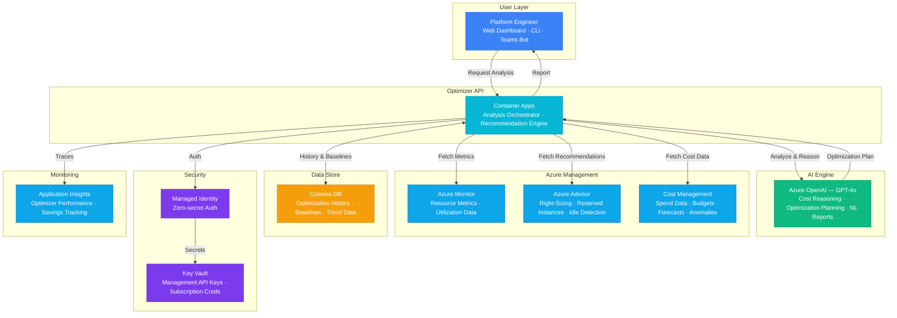

# Architecture — Play 66: AI Infrastructure Optimizer — Intelligent Cost & Performance Analysis

## Overview

AI-driven infrastructure optimization agent that continuously analyzes Azure resource utilization, identifies cost savings opportunities, and generates actionable recommendations with natural language explanations. The optimizer ingests metrics from Azure Monitor, correlates with Azure Advisor recommendations and Cost Management data, then uses Azure OpenAI to reason across the full infrastructure graph — identifying right-sizing opportunities, idle resources, reservation candidates, and architectural improvements. Recommendations include projected savings, implementation risk, and one-click remediation plans.

## Architecture Diagram

## Data Flow

1. **Data Collection**: Optimizer agent collects resource metrics from Azure Monitor (CPU, memory, network, disk — 14-day window) → Fetches Azure Advisor recommendations (right-sizing, reserved instances, idle resources) → Pulls cost data from Cost Management API (spend by resource, anomalies, forecasts) → Raw data cached in Cosmos DB with timestamp for trend analysis
2. **Infrastructure Graph Analysis**: Agent builds a dependency graph of all resources in scope (subscription/resource group) → Identifies resource relationships: VM → Disk → NIC → NSG → VNet → Maps utilization patterns to resource tiers: over-provisioned, right-sized, under-provisioned → Correlates Advisor recommendations with actual utilization data for validation
3. **AI-Powered Optimization**: Resource graph + utilization data + cost data sent to GPT-4o → GPT-4o performs multi-factor reasoning: current spend vs optimal, reservation vs pay-as-you-go, consolidation opportunities → Generates prioritized recommendation list with: projected monthly savings, implementation complexity (low/medium/high), risk level, and step-by-step remediation plan → Each recommendation includes natural language justification
4. **Recommendation Delivery**: Recommendations stored in Cosmos DB with status tracking (new → approved → implemented → verified) → Dashboard shows: total potential savings, savings by category, trend over time → Platform engineer can approve and trigger automated remediation (resize VM, delete idle resource) → Weekly digest report generated with AI-written executive summary
5. **Continuous Improvement**: Post-implementation, agent verifies actual savings match projections → Recommendation accuracy tracked in Application Insights → Baseline snapshots updated after each optimization cycle → Anomaly detection flags unexpected cost increases for investigation

## Service Roles

| Service | Layer | Role |
|---------|-------|------|
| Container Apps | Compute | Optimizer API — analysis orchestration, recommendation engine, report generation |
| Azure OpenAI (GPT-4o) | Reasoning | Cost reasoning, optimization planning, natural language report generation |
| Azure Monitor | Data Source | Resource utilization metrics — CPU, memory, network, disk across subscriptions |
| Azure Advisor | Data Source | Built-in optimization recommendations — right-sizing, reservations, idle detection |
| Cost Management | Data Source | Spend data, budgets, forecasts, anomaly detection, cost exports |
| Cosmos DB | Persistence | Optimization history, baseline snapshots, trend data, recommendation state |
| Key Vault | Security | Management API credentials, subscription secrets, automation keys |
| Application Insights | Monitoring | Optimizer performance, recommendation accuracy, savings verification |

## Security Architecture

- **Managed Identity**: Optimizer-to-Monitor, Advisor, and Cost Management APIs via managed identity — zero hardcoded subscription credentials
- **Least Privilege RBAC**: Optimizer requires Reader role on target subscriptions — never Contributor or Owner
- **Key Vault**: Any non-MI credentials (cross-tenant scenarios) stored in Key Vault with automatic rotation
- **Audit Trail**: Every recommendation and automated action logged with timestamp, approver, and outcome for compliance
- **Scope Isolation**: Optimizer scoped per subscription or management group — no cross-tenant data leakage
- **Read-Only Default**: Automated remediation disabled by default — requires explicit opt-in and approval workflow
- **PII-Free Analysis**: No user data processed — only resource metadata, metrics, and cost data

## Scaling

| Metric | Dev | Production | Enterprise |
|--------|-----|-----------|------------|
| Subscriptions monitored | 1 | 5-20 | 50-200+ |
| Resources analyzed | 50 | 500-2,000 | 10,000-50,000 |
| Optimization scans/day | 1 | 4-6 | 24 (hourly) |
| Recommendations/scan | 5-10 | 20-50 | 100-500 |
| Cost data retention | 30 days | 90 days | 1 year |
| Container replicas | 1 | 2-3 | 5-10 |
| P95 scan time | 30s | 2 min | 5 min |
